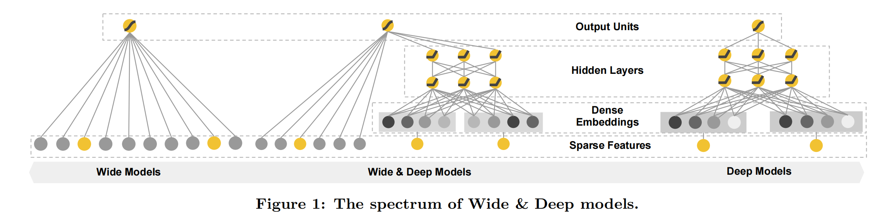

[TOC]

# 机器学习算法

## 逻辑斯蒂回归（Logistic Regression，LR）

### 定义

逻辑斯蒂回归(Logistic Regression)虽然名字中有回归，但模型最初是为了解决二分类问题。线性回归模型帮助我们用最简单的线性方程实现了对数据的拟合，但只实现了回归而无法分类。因此LR就是在线性回归的基础上，构建的一种分类模型。

**对线性模型进行二分类任务**，简单的是通过阶跃函数，即将线性模型的输出值套上一个函数进行分割，大于z的判定为0，小于z的判定为1


**但是该分段函数数学性质不好，既不连续也不可微**。因此有人提出了对数几率函数，简称Sigmoid函数。
$$
y=\frac{1}{1+e^{-z}}
$$
该函数具有很好的数学性质，既可以用于预测类别，并且任意阶可微，因此可用于求解最优解，将线性函数带进去，可得LR模型为：
$$
y=\frac{1}{1+e^{-w^Tx+b}}
$$

### 损失函数

- 什么是极大似然估计：通俗理解来说，就是利用已知的样本结果信息，反推最具有可能（最大概率）导致这些样本结果出现的模型参数值。极大似然估计提供了一种给定观察数据来评估模型参数的方法，即："模型已定，参数未知"
  - 极大似然估计中采样需要满足一个重要的假设，就是所有的采样都是独立同分布的。

y为概率p，根据似然函数的对数可得
$$
L=-[ylogy_{pre}+(1-y)log(1-y_{pre})]
$$
极大似然估计推导损失函数，写出似然函数：
$$
P(y^{(i)}=1|x^{(i)};\theta)=h_{\theta}(x^{(i)})
$$

$$
P(y^{(i)}=0|x^{(i)};\theta)=1-h_{\theta}(x^{(i)})
$$

$$
L=\Pi_{i=1}^mP(y^{(i)}|y^{(i)}_{pre})
$$

$$
=\Pi_{i=1}^my_{pre}^{(i)y^{(i)}}(1-y_{pre}^{(i)})^{1-y^{(i)}}
$$

取对数
$$
logL=\sum_{i=1}^my^{(i)}logy_{pre}^{(i)}+(1-y^{(i)})log(1-y_{pre}^{(i)})
$$
根据**梯度下降法**求解，需要**链式求导法则求解**
$$
\frac{\partial{J(\theta)}}{\partial{\theta_j}}=\frac{\partial}{\partial{\theta}}(\sum_{i=1}^m[y^{(i)}log(h_{\theta}(x^{(i)}))+(1-y^{(i)})log(1-h_{\theta}(x^{(i)}))])
$$

$$
=\sum_{i=1}^m[y^{(i)}\frac{1}{h_{\theta}(x^{(i)})}-(1-y^{(i)})\frac{1}{1-h_{\theta}(x^{(i)})}]\frac{\partial}{\partial{\theta}}h_{\theta}(x^{(i)})
$$

$$
=\sum_{i=1}^m[y^{(i)}\frac{1}{h_{\theta}(x^{(i)})}-(1-y^{(i)})\frac{1}{1-h_{\theta}(x^{(i)})}]h_{\theta}(x^{(i)})(1-h_{\theta}(x^{(i)}))\frac{\partial}{\partial{\theta}}\theta{x^{(i)}}
$$

$$
=\sum_{i=1}^m[y^{(i)}(1-h_{\theta}(x^{(i)}))-(1-y^{(i)})h_{\theta}(x^{(i)})]\frac{\partial}{\partial{\theta}}\theta{x^{(i)}}
$$

$$
=\sum_{i=1}^m[y^{(i)}-h_{\theta}(x^{(i)})]x_j^{(i)}
$$

### 逻辑斯蒂回归的优缺点

- 优点
  - 将推荐问题转化为CTR点击率预估问题，**能综合利用用户、物品、上下文等多种不同的特征**
  - 模型简单，可解释性强
  - 训练开销小
    - 简单的线性计算
    - 训练时便于并行化，在预测时只需要对特征进行线性加权，所以性能比较好
  - 资源占用小，尤其是内存：在实际工程中只需要存储权重比较大的特征及特征对应的权重
- 缺点
  - 表达能力不足，**无法进行特征交叉，特征筛选等一系列高级操作**
  - **准确率并不是很高**：模型太过简单，很难去拟合数据的真实分布

## 协同过滤

### 1 目标场景

存在共现矩阵的情况下，进行点击率预估、评分预测等等

### 2 基本思想

物以类聚，人以群分。

### 3 相似度计算方式

- 杰卡德（Jaccard）相似度

  这个是**衡量两个集合的相似度的一种指标**。两个集合A和B的交集元素在A，B的并集中所占的比例，称为两个集合的杰卡德相似系数
  $$
  J(A,B)=\frac{|A\cap{B}|}{|A\cup{B}|}
  $$

- 余弦相似度

  衡量了用户向量之间向量夹角的大小，夹角越小，说明相似度越大，两个用户越相似
  $$
  sim(i,j)=cos(i,j)=\frac{i·j}{||i||·||j||}
  $$
  **局限性：**对于评分数据不规范的时候，存在有的用户喜欢打高分，有的用户喜欢打低分情况的时候，有的用户喜欢乱打分的情况，这时候余弦相似度算出来的结果可能就不是那么准确了。

- 皮尔逊相关系数

  皮尔逊相关系数通过使用用户平均分对个体独立评分进行修正，减少了用户评分偏置的影响
  $$
  sim(i,j)=\frac{\sum_{p\in{P}}(R_{i,p}-\overline{R_i})(R_{jp}-\overline{R_j})}{\sqrt{\sum_{p\in{P}}(R_{i,p}-\overline{R_i})^2}\sqrt{\sum_{p\in{P}}(R_{jp}-\overline{R_j})^2}}
  $$

- 其他

- 余弦相似度VS欧式距离

### 4 基于User的协同过滤 UserCF

- 步骤：

  - 计算用户A与其他用户的相似度

  - 根据相似度用户计算用户A对物品的最终评分
    $$
    R_{u,p}=\frac{\sum_{s\in{S}}(w_{u,s}R_{s,p})}{\sum_{s\in{S}}w_{u,s}}
    $$

  - 根据用户评分对用户进行推荐：定一个阈值，预测评分超过阈值即可推荐给用户

- 缺点：

  - 数据稀疏性：

    一个大型的电子商务推荐系统一般有非常多的物品，用户可能买的其中不到1%的物品，不同用户之间买的物品重叠性较低，导致算法无法找到一个用户的邻居，即偏好相似的用户，即使找到准确性也不会太高。这导致UserCF不适用于那些正反馈获取较困难的应用场景

  - 用户相似度矩阵维护难度大：

    绝大多数产品的用户数都要远大于物品数，因此维护用户相似度矩阵的难度要大得多；用户相似度矩阵的存储空间随着用户数量的增加而增加，不适合用户数据量大的情况的使用。

- 适用场景：常适用于用户少，物品多，时效性较强的场合

### 5 基于Item的协同过滤 ItemCF

- 步骤：
  - 首先计算待选物品和其他物品的相似度
  - 找出与待选物品最相似的n个物品
  - 根据用户对这n个物品的打分去计算对待选物品的打分情况
- 优点：
  - ItemCF算法的预测结果比UserCF算法质量要高一些
  - 由于ItemCF算法可以预先计算好物品的相似度，所以在线的预测性能要比UserCF算法高
- 缺点：
  - 数据稀疏性
  - 物品相似度矩阵维护难度大
- 适用场景：

### 6 UserCF和ItemCF的优缺点对比

- 区别 

  

- 共同的缺点

  - 不能彻底解决数据稀疏性问题
  - 泛化能力弱
    - 热门物品具有很强的头部效应，容易跟大量物品产生相似，而尾部物品由于特征向量稀疏，导致很少被推荐
    - 为解决这一问题，矩阵分解技术被提出
  - 无法利用更多的信息：**一般是仅仅基于用户的行为数据**，而不依赖于任何附加信息或者用户的任何附加信息，比如不依赖物品自身特征、用户性别、年龄等

### 7 协同过滤算法的优缺点

- 优点：
  - 算法原理朴素简单，即"物以类聚，人以群分"，已得到工业界验证过的一类重要算法，在大型互联网公司都有很好的落地和应用
  - 易使用Spark分布平台来实现，因此可以通过增加计算节点很容易处理大规模数据集。
  - 可以很好的为用户推荐多样性、新颖性的item，特别是当群体规模越大、用户行为越多，推荐的效果越好
  - 只依赖用户的操作行为，不依赖具体user相关和item相关的信息就可以实现
- 缺点：
  - 冷启动问题：如果用户行为少，这时就很难发挥协同过滤算法的优势和价值，甚至无法为用户做推荐
  - 稀疏性问题：互联网产品用户基数大，item数量多，一般用户只对很少量的item产生操作行为，这时用户操作行为矩阵是非常稀疏的，太稀疏的行为矩阵计算出的item相似度往往不够精准，最终影响推荐结果的精确度。

## 决策树

一颗完整的决策树包含以下三个部分：

- **根节点：**就是树最顶端的节点，即初始特征
- **叶子节点：**树最底部的节点，也就是决策结果
- **内部节点：**除了叶节点，都是内部节点

决策树采用的是自顶向下的递归方法，**其基本思想是以信息熵为度量构造一棵熵值下降最快的树**，到叶子节点的熵值为0，此时每个叶子节点的实例都属于同一类。

### 信息论知识

#### 1 信息熵概念

离散型随机变量X的取值为X1、X2、...、Xn，发生概率分别为P1、P2、...、Pn，则信息熵为：
$$
H(X)=-\sum_{i=1}^np_ilog(p_i)
$$
**信息熵用于描述信息的不确定度，概率越大，可能性越大，信息量越小，不确定度越小，熵越小。**

#### 2 条件熵

设随机变量(X, Y)具有联合概率分布：
$$
P(X=x_i,Y=y_i)=p_{ij}
$$
条件熵H(Y|X)表示在**已知随机变量X的条件下随机变量Y的不确定性。**

(X, Y)发生所包含的熵，减去X单独发生的熵，就是在X发生的前提下，Y发生带来的熵
$$
H(Y|X)=H(X,Y)-H(X)
$$

$$
H(X,Y)-H(X)=-\sum_{x,y}p(x,y)logp(x,y)+\sum_xp(x)
		   =-\sum_{x,y}p(x,y)logp(x,y)+\sum_x(\sum_yp(x,y))logp(x)
		   =-\sum_{x,y}p(x,y)logp(x,y)+\sum_{x,y}p(x,y)logp(x)
		   =-\sum_{x,y}p(x,y)logp(y|x)
$$

#### 3 相对熵


### ID3算法

核心是在决策树各个节点上应用**信息增益**准则选择特征，递归地构建决策树。

**具体方法是：**从根结点开始，对节点计算所有可能特征的信息增益，选择信息增益最大的特征作为节点的特征，由该特征的不同取值建立子节点，再对子节点递归的调用以上方法，构建决策树；**直到所有特征的信息增益均很小或没有特征可以选择为止**。

ID3相当于用**极大似然法**进行概率模型的选择。使用**二分法则易于对树构建过程中进行调整以处理连续性特征**。**具体的处理方法是：如果特征值大于给定值就走左子树，否则走右子树。**

**信息增益：**给定一个样本集D，划分前样本集合D的熵是一定的，用H0表示，使用某个特征A划分数据集D，计算划分后的数据子集的熵，用H'表示。
$$
信息增益=H_0-H'
$$

$$
H_0=-\frac{5}{14}log\frac{5}{14}-\frac{9}{14}log\frac{9}{14}=0.9403
$$

选天气特征：
$$
H_1=-\frac{2}{5}log\frac{2}{5}-\frac{3}{5}log\frac{3}{5}=0.9710
$$

$$
H_2=-log1=0
$$

$$
H_3=-\frac{2}{5}log\frac{2}{5}-\frac{3}{5}log\frac{3}{5}=0.9710
$$

$$
H'=\frac{5}{14}H_1+\frac{4}{14}H_2+\frac{5}{14}H_3=0.6936
$$

$$
信息增益=0.9403-0.6936=0.2467
$$

**局限：信息增益偏向取值较多的特征**

**原因：**当**特征的取值较多时**，根据此特征划分更容易得到纯度更高的子集，因此划分之后的熵更低，由于划分前的熵是一定的，因此信息增益更大，**因此信息增益比较偏向取值较多的特征。**（比如ID类特征，如果根据ID划分的话，每个人的ID都是不同的，那么每个子集的熵都为0，那么信息增益就很大了。）

### C4.5算法

算法用**信息增益率**选择特征，在树的构造过程中会进行剪枝操作优化，能够自动完成对连续属性的离散化处理；**在选择分割特征时选择信息增益率最大的特征。**

为了解决信息增益的局限，引入了信息增益率的概念。分支过多容易导致过拟合，造成不理想的后果。**定义决策指标=信息增益/特征本身的熵。**
$$
H_0=0.9403,H_1=0.9710,H_2=0,H_3=0.9710
$$

$$
H'=\frac{5}{14}H_1+\frac{4}{14}H_2+\frac{5}{14}H_3=0.6936
$$

$$
H_0'=-(\frac{5}{14}log\frac{5}{14}+\frac{4}{14}log\frac{4}{14}+\frac{5}{14}log\frac{5}{14})=1.5774
$$

$$
信息增益率=H'/H_0'=0.1566
$$

**既然信息增益可以计算，为什么C4.5还使用信息增益率：**

在使用信息增益的时候，如果某个特征有很多取值，使用这个取值多的特征会得到大的信息增益，这个问题是出现很多分支，将数据划分更细，模型复杂度更高，出现过拟合的几率更大。**使用信息增益比就是为了解决偏向于选择取值较多的特征的问题。使用信息增益率对取值多的特征加上的惩罚，对这个问题进行校正。**

**信息增益率本质：**是在信息增益的基础上乘上一个惩罚系数。特征个数较多时，惩罚参数较小；特征个数较少时，惩罚参数较大。

### Gini系数和CART算法

**使用Gini作为分割属性选择的标准，选择Gini最大的作为当前数据集的分割属性。**

Gini：**表示在样本集合中一个随机选中的样本被分错的概率**

**Gini指数越小表示集合中被选中的样本被分错的概率越小，也就是说集合的纯度越高，反之，集合越不纯。**

Gini指数（Gini不纯度）=样本被选中的概率*样本被分错的概率
$$
Gini(p)=\sum_{k=1}^Kp_k(1-p_k)=1-\sum_{k=1}^Kp_k^2=1-\sum_{k=1}^K(\frac{|C_k|}{|D|})^2
$$

- Pk表示选中的样本属于k类别的概率，被错分的概率为1-Pk
- 样本集合中有K个类别，一个随机选中的样本可属于这K个类别中的任意一个
- 当样本属于每一个类别的概率都相等即均为1/k时，Gini系数最大，不确定度最小

**CART决策树又称分类回归树。当CART是分类树时，采用Gini值作为结点分裂的依据；当CART为回归树时，采用MSE作为结点分裂的依据**。

CART算法由以下两步组成：

- **决策树生成**：基于训练数据集生成决策树，生成的决策树要尽量大
- **决策树剪枝**：**用验证数据集对已生成的树进行剪枝并选择最优子树**，这时用损失函数最小作为剪枝的标准。

#### Gini指数和信息熵都表示数据不确定性，为什么CART使用Gini指数

信息熵logK都是值越大，数据的不确定性越大。**信息熵需要计算对数，计算量大；信息熵是可以处理多个类别，Gini指数就是针对两个类计算的，由于CART树是一个二叉树，每次都是选择yes or no进行划分**，从这个角度也是应该选择简单的Gini指数进行计算。

#### Gini指数存在的问题？

**Gini指数偏向于多值属性**。当类数较大时，Gini指数求解比较困难；Gini指数倾向于支持在两个分区中生成大小相同的测试

### ID3 vs C4.5 vs CART

|                      | ID3                                                          | C4.5                                                         | CART                          |
| -------------------- | ------------------------------------------------------------ | ------------------------------------------------------------ | ----------------------------- |
| 分叉情况             | 多叉树                                                       | 多叉树                                                       | 二叉树                        |
| 应用类型             | 分类树                                                       | 分类树                                                       | 分类和回归树                  |
| 生成过程特征是否复用 | 不复用                                                       | 不复用（离散型特征）和复用（连续型特征）                     | 复用                          |
| 特征选择方式         | 信息增益                                                     | 信息增益比                                                   | 分类树：Gini<br />回归树：MSE |
| 优点                 |                                                              | 产生的规则易于理解；准确率较高；实现简单                     |                               |
| 缺点                 | 1、不能对连续数据进行处理，只能通过连续数据离散化进行处理<br />2、采用信息增益进行数据分裂容易偏向取值较多的特征，准确性不如信息增益率<br />3、缺失值不好处理<br />4、没有采用剪枝，决策树的结构可能过于复杂，出现过拟合 | 1、对数据进行多次顺序扫描和排序，效率较低<br />2、只适合小规模数据集，需要将数据放到内存中 |                               |

| C4.5算法改进 | 将连续的特征离散化，取相邻两样本值的平均值，其中第i个划分点  |
| ------------ | ------------------------------------------------------------ |
|              | 采用信息增益率的方法，它是信息增益和特征熵的比值，特征数较多的特征对应的特征熵越大，它作为分母，可以校正信息增益偏向取值较多的特征的问题 |
|              | 主要需要解决的是两个问题<br />一是在样本某些特征缺失的情况下选择划分的属性<br />对于第一个子问题，对于某一个有缺失特征值的特征A。C4.5的思路是将数据分成两部分，对每个样本设置一个权重，然后划分数据，一部分是有特征值A的数据D1，另一部分是没有特征A的数据D2，然后对于没有缺失特征A的数据集D1来和对应的A特征的各个特征值一起计算加权权重后的信息增益比，最后乘上一个系数，这个系数是无特征A缺失的样本加权后所占加权总样本的比例 |
|              | 二选定了划分属性，对于在该属性上缺失特征的样本的处理<br />对于第二个子问题，可以将缺失特征的样本同时划分入所有的子节点。不过将该样本的权重按各个子节点样本的数量比例来分配。比如缺失特征A的样本a之前权重为1，特征A有3个特征A1，A2，A3。3个特征值对应的无缺失A特征的样本个数为2，3，4。则a同时划分入A1，A2，A3。对应权重调节为2/9，3/9，4/9 |
|              | 引入了正则化系数进行初步的剪枝，剪枝有两种：<br />预剪枝：在构造过程中，当某个节点满足剪枝条件，则直接停止此分支的构造<br />后剪枝：先构造完成完整的决策树，再通过某些条件遍历树进行剪枝 |

### 决策树

定义：决策树就是一棵树，其中根节点和内部节点是输入特征的判定条件，叶子节点就是最终结果。

**其损失函数通常是正则化的极大似然函数；**

目标：**以损失函数为目标函数的最小化。**

算法通常是一个递归的选择最优特征，并根据该特征对训练数据进行分割，使得对各个子数据集有一个最好的分类过程。

判断数据集'纯'的指标有三个：

- Gini指数
- 熵
- 错误率

#### 决策树的数据split原理或者流程

- 将所有样本看作一个节点
- 根据纯度量化指标，**计算每一个特征的纯度，根据最不纯的特征进行数据划分**
- 重复上述步骤，**直到每一个叶子节点都足够纯或者达到停止条件**

#### 构造决策树的步骤

- 特征选择
- 决策树的生成（包括预剪枝）——只考虑局部最优
- 决策树的剪枝（后剪枝）——只考虑全局最优

#### 决策树算法中如何避免过拟合和欠拟合

- 过拟合：
  - 选择能够反映业务逻辑的训练集去产生决策树；
  - 剪枝操作（预剪枝和后剪枝）；
  - k折交叉验证

- 欠拟合：
  - 增加树的深度；
  - 随机森林RF


#### 决策树怎么剪枝

- **预剪枝**：在构造决策树的过程中加入限制，比如**控制叶子节点最少的样本个数、树的最大深度，提前停止**；
- **后剪枝**：在决策树构造完成之后，根据**加上正则化的结构风险最小化自下向上进行的剪枝操作**。损失函数加上惩罚项（**叶子节点个数**）

**剪枝的目的是防止过拟合，是模型在测试数据上表现良好，增强鲁棒性**

#### 决策树的优缺点

- 优点
  - 决策树模型可读性好，具有描述性，有助于人工分析
  - 效率高，决策树只需要一次性构建，反复使用，每一次预测的最大计算次数不超过决策树的深度

- 缺点：
  - 即使做了预剪枝，它也经常过拟合，泛化性能很差
  - 对中间值的缺失敏感
  - ID3算法计算信息增益时结果偏向数值多的特征

#### 如果特征很多，决策树中最后没有用到的特征一定无用吗？

不是。从两个角度考虑：

- 一是特征替换性，如果已经使用的特征A和特征B可以替代特征C，特征C可能就没有被使用，但是如果把特征C单独拿出来训练，依然有效。
- 二是决策树的每一条路径就是计算条件概率的条件，前面的条件如果包含了后面的条件，只是这个条件在这颗树中是无用的，如果把这个条件拿出来也是可以帮助分析的。

#### 决策树怎么做回归

给回归定义一个损失函数，比如L2损失，可以把分叉结果量化；最终的输出值是分支下的样本均值

#### 决策树算法的停止条件

- **最小节点数**：当节点的数据量小于一个指定的数量时，不继续分裂。两个原因：一是数据量少时，再做分裂容易强化噪声数据的作用；二是降低树生长的复杂性。提前结束分裂一定程度上有利于降低过拟合的影响。
- **熵或Gini值小于阈值**：当熵或Gini值过小时，表示数据的纯度比较大，如果熵或者Gini值小于一定程度，节点停止分裂
- **决策树的深度达到指定的条件**：决策树的深度是所有叶子节点的最大深度，当深度到达指定的上限大小时，停止分裂
- **所有特征已经使用完毕**，不能继续进行分裂

## 随机森林

**定义**：随机森林就是通过**集成学习的思想**把多棵树集成的一种算法，它的基本单元是**决策树**，**而它的本质属于集成学习方法。**它的工作原理是生成多个分类器模型，各自独立地学习和作出预测。这些预测最终结合成单预测，因此优于一个单分类做出的预测。

算法思想：随机选择样本（放回抽样）——>随机选择特征——>构建决策树——>随机森林投票（平均）

| 优点                                                         | 缺点                                                         |
| ------------------------------------------------------------ | ------------------------------------------------------------ |
| 并行                                                         | 在解决回归问题时，表现较差，这是因为它并不能给出一个连续的输出 |
| 随机性的引入，增加了多样性，泛化能力非常强，抗噪能力强，对缺失值不敏感 | 在某些噪声较大的分类或者回归问题上会过拟合                   |
| 可省略交叉验证，因为随机采样                                 | 对许多统计建模者来说，无法控制模型内部运行（可控性差）       |
| 可得到特征重要性排序，因此可做特征选择                       | 对于特征较少的数据，可能不能产生很好的分类                   |
| 可处理高维特征，且不用特征选择                               | 可能有很多相似的决策树，掩盖了真实的结果                     |
| 能处理离散型、连续型数据，无需规范化                         | 执行速度比boosting等快，但比单个决策树慢得多                 |

### 随机森林的随机性指的是？

- 决策树**训练样本是有放回随机采样**的
- 决策树节点分裂**特征集是有放回随机抽样**的

### 为什么随机抽样？

保证基分类器的多样性，若每棵树的样本集都一样，训练的每颗决策树都会一样。

### 为什么有放回地抽样

保证样本集之间有重叠，若不放回，**每个训练集及其分布都不一样，容易导致训练的各个决策树差异性很大，最终多数表决无法求同，即最终多数表决相当于求同过程。**

### 为什么不用全样本训练

**全样本忽视了局部样本的规律**，不利于模型的泛化能力。

### 为什么要随机特征？

**随机特征保证基分类器的多样性（差异性）**，最终集成的泛化性能可通过学习器之间的差异度而进一步提升，**从而提高泛化能力和抗噪能力。**

### 需要剪枝吗？

不需要，后剪枝是为了避免过拟合，随机森林随机选择变量与树的数量，已经避免了过拟合，没必要去剪枝了。一般RF要控制的是树的规模，而不是树的置信度，剩下的每棵树需要做的就是尽可能的在自己所对应的数据集下尽可能的做到最好的预测结果。

剪枝的作用其实被集成方法代替的，所以用处不大。

### 随机森林如何处理缺失值

- 对于训练集，同一个类下的数据：如果是分类变量缺失，用众数补上；如果是连续型变量缺失，用中位数补
- 先用上述方法补上缺失值，然后构建森林并计算相似矩阵，再回头看缺失值，如果是分类变量，则用加权平均的方法补缺失值。迭代4-6次。

### 随机森林如何评估特征的重要性？

如果一个变量足够重要，那么改变它会极大的增加测试误差；反之，如果改变它测试误差没有增大，则说明该变量不是很重要

### RF与决策树的区别

- RF是决策树的集成
- RF中是随机属性型决策树

### RF为什么比bagging效率高

因为在个体决策树的构建过程中，Bagging使用的是'确定型'决策树，bagging在选择划分属性时要对每棵树是对所有特征进行考察

而随机森林仅仅考虑一个特征子集

### RF为什么更鲁棒

由于RF使用了行采样和列采样技术，使得每棵树不容易过拟合；并且是基于树的继承算法，由于使用了随机数据使得每棵树差别较大，在进行embedding的时候，**可以更好地降低模型的方差，整体而言使得RF是一个鲁棒的模型。**

### RF分类和回归问题如何预测y值

RF是一个**加权平均**的模型，**进行分类问题的时候，使用的k个树的投票策略：少数服从多数**。**在回归问题是使用的k个树的平均**。可以看出RF的训练和预测过程都可以进行并行处理。

### 为什么RF的树比GBDT的要深

RF是通过投票的方式来降低方差，**但是本质上需要每棵树有较强的表达能力，所以单颗树深点没关系，通过投票的方式降低过拟合**。而GBDT是通过加强前一棵树的表达能力，所以每棵树不必有太强的表达能力。可以通过boosting的方式来提高，也能提高训练速度（**GBDT害怕过拟合，RF不怕，通过投票的方式杜绝**）。

## KNN


### 简述KNN算法的原理（分类算法）

利用训练数据集对特征向量空间进行划分。**KNN算法的核心思想是在一个含未知样本的空间，可以根据样本最近的k个样本的数据类型来确定未知样本的数据类型。**

该算法涉及的3个主要因素是：**k值选择，距离度量，分类决策**

- 通用步骤
  - 计算距离（常用欧几里得距离或马氏距离）
  - 升序排列
  - 取前K个
  - 加权平均

### 如何理解KNN中的k的取值

在应用中，k值一般取比较小的值，并采用交叉验证法进行调优

K的选取：

- K太大：导致分类模糊。相当于用较大的领域中的训练实例进行预测，减少测试误差，增大训练误差。K值增大意味着整体模型变简单，**容易欠拟合**。
- K太小：受个例影响，波动较大。相当于用较小的领域中的训练实例进行预测，训练误差会减小，只有与输入实例较近的训练实例才会对预测结果起作用，测试误差会增大。K值减小意味着整体模型变复杂，**容易过拟合。**

如何选取K：

- 经验
- 均方根误差

### 在KNN的样本搜索中，如何进行高效的匹配查找

线性扫描（数据多时效率很低）构建数据索引——clipping和overlapping两种；或者划分的空间没有重叠，如k-d树；后者划分的空间相互重叠，如R树。

### KNN算法的优点和缺点

| 优点                                          | 缺点                         |
| --------------------------------------------- | ---------------------------- |
| 既可以做分类也可以做回归                      | 计算量大                     |
| 可以用于非线性分类/回归；训练时间复杂度为O(n) | 存在类别不平衡问题           |
| 准确率高，对数据没有假设，对离群点不敏感      | 需要大量的内存，空间复杂度高 |

### 不平衡的样本可以给KNN的预测结果造成哪些问题，有没有好的解决方法

输入实例的K近邻点中，大数量类别的点会比较多，但其实可能都离实例较远，这样会影响最后的分类。

可以使用权值来改进，距离实例较近的点赋予较高的权重，较远的点赋予较低的权重

### 为了解决KNN算法计算量过大的问题，可以使用分组的方法进行计算，简述一下该方法的原理

先将样本按距离分解成组，获得质心，然后计算未知样本到各质心的距离，选出距离最近的一组或几组，再在这些组内引用KNN。

本质上就是事先对已知样本点进行剪辑，事先去除对分类作用不大的样本，该方法比较适用于样本容量比较大时的情况。

### 如何优化K-Means

使用k-d树或者Ball Tree：将所有的观测实例构建成一颗kd树，之前每一个聚类中心都是需要和每个观测点做依次距离计算，现在这些聚类中心根据kd树只需要计算附近的一个局部区域即可。

### 在K-means或KNN，我们是用欧式距离来计算最近的邻居之间的距离，为什么不用曼哈顿距离？

曼哈顿距离只计算水平或垂直距离，有维度的限制。另一方面，欧式距离可用于任何空间的距离计算问题。


绿色的线为欧氏距离的丈量长度，红色的线即为曼哈顿距离长度。

蓝色和黄色的线是这两点间曼哈顿距离的等价长度。

- 欧式距离：两点之间的最短距离
  $$
  L=\sqrt{\sum_{k=1}^{n}(x_1-x_2)^2}
  $$

- 曼哈顿距离：投影到坐标轴的长度之和
  $$
  L=\sum_{k=1}^{n}|x_1-x_2|
  $$

- 切比雪夫距离：各坐标数值差的最大值
  $$
  L=max(|x_1-x_2|)
  $$

## K-Means

聚类是一种无监督的学习，它将相似的对象归到一个簇中，将不相似对象归到不同簇中。

相似这一概念取决于所选择的相似度计算方法。

K-Means是发现给定数据集的K个簇的聚类算法，之所以称之为**K-均值**是因为它可以发现K个不同的簇，且每个簇的中心采用簇中所含值的均值计算而成。簇个数K是用户指定的，每一个簇通过其质心，即簇中所有点的中心来描述。

聚类与分类算法最大区别在于，分类的目标类别已知，而聚类的目标类别是未知的。

- 优点：易于实现
- 缺点：可能收敛到局部最小值，在大规模数据集上收敛较慢。

### K-Means术语

- 簇：所有数据点的集合，簇中的对象是相似的
- 质心：**簇中所有点的中心**（计算所有点的均值而来）
- SSE：Sum of Sqared Error（平方误差和），SSE值越小，表示越接近它们的质心，由于对误差取了平方，因此更注重远离中心的点。


### K-means工作流程

- 首先，随机确定K个初始点作为质心（不是数据中的点）
- 然后将该数据集中的每个点分配到一个簇中，具体来讲，就是为每个点找到距其最近的质心，并将其分配该质心所对应的簇。这一步完成之后，每个簇的质心更新为该簇所有点的平均值。

## SVM

### SVM概念


我们**的目标**就是从计算和数学的角度去找到这个**最大化间隔的解**，即找到最佳的直线来分割分类点，即**具有很强的鲁棒性**。

定义：**SVM是一种二分类分类模型，其基本模型定义为特征空间上的间隔最大的线性分类器，其学习策略便是间隔最大化**，最终转化为一个凸二次规划问题的求解。

### 线性分类器

给定一些数据点，其分别属于不同的两个类，现在要找到一个分类器把这些数据分成两类。X表示数据，Y表示类别（1，-1），一个线性分类器的目标是要在n维数据空间中找到一个超平面：
$$
W^TX+b=0
$$

$$
W^TX_m+b=1,       (1)
$$

$$
W^TX_n+b=-1,(2)
$$

$$
(1)-(2)=W^T(X_m-X_n)=2,(3)
$$

$$
W^TX_O+b=0,(4)
$$

$$
W^TX_P+b=0,(5)
$$

$$
(4)-(5)=W^T(X_O-X_P)=0,即W与决策超平面垂直
$$

$$
(3)=||W||·||X_m-X_n||·cos\theta=2
$$

$$
=||W||·L=2
$$

$$
几何间隔L=\frac{2}{||W||}
$$

Logistic回归目的是从特征中学习出一个0-1分类模型，故使用logistic函数：
$$
h_\theta(x)=\frac{1}{1+e^{-\theta^TX}}
$$

$$
P(y=1|x)=h_\theta(x),P(y=0|x)=1-h_\theta(x)
$$

### 函数间隔和几何间隔

- 函数间隔：一般来说，一个点距离分离超平面的远近可以表示分类预测的确信程度。在超平面wx+b=0确定的情况下，|wx+b|能够相对地表示点距离超平面的远近。wx+b的符号与类标记y的符号是否一致能够表示分类是否正确。所以可以用y（wx+b）来表示分类的正确性及确信度，这就是函数间隔的概念。

$$
\gamma=y(w^Tx+b)=yf(x)
$$

- 几何间隔：

$$
\gamma'=\frac{\gamma}{||w||}
$$

- 当选择分离超平面的时候，只有函数间隔还不够。因为只要成比例地改变，平面并没有改变，但函数间隔却成为了原来的两倍。所以可以对分离超平面的法向量加某些约束，如规范化，使得间隔是确定的。这时函数间隔成为几何间隔。

### 最大间隔分类器的定义

对一个数据点进行分类，当**超平面离数据点的间隔越大，分类的确信度越大。**

**函数间隔不适合用来最大化间隔值，因为在超平面固定后，可以等比例地缩放w和b，这样可以使f(x)=w^Tx+b的值任意大，即γ可在超平面不变的情况下取得无限大，而几何间隔只随着超平面的变化而变化。**

目标函数：
$$
max\gamma'=max\frac{\gamma}{||w||}=max\frac{1}{||w||}
$$

### 从线性可分到线性不可分

#### 从原始问题到对偶问题的求解

**约束条件：**这样强制数据点不会落在分界线上。（软间隔SVM问题）
$$
s.t.  y_i(w^Tx_i+b)>=1-\sigma
$$
**可在1之后减去一个惩罚系数**，来进行平衡，因为数据中免不了包含噪声。

**目标函数：**
$$
max\frac{1}{||w||}
$$
**转换为：**
$$
min\frac{1}{2}||w||^2+C\sum_{i=1}^n\sigma_i
$$
**故损失函数可写为：**
$$
L(w,b,\alpha)=\frac{1}{2}||w||^2+C\sum_{i=1}^{n}\sigma_i-\sum_{i=1}^{n}\alpha_i(y_i(w^Tx_i+b)-1+\sigma_i)
$$

$$
\theta(w)=maxL(w,b,\alpha),\alpha_i>=0
$$

**约束条件**：硬间隔
$$
y_i*(w·x_i+b)-1>=0
$$
增加一个非负变量
$$
y_i*(w·x_i+b)-1=p_i^2
$$
损失函数：
$$
L(w,b,\alpha,p_i)=\frac{1}{2}||w||^2-\sum_{i=1}^n\alpha_i*(y_i*(w·x_i+b)-1-p^2_i)
$$
**KKT条件：**
$$
\frac{\partial{L}}{\partial{w}}=0=>w-\sum_{i=1}^n\alpha_iy_ix_i=0
$$

$$
\frac{\partial{L}}{\partial{b}}=0=>-\sum_{i=1}^n\alpha_iy_i=0
$$

$$
\frac{\partial{L}}{\partial{\alpha_i}}=0=>y_i*(w·x_i+b)-1-p_i^2=0
$$

$$
\frac{\partial{L}}{\partial{p_i}}=0=>2\alpha_ip_i=0=>\alpha_ip_i^2=0
$$

$$
\alpha_i(y_i*(w·x_i+b)-1)=0
$$

$$
\alpha_i>=0
$$

有两种情况：

- $$
  y_i*(w·x_i+b)-1>0,\alpha_i=0
  $$

- $$
  y_i*(w·x_i+b)-1=0,\alpha_i!=0
  $$

  

**KKT对偶条件：**

- **所有原变量和对偶变量的梯度是0**
- 原问题中的原始的约束条件要被满足
- 要求对偶变量的约束要被满足
- **松弛互补：对所有的不等式约束，要么KKT乘子为0，要么不等式约束取等号**

$$
minmaxL(w,b,\alpha)=>maxminL(w,b,\alpha)
$$

**对偶的好处：**

- 对偶的问题往往更容易求解
- 可以**自然地引入核函数，推广到非线性分类问题**

**求解：**
$$
\frac{\partial{L}}{\partial{w}}=0=>\sum_{i=1}^{n}\alpha_iy_ix_i=w
$$

$$
\frac{\partial{L}}{\partial{b}}=0=>\sum_{i=1}^{n}\alpha_iy_i=0
$$

$$
L(w,b,\alpha)=\frac{1}{2}||w||^2-\sum_{i=1}^{n}\alpha_i(y_i(w^Tx_i+b)-1)
$$

$$
=\frac{1}{2}w^Tw-\sum_{i=1}^{n}\alpha_iy_iw^Tx_i-\sum_{i=1}^{n}\alpha_iy_ib+\sum_{i=1}^{n}\alpha_i
$$

$$
=\frac{1}{2}w^T\sum_{i=1}^{n}\alpha_iy_ix_i-w^T\sum_{i=1}^{n}\alpha_iy_ix_i-b\sum_{i=1}^{n}\alpha_iy_i+\sum_{i=1}^{n}\alpha_i
$$

$$
=-\frac{1}{2}w^T\sum_{i=1}^{n}\alpha_iy_ix_i-b\sum_{i=1}^{n}\alpha_iy_i+\sum_{i=1}^{n}\alpha_i
$$

$$
=-\frac{1}{2}(\sum_{i=1}^{n}\alpha_iy_ix_i)^T\sum_{i=1}^{n}\alpha_iy_ix_i-b\sum_{i=1}^{n}\alpha_iy_i+\sum_{i=1}^{n}\alpha_i
$$

$$
=-\frac{1}{2}\sum_{i=1}^{n}\alpha_iy_ix_i^T\sum_{i=1}^{n}\alpha_iy_ix_i-b\sum_{i=1}^{n}\alpha_iy_i+\sum_{i=1}^{n}\alpha_i
$$

$$
=\sum_{i=1}^{n}\alpha_i-\frac{1}{2}\sum_i\sum_j\alpha_i\alpha_jy_iy_jx_i^Tx_j
$$

$$
w=\sum_i\alpha_iy_ix_i,b=y_i-\sum_j\alpha_jy_jx_j^Tx_i
$$

#### 核函数

原损失函数
$$
L(w,b,\alpha)=\sum_{i=1}^{n}\alpha_i-\frac{1}{2}\sum_i\sum_j\alpha_i\alpha_jy_iy_jx_i^Tx_j
$$
使用核技巧后
$$
L(w,b,\alpha)=\sum_{i=1}^{n}\alpha_i-\frac{1}{2}\sum_i\sum_j\alpha_i\alpha_jy_iy_jT(x_i)T(x_j)
$$
使得
$$
T(x_i)T(x_j)=K(x_i,x_j)
$$
核函数的一般表达式如下
$$
K(x_i,x_j)=(c+x_i·x_j)^d
$$
高斯核函数（RBF）
$$
K(x_i,x_j)=e^{-\gamma||x_i-x_j||^2}
$$
在小γ值的情况下，数据点之间的相似度被放大了，这能让数据点更容易被简单超平面划分。在大γ情况下，除了数据点非常近的情况下，其余数据点均与其他点缺乏相似性，在计算分离超平面的过程中，需要考虑到这些点各自的空间特征，容易过拟合。

### 问题总结

#### SVM的原理是什么

SVM是一种二类分类模型。它的**基本模型是在特征空间中寻找间隔最大化的分离超平面的线性分类器。**（间隔最大是它有别于感知机）

- 当训练样本线性可分时，通过硬间隔最大化，学习一个线性分类器，即线性可分支持向量机；
- 当训练数据近似线性可分时，引入松弛变量，通过软间隔最大化，学习一个线性分类器，即线性支持向量机
- 当训练数据线性不可分时，通过使用**核技巧及软间隔最大化**，学习非线性支持向量机。

注：以上各SVM的数学推导应该熟悉：**硬间隔最大化（几何间隔）——学习的对偶问题——软间隔最大化（引入松弛变量）——非线性支持向量机（核技巧）**

#### SVM为什么采用间隔最大化

当训练数据线性可分时，存在无穷个分离超平面可以将两类数据正确分开，感知机利用误分类最小策略，求得分离超平面，不过此时的解有无穷多个。**线性可分支持向量机利用间隔最大化求得最优分离超平面，这时解是唯一的。**

**另一方面，此时的分隔超平面所产生的分类结果是最鲁棒的，对未知实例的泛化能力最强。**可以借此机会阐述一下几何间隔以及函数间隔的关系。

#### 为什么SVM要引入核函数

原始空间线性不可分，可以使用一个非线性映射将原始数据x变换到一个高维特征空间，在这个空间中，样本变得线性可分。

解决方法：常用的一般是**径向基RBF函数（线性核、高斯核、拉普拉斯核等）**

#### 为什么SVM对缺失数据敏感

这里说的缺失数据是指缺失某些特征数据，向量数据不完整。SVM没有处理缺失值的策略。**而SVM希望样本在特征空间中线性可分，所以特征空间的好坏对SVM的性能很重要。缺失特征数据将影响训练结果的好坏。**

#### SVM核函数之间的区别

一般选择线性核和高斯核，也就是线性核和RBF核

本质：将每一个样本点映射到一个无穷维的特征空间

高斯核升维的本质，使得线性不可分的数据线性可分

| 模型          | 线性核                 | RBF核                                                        |
| ------------- | ---------------------- | ------------------------------------------------------------ |
| 区别          | 用于线性可分           | 用于线性不可分                                               |
|               | 参数少，速度快         | 参数多，分类结果非常依赖于参数；很多人通过训练数据的交叉验证来寻找合适的参数，过程比较耗时 |
| feature的数量 | 很大，跟样本数量差不多 | 比较小，样本数量一般                                         |

#### SVM如何处理多分类问题

- 直接法，直接在目标函数上修改，将多个分类面的参数求解合并到一个最优化问题里面。计算量很大
- 间接法：对训练器进行组合。其中比较典型的有一对一和一对多。
  - 一对多，就是对每个类都训练出一个分类器，由于svm是二分类，所以将此分类器的两类设定为目标类为一类，其余类为另一类。这样针对k个类可以训练出k个分类器，当有一个新的样本来的时候，用这k个分类器来测试，哪个分类器的概率高，那么这个样本就属于哪一类。这种方法不太好，bias比较高。
  - 一对一法，针对任意两个类训练出一个分类器，如果有k类，一共训练出C(2,k)个分类器，这样当有一个新的样本要来的时候，用这C(2,k)个分类器来测试，每当被判定属于某一类的时候，该类就加一，最后票数最多的类比被认定为该样本的类。

#### 带核的SVM为什么能分类非线性问题

核函数的本质是两个函数的内积，而这个函数在SVM中可以表示成对于输入值的高维映射。注意核并不是直接对应映射，核只不过是一个内积。

#### RBF核一定是线性可分的吗

不一定，RBF核比较难调参而且容易出现**维度灾难**，要知道无穷维概念是从泰勒展开得出的。

维度灾难：

- 现象：**随着维度的增加，分类器性能逐步上升，到达某点之后，其性能便逐渐下降**
- 原因：继续增加特征数量，即维度增加。随着维度的增加，样本会变得越来越稀疏，在这种情况下，也更容易找到一个超平面将目标分开。但是高维空间训练形成的分类器，相当于在低维空间的一个复杂的非线性分类器，**这种分类器过多的强调了训练集的准确率甚至于对一些错误/异常的数据也进行了学习，而正确的数据却无法覆盖整个特征空间。为此，这样得到的分类器在对新数据进行预测时将会出现错误，这种现象称之为过拟合，同时也是维度灾难的直接体现。**

#### 常用核函数及核函数的条件

- 线性核：主要用于线性可分的情况
- 多项式核
  - **RBF核径向基**：这类函数取值依赖于特定点间的距离，所以拉普拉斯核其实也是径向基核
  - 傅里叶核
  - 样条核
  - sigmoid核函数

#### 为什么要把求解SVM的原始问题转换为对偶问题

- 对偶问题将原始问题中的约束转为了对偶问题中的等式约束
- 方便核函数的引入
- **改变了问题的复杂度。**由求特征向量w转化为比例系数a，在原始问题下，求解的复杂度与样本的维度有关，即w的维度。在对偶问题下，只与样本数量有关。**对偶问题是凸优化问题，可以进行较好的求解，SVM中就是将原问题转换为对偶问题进行求解。**

#### SVM怎么输出预测概率

把SVM的输出结果当作x经过一层LR模型得到概率，其中LR的w和b参数为使得总体交叉熵最小的值。

#### 如何处理数据偏斜

可以对数量多的类使得惩罚系数C越小表示越不重视，相反，数量少的类惩罚系数变大。

## 9、XGBoost

### 9.1 目标函数

#### 9.1.1 加法模型

- 基学习器	

  - 回归树
    $$
    T(\theta;x_i)=W_{q(x_i)}
    $$

  - 表达式
    $$
    y=\sum_{j=1}^Mf_j(x_i)=\sum_{j=1}^{M-1}f_j(x_i)+f_j^{(M)}(x_i)
    $$

#### 9.1.2 前向分步算法

$$
y_i^{(t)}=y_i^{(t-1)}+T(\theta;x_i)=y_i^{(t-1)}+W_{q(x_i)}
$$

#### 9.1.3 目标函数推导

$$
obj=\sum_{i=1}^NL(y_i,y_{i,pre}^{(t)})+\sum_{j=1}^t\omega(f_j),\omega(f_j)表示树的复杂度
$$

$$
\omega(f_t)=\gamma{T}+\frac{1}{2}\lambda\sum_{j=1}^Tw_j^2,T为叶子节点个数，w_j为每个节点预测值
$$

$$
obj=\sum_{i=1}^NL(y_i,y_{i,pre}^{(t)})+\sum_{j=1}^{t-1}\omega(f_j)+\omega(f_t)
$$

$$
obj=\sum_{i=1}^NL(y_i,y_{i,pre}^{(t)})+\gamma{T}+\frac{1}{2}\lambda\sum_{j=1}^Tw_j^2
$$

**可以求每一个叶子节点的最小值。**
$$
obj=\gamma{T}+\sum_{j=1}^T[\sum_{i\in{I_j}}L(y_i,y_{i,pre}^{(t)})]+\frac{1}{2}\lambda{w_j}^2
$$
**二阶泰勒展开**
$$
f(x)≈f(x_0)+f'(x_0)(x-x_0)+\frac{1}{2}f''(x_0)(x-x_0)^2
$$

$$
L(y_i,y_{i,pre}^{(t)})=L(y_i,y_{i,pre}^{(t-1)}+w_j)≈L(y_i,y_{i,pre}^{(t-1)})+L'(y_i,y_{i,pre}^{(t-1)})w_j+\frac{1}{2}L''(y_i,y_{i,pre}^{(t-1)})w_j^2
$$

$$
L(y_i,y_{i,pre}^{(t-1)}+w_j)≈\gamma{T}+\sum_{j=1}^T[\sum_{i\in{I_j}}(g_iw_j+\frac{1}{2}h_iw_j^2)]+\frac{1}{2}\lambda{w_j}^2
$$

$$
=\gamma{T}+\sum_{j=1}^T[w_j\sum_{i\in{I_j}}g_i+w_j^2\sum_{i\in{I_j}}\frac{1}{2}h_i+\frac{1}{2}\lambda{w_j}^2]
$$

$$
=\gamma{T}+\sum_{j=1}^T[w_j\sum_{i\in{I_j}}g_i+\frac{1}{2}w_j^2(\sum_{i\in{I_j}}h_i+\lambda)]
$$

$$
\gamma{T}+\sum_{j=1}^T(w_jG_j+\frac{1}{2}w_j^2(\lambda+H_j)),G_j为损失函数的一阶梯度，H_j为损失函数的二阶梯度
$$

**正则化的作用：防止过拟合**

**优化目标**：
$$
(w_1^*,w_2^*,...,w_T^*)=argmin\sum_{i=1}^NL(y_i,y_{i,pre}^{(t)})+\sum_{j=1}^t\omega(f_j)
$$

#### 9.1.4 最优解

$$
w^*_j=-\frac{G_j}{H_j+\lambda}
$$

代入：
$$
obj^*≈\gamma{T}-\frac{1}{2}\sum_{j=1}^T\frac{G_j^2}{H_j+\lambda}
$$

### 9.2 构建树的方法

- 穷举法

- 贪心算法

  - 每次只计算一个结点的最优划分

  - 按照增益来决定优劣
    $$
    gain=-\gamma+\frac{1}{2}(\frac{G_L^2}{H_L+\lambda}+\frac{G_R^2}{H_R+\lambda}-\frac{G^2}{H+\lambda})
    $$

  - 何时停止

    - 最大增益小于某个阈值
    - 叶子结点包含样本个数为一个
    - 叶子结点个数、层数

- 近似算法

  - 压缩特征数：列采样

    - 按树随机

      在根结点分裂之前就选取候选特征，一开始定下需要使用的特征。

    - 按层随机

      每一次对新的树进行划分时，重新选取特征。

  - 压缩候选切分点数量：即**减少阈值划分的边界个数**，分桶

    - 遵循原则：每个桶内的样本个数相差不会过多
    - 加权分位法
    - 策略
      - 全局策略：**分桶策略**一致
      - 局部策略：**分桶策略**每一个结点使用的策略不一致

- 缺失值处理

- 学习率shrink：防止过拟合，也叫做**收缩率**

### 9.3 系统设计

- 分块并行
- 缓存优化
- 核外块运算

## 10、GBDT

使用的基学习器是**决策树CART算法**

### 10.1 决策树CART算法

#### 10.1.1 回归树

- 数学表达式
  $$
  f(x)=\sum_{m=1}^Mc_mI(x\in{R_m})
  $$
  每个叶子结点都会输出一个预测值。**预测值一般是该叶子所含训练样本在该结点上的输出的均值。**

- 树如何构建

  - **树的深度**如何决定
    - 确定叶子节点个数或者树的深度
    - 子节点所包含样本数
    - 给定精度
  - 划分节点如何选取：不同的节点划分条件，对应着不同的树，也就对应着不同的损失，我们从中选取使得损失最小的树即可
  - 叶子节点代表的值c<sub>m</sub>如何定？

- 损失函数
  $$
  \frac{1}{n}\sum_{i=1}^n(f(x_i)-y_i)^2
  $$
  **以均方误差MSE作为损失函数**

- 优化求解

  - 结论：
    $$
    C_m=\frac{\sum_{x_i\in{R_m}}y_i}{N_m}
    $$
    即，**当每个叶子节点的Cm取值为该节点所有样本yi的平均值时**，得到损失最小即最优的回归树。

  - 推导过程

    损失函数：
    $$
    J=\frac{1}{n}\sum_{i=1}^n(f(x_i)-y_i)^2
    $$

    $$
    =\frac{1}{n}\sum_{i=1}^n(\sum_{m=1}^MC_mI(x_i\in{R_m})-y_i)^2
    $$

    $$
    =\frac{1}{n}\sum_{m=1}^M\sum_{x_i\in{R_m}}(C_m-y_i)^2
    $$

    优化目标：
    $$
    C_m^*=min\frac{1}{n}\sum_{m=1}^M\sum_{x_i\in{R_m}}(C_m-y_i)^2
    $$
    由于损失函数只包含一个参数cm，可直接对J求导并令导数等于0，进行求解。
    $$
    \frac{\partial{J}}{\partial{C_m}}=\frac{\partial{\frac{1}{n}\sum_{m=1}^M\sum_{x_i\in{R_m}}(C_m-y_i)^2}}{\partial{C_m}}=\frac{\partial{\sum_{x_i\in{R_m}}}(C_m-y_i)^2}{\partial{C_m}}
    $$

    $$
    =2\sum_{x_i\in{R_m}}(C_m-y_i)=0
    $$

    $$
    =N_mC_m-\sum_{x_i\in{R_m}}y_i=0
    $$

    $$
    C_m=\frac{\sum_{x_i\in{R_m}}y_i}{N_m}
    $$

#### 10.1.2 分类树 

- 特征选择方式

  - Gini系数最小

  - Gini系数：分类问题中，假设有K个类，样本点属于第k类的概率为Pk，则概率分布的Gini指数定义为
    $$
    Gini(p)=\sum_{k=1}^Kp_k(1-p_k)=1-\sum_{k=1}^Kp_k^2
    $$

    - 特殊：二分类问题，若样本属于第一个类的概率是p，则概率分布的Gini指数为：
      $$
      Gini(p)=2p(1-p)
      $$

    - 对给定的样本集合，其Gini指数为
      $$
      Gini(D)=1-\sum_{k=1}^K(\frac{|C_k|}{|D|})^2
      $$
      这里Ck是D中属于第k类的样本子集，K是类的个数

      如果样本集合D根据特征A是否取某一可能值a被分割为D1和D2两部分，即
      $$
      D_1=[(x,y)\in{D}|A(x)=a],D_2=D-D_1
      $$
      则在特征A的条件下，集合D的Gini系数为：
      $$
      Gini(D,A)=\frac{|D_1|}{|D|}Gini(D_1)+\frac{|D_2|}{|D|}Gini(D_2)
      $$

- 算法流程

#### 10.1.3 区别

- **回归树**：使用的是**平方损失**
  - 特征是离散型类别特征时：是否是某一个值
  - 特征是连续性类别特征时：筛选阈值，进行分段处理
- **分类树**：使用的是**Gini系数**
  - 特征是离散型类别特征时：是否是某一个值
  - 特征是连续性类别特征时：筛选阈值，进行分段处理

### 10.2 整体概述

$$
f_M(x)=\sum_{m=1}^MT(x;\theta_m),M为树的个数，T(x;\theta_m)表示决策树，\theta_m表示决策树的参数
$$

- 加法模型：

- 损失函数：

  - 回归问题：**平方误差损失函数**
  - 分类问题
    - 二分类问题：**指数损失函数**
    - 多分类问题：**softmax**
  - 一般决策问题：**自定义损失函数**

- 优化方法：**前向分步算法**

  **提升树算法采用前向分步算法**。首先确定初始提升树f0(x)=0，第m步的模型是：
  $$
  f_m(x)=f_{m-1}(x)+T(x;\theta_m)
  $$
  其中，fm-1(x)为当前模型，通过经验风险极小化确定下一棵决策树的参数
  $$
  \theta_m^*=argmin\sum_{i=1}^NL(y_i,f_{m-1}(x_i)+T(x_i;\theta_m))
  $$

### 10.3 二分类问题的提升树

- 基学习器：CART回归树
- 损失函数：指数损失函数
- 相当于**AdaBoost算法的特殊情况**
  - 基分类器G(x)限制为**二类CART树**
  - 基分类器权重αm全部置为1

### 10.4 回归问题的提升树

- 基学习器：回归树
  $$
  T(x;\theta)=\sum_{j=1}^Jc_jI(x\in{R_j})
  $$

- 损失函数：平方误差损失
  $$
  L(y,f(x))=(y-f(x))^2
  $$

  $$
  =[y-f_{m-1}(x)-T(x;\theta_m)]^2
  $$

  $$
  =[r-T(x;\theta_m)]^2
  $$

  r叫做**残差**

- 前向分步算法
  $$
  \theta_m=argmin\sum_{i=1}^N(r_m^{(i)}-T(x^{(i)};\theta_m))^2
  $$

- 思路

  - 个体学习器如何训练得到？改变训练数据的权值或概率分布如何改变？：**残差**

  - 如何将个体学习器组合：**直接相加**

  - 目标：使得总体损失逐步减小

- 算法流程：输入训练数据集T=[(x1,y1), (x2,y2), ..., (xN,yN)]，输出提升数fM(x)

  - 初始化f0(x)=0

  - 对m=1,2,...,M

    - 计算残差
      $$
      r_{mi}=y_i-f_{m-1}(x_i),i=1,2,...,N
      $$

    - 拟合残差学习一个回归树

    - 更新
      $$
      f_m(x)=f_{m-1}(x)+T(x;\theta_m)
      $$

  - 得到回归问题提升树
    $$
    f_M(x)=\sum_{m=1}^MT(x;\theta_m)
    $$

### 10.5 一般决策问题的梯度提升树GBDT

- 基学习器：回归树
  $$
  T(x;\theta)=\sum_{j=1}^Jc_jI(x\in{R_j})
  $$

- 损失函数：一般损失函数
  $$
  L(y,f(x))
  $$

- 前向分步算法+梯度提升

  - 核心目标：1、已知加法模型，一定会存在多个优化器，不断迭代优化。2、我们要确保，每增加一个基学习器，都要使得总体损失越来越小，即第m步要比第m-1步的损失要小。
    $$
    L(y^{(i)},f_m(x^{(i)}))<L(y^{(i)},f_{m-1}(x^{(i)}))
    $$

  - 将损失函数进行处理，对损失函数进行**一阶泰勒展开**

    目标：
    $$
    L(y^{(i)},f_{m-1}(x^{(i)}))-L(y^{(i)},f_m(x^{(i)}))>0
    $$
    一阶泰勒展开：
    $$
    f(x)≈f(x_0)+f'(x_0)(x-x_0)
    $$
    L(y,fm(x))中只有fm(x)是未知量，且
    $$
    f_m(x)=f_{m-1}(x)+T(x;\theta_m)
    $$
    因此有：
    $$
    f(x)≈f(x_0)+f(x_0)(x-x_0)
    $$

    $$
    L(y,f_m(x))≈L(y,f_{m-1}(x))+\frac{\partial{L(y,f_m(x))}}{\partial{f_m(x)}}|_{f_m(x)=f_{m-1}(x)}(f_m(x)-f_{m-1}(x))
    $$

    $$
    ≈L(y,f_{m-1}(x))+\frac{\partial{L(y,f_m(x))}}{\partial{f_m(x)}}|_{f_m(x)=f_{m-1}(x)}T(x;\theta_m)
    $$

    即有：
    $$
    L(y,f_{m-1}(x))-L(y,f_{m}(x))≈-\frac{\partial{L(y,f_m(x))}}{\partial{f_m(x)}}|_{f_m(x)=f_{m-1}(x)}T(x;\theta_m)
    $$
    当满足以下条件时
    $$
    T(x;\theta_m)≈-\frac{\partial{L(y,f_m(x))}}{\partial{f_m(x)}}|_{f_m(x)=f_{m-1}(x)}
    $$
    满足：
    $$
    L(y^{(i)},f_{m-1}(x^{(i)}))-L(y^{(i)},f_m(x^{(i)}))>=0
    $$

    $$
    r_m(x,y)=-[\frac{\partial{L(y,f_m(x))}}{\partial{f_m(x)}}]_{f_m(x)=f_{m-1}(x)}
    $$

  - 梯度提升

    - **计算当前损失函数的负梯度表达式**
    - 构造新的训练样本
    - **让当前的基学习器去拟合上述训练样本，得到CART决策树**

- 算法流程：输入训练数据集T=[(x1,y1),(x2,y2),...,(xN,yN)]，损失函数L(y,f(x))，输出回归树f(x)

  - 初始化
    $$
    f_0(x)=argmin\sum_{i=1}^NL(y_i,c)
    $$

  - 对m=1,2,...,N

    - 对i=1,2,...,N，计算
      $$
      r_m(x,y)=-[\frac{\partial{L(y,f_m(x))}}{\partial{f_m(x)}}]_{f_m(x)=f_{m-1}(x)}
      $$

    - 对残差拟合一个回归树，得到第m棵树的叶结点区域R<sub>mj</sub>，j=1,2,...,J

    - 对j=1,2,...,J，计算
      $$
      c_{mj}=argmin\sum_{x_i\in{R_{mj}}}L(y_i,f_{m-1}(x_i)+c)
      $$

    - 更新
      $$
      f_m(x)=f_{m-1}(x)+\sum_{j=1}^Jc_{mj}I(x\in{R_{mj}})
      $$

  - 得到回归树
    $$
    f_M(x)=\sum_{m=1}^M\sum_{j=1}^Jc_{mj}I(x\in{R_{mj}})
    $$

- 思路

- GBDT优缺点

## 11、AdaBoost

解决的是**二分类问题**。

数学表达：
$$
f(x)=\sum_{m=1}^M\alpha_mG_m(x)
$$

$$
=\alpha_1G_1(x)+...+\alpha_mG_m(x)+...+\alpha_MG_M(x)
$$

思路：

- 在每一轮中，分别记录好那些被当前**弱分类器正确分类与错误分类的样本**，在下一轮训练时，**提高错误分类样本的权值，同时降低正确分类样本的权值，用以训练新的弱分类器**。这样一来，那些没有得到正确分类的数据，由于其权值加大，会受到后一轮的弱分类器的更大关注
- 加权多数表决
  - **加大分类误差率小的弱分类器的权值，使其在表决中起较大作用**
  - **减小分类误差率大的弱分类器的权值，使其在表决中起较小作用**

### 11.1 算法流程

- 获得二分类训练数据集
  $$
  T=[(x_1, y_1),(x_2,y_2),...,(x_N,y_N)]
  $$
  其中，每个样本点由实例与标记组成。实例xi，标记yi={-1，+1}。

- **定义基分类器（弱分类器）**

- 循环M次

  - 初始化、更新当前训练数据的权值分布

    - 初始化
      $$
      D1=(w_{11},...,w_{1i},...,w_{1N}),w_{1i}=\frac{1}{N},i=1,2,...,N
      $$

    - 更新
      $$
      D_m=(w_{m,1},...,w_{m,i},...,w_{m,N})
      $$

      $$
      w_{m,i}=\frac{w_{m-1,i}}{Z_{m-1}}exp(-\alpha_{m-1}y_iG_{m-1}(x_i)),i=1,2,...,N
      $$

      $$
      Z_{m-1}=\sum_{i=1}^Nw_{m-1,i}exp(-\alpha_{m-1}y_iG_{m-1}(x_i)),规范化因子
      $$

      它使得**Dm**称为一个**概率分布**
      $$
      w_{m,i}=
      \begin{cases}
      \frac{w_{m-1,i}}{Z_{m-1}}e^{-\alpha_{m-1}}, & G_{m-1}(x_i)=y_i \\ 
      \frac{w_{m-1,i}}{Z_{m-1}}e^{\alpha_{m-1}}, & G_{m-1}(x_i)≠y_i
      \end{cases}
      $$
      由此可知，**被基本分类器Gm(x)误分类样本的权值得以扩大，而被正确分类样本的权值却得以缩小。**

  - 训练当前基分类器Gm(x)

    - 使用具有权值分布Dm的训练数据集学习，**得到基分类器Gm(x)**

  - 计算当前**基分类器的权值αm**

    - 计算当前Gm(x)在训练数据集上的**分类误差率**
      $$
      e_m=\sum_{i=1}^NP(G_m(x_i)≠y_i)=\sum_{i=1}^Nw_{mi}I(G_m(x_i)≠y_i)=\sum_{G_m(x_i)≠y_i}w_{mi},0<=e_m<=0.5
      $$

    - 根据**分类误差率em**，计算基分类器G<sub>m</sub>(x)**的权重系数**
      $$
      \alpha_m=\frac{1}{2}log\frac{1-e_m}{e_m}
      $$

  - 将α<sub>m</sub>G<sub>m</sub>(x)更新到加法模型f(x)中

  - 判断是否满足循环退出条件

    - 分类器个数是否达到M
    - 总分类器误差率是否低于设定的精度

### 11.2 加法模型

- 预测函数
  $$
  f(x)=\sum_{m=1}^M\beta_mb(x;\gamma_m),\beta_m为基函数的系数，b(x;\gamma_m)为基函数，\gamma_m为基函数的参数
  $$
  类比于Adaboost的预测函数：**可知道AdaBoost就是一个加法模型**

- 损失函数

  - 自定义损失函数
    $$
    L(y,f(x))
    $$

  - 回归问题

    - MSE均方误差

  - 分类问题

    - 指数函数
    - 交叉熵损失

- 优化方法

  - **梯度下降**的缺点

    - 整体损失极小化
      $$
      min\sum_{i=1}^NL(y_i,\sum_{m=1}^M\beta_mb(x_i;\gamma_m))
      $$

    - 缺点：复杂度高。需要更新2M个参数

  - **前向分步算法**具体步骤：

    输入训练数据集T={(x1,y1), (x2,y2), ...,(xN,yN)}；损失函数L(y,f(x))；基函数集{b(x;γ)}

    输出：加法模型f(x)

    - 初始化f0(x)=0

    - 对m=1，2，...，M

      - 极小化损失函数
        $$
        (\beta_m,\gamma_m)=argmin\sum_{i=1}^NL(y_i,f_{m-1}(x_i)+\beta{b(x_i;\gamma)})
        $$
        得到两个参数

      - 更新
        $$
        f_m(x)=f_{m-1}(x)+\beta_mb(x;\gamma_m)
        $$

    - 得到加法模型
      $$
      f(x)=f_M(x)=\sum_{m=1}^M\beta_m{b(x;\gamma_m)}
      $$

### 11.3 算法原理

- 优化问题：二分类

- 模型：加法模型
  $$
  f(x)=\sum_{m=1}^M\alpha_mG_m(x)
  $$

- 最终分类器
  $$
  G(x)=sign[f(x)]
  $$

- 损失函数：指数损失函数

  - 二分类问题使用指数损失函数
    $$
    L(y,f(x))=exp[-yf(x)]
    $$
    当G(x)分类正确时，与y同号，L(y,f(x))<=1，当G(x)分类错误时，与y异号，L(y,f(x))>1

    **将损失函数视为训练数据的权值。因为要提高被错误分类的训练样本的权值。**
    $$
    w_{mi}=exp[-y_if_{m-1}(x_i)]
    $$

  - 单个样本损失函数
    $$
    L(y,f_m(x))=exp[-yf_m(x)]=exp[-y\sum_{m=1}^M\alpha_mG_m(x)]=exp[-y(f_{m-1}(x)+\alpha_mG_m(x))]
    $$

  - 总体损失函数
    $$
    \sum_{i=1}^Nexp[-y_i(f_{m-1}(x_i)+\alpha_mG_m(x_i))]
    $$

- 优化方法：前向分步算法

  - 算法流程

  - 第m轮
    $$
    (\alpha_m,G_m(x))=argmin\sum_{i=1}^Nexp[-y_i(f_{m-1}(x_i)+\alpha{G(x_i)})]
    $$

    - 式子变换
      $$
      (\alpha_m,G_m(x))=argmin(e^{-\alpha}\sum_{y_i=G(x_i)}w_{mi}+e^\alpha\sum_{y_i≠G(x_i)}w_{mi}),w_{mi}=exp[-y_if_{m-1}(x_i)]
      $$

  - 求解

    - 优化Gm(x)
      $$
      G_m(x)=argmin\sum_{i=1}^Nw_{mi}I(y_i≠G(x_i))
      $$

    - 优化αm
      $$
      argmin(e^{-\alpha_m}\sum_{y_i=G(x_i)}w_{mi}+e^{\alpha_m}\sum_{y_i≠G(x_i)}w_{mi})
      $$

      $$
      =argmin(e^{-\alpha_m}\sum_{i=1}^Nw_{mi}+(e^{\alpha_m}-e^{-\alpha_m})\sum_{y_i≠G(x_i)}w_{mi})
      $$

      求导
      $$
        =-e^{-\alpha_m}\sum_{y_i=G(x_i)}w_{mi}+e^{\alpha_m}\sum_{y_i≠G(x_i)}w_{mi}
      $$
        令导数为0
      $$
        e^{-\alpha_m}\sum_{y_i=G(x_i)}w_{mi}=e^{\alpha_m}\sum_{y_i≠G(x_i)}w_{mi}
      $$

      $$
        ln(e^{-\alpha_m}\sum_{y_i=G(x_i)}w_{mi})=ln(e^{\alpha_m}\sum_{y_i≠G(x_i)}w_{mi})
      $$

      $$
        -\alpha+ln(\sum_{y_i=G(x_i)}w_{mi})=\alpha+ln(\sum_{y_i≠G(x_i)}w_{mi})
      $$

      $$
        2\alpha=ln(\sum_{y_i=G(x_i)}w_{mi})-ln(\sum_{y_i≠G(x_i)}w_{mi})
      $$

      $$
        2\alpha=ln(\frac{\sum_{y_i=G(x_i)}w_{mi}}{\sum_{y_i≠G(x_i)}w_{mi}})
      $$

      $$
        \alpha=\frac{1}{2}ln(\frac{\sum_{i=1}^Nw_{mi}-\sum_{y_i≠G(x_i)}w_{mi}}{\sum_{y_i≠G(x_i)}w_{mi}})
      $$

      $$
        \alpha=\frac{1}{2}ln\frac{1-e_m}{e_m}
      $$

    - 前向更新fm(x)

    - 更新训练数据权值wmi

## 12、朴素贝叶斯

### 12.1 概率论基础知识

- 条件概率是指事件A在另外一件事件B已发生条件下的发生概率
  $$
  P(A|B)=\frac{P(AB)}{P(B)}
  $$

- 全概率公式
  $$
  P(B)=P(AB+\overline{A}B)=P(AB)+P(\overline{A}B)=P(A)P(B|A)+P(\overline{A})P(B|\overline{A})
  $$

- 贝叶斯公式
  $$
  P(A_k|B)=\frac{P(B|A_k)P(A_k)}{\sum{P(B|A_i)P(A_i)}}=P(B|A_k)P(A_k)
  $$

- 特征条件独立假设就是各条件之间互不影响

### 12.2 朴素贝叶斯模型流程

- 基本方法：在统计数据的基础上，依据条件概率公式，计算当前的特征属于某个分类的概率，选最大的概率分类对于给出的待分类项，求解在此项出现的条件下各个类别出现的概率，哪个最大就属于哪个类别

- 计算流程：

  - x={a1,a2,...,am}为待分类项，每个a为x的一个特征属性

  - 有类别集合c={y1,y2,...,yn}

  - 计算P(y1|x),P(y2|x),...,P(yn|x)

  - P(yk|x)=max{P(y1|x),P(y2|x),...,P(yn|x)}

    - 找到一个已知分类的待分类项集合

    - 得到各类别下各个特征属性的条件概率估计

    - 如果各个特征属性是独立的，根据贝叶斯定理：
      $$
      P(y_i|x)=\frac{P(x|y_i)P(y_i)}{P(x)}
      $$

- 三个阶段

  - 准备阶段：根据具体情况确定特征属性，对每个特征属性进行划分，然后由人工对部分待分类项进行分类，形成训练样本集合
  - 训练阶段：计算每个类别在训练样本中的出现频率及每个特征属性划分对每个类别的条件概率估计
  - 应用：使用分类器对待分类项进行分类

### 12.3 拉普拉斯平滑

为了解决0概率的问题，在每个分类加1，因训练样本较大，可忽略不计

### 12.4 面试题

- 朴素贝叶斯和LR的区别：

  ​	朴素贝叶斯是生成模型，根据已有样本进行贝叶斯估计学习出先验概率P(Y)和P(X|Y)，进而求出联合概率P(XY)，最后利用贝叶斯定理求解P(Y|X)。朴素贝叶斯基于很强的条件独立假设条件。适用于数据集少。

  ​	而LR是判别模型，根据极大化对数似然函数直接求出条件概率P(Y|X)，LR适用于规模大的数据集。

- 朴素在哪：朴素贝叶斯做了很强的**条件独立假设**

- 在估计条件概率P(X|Y)时出现概率0怎么办：拉普拉斯平滑

- 优缺点：

  - 优点：对小规模的数据训练表现很好，适合多分类，适合增量式训练
  - 缺点：对输入数据的表达方式很敏感


# 深度学习

## 神经网络

### 2、神经网络中有哪些正则化技术

- L1正则化（Lasso）
- L2正则化（Ridge）
- 权重衰减
- 丢弃法
- 批量归一化
- 数据增强
- 早停法

### 3、批量归一化（BN）如何实现？有何作用？

- 动机：

  - 神经网络训练前需要做一个归一化处理，这是因为学习过程本质是为了学习数据分布，一旦训练数据与测试数据的分布不同，网络的泛化能力就会大大降低；另一方面，若每一批的训练数据的分布各不相同，那么网络就要在每次迭代都去学习不同的分布，会降低训练速度。
  - 网络的训练十分复杂，只要前几层发生微小改变，后几层就会累积放大，一旦某一层的输入数据分布发生改变，那么这层网络就要适应学习新的分布。
  - 解决传播过程中的梯度消失问题

- 实现过程：计算训练阶段mini_batch数量激活函数前结果的均值和方差，然后对其进行归一化，最后对其进行缩放和平移

- 作用

  - 可以使用更高的学习率进行优化
  - 移除或使用较低的dropout
  - 降低L2权重衰减系数
  - 调整了数据的分布，不考虑激活函数，它让每一层的输出归一化到了均值为0方差为1的分布，这保证了梯度的有效性，可以解决反向传播过程中的梯度问题

- 算法

  近似化预处理
  $$
  \hat{X}^{(k)}=\frac{X^{(k)}-E[X^{(k)}]}{\sqrt{Var[X^{(k)}]}}
  $$
  变换重构
  $$
  y^{(k)}=\gamma^{(k)}\hat{X}^{(k)}+\beta^{(k)},\gamma和\beta是可训练参数
  $$
  

  这个可学习重构参数γ、β，让我们的网络可以学习恢复出原始网络所要学习的特征分布。（因为如果没有γ、β，那相当于这一层网络所学习到的特征分布被破坏了）

  这个scale和shift，主要作用就是找到一个线性和非线性的平衡点，既能享受非线性较强的表达能力，又可以避免非线性饱和导致网络收敛问题。

### 4、神经网络中权值共享的理解

### 5、对fine-tuning的理解？为什么要修改最后几层神经网络的权值？

使用预训练模型的好处：在于利用训练好的SOTA模型权重去做特征提取，可以节省我们训练模型和调参的时间。

原因：

- CNN中更靠近底部的层（定义模型时先添加到模型中的层）编码的是更加通用的可复用特征，而更靠近顶部的层（最后添加到模型中的层）编码的是更专业化的特征。微调这些更专业化的特征更加有用，它代表了新数据集上的有用特征
- 训练参数越多，过拟合的风险越大。很多SOTA模型拥有超过千万的参数，在一个不大的数据集上训练这么多参数是有过拟合风险的。

- 

### 7、BN和Dropout在训练和测试时的差别

- BN
  - 训练时：是对每一个batch的训练数据进行归一化，也即是用每一批数据的均值和方差
  - 都是对单个样本进行测试。这时候的均值和方差是全部训练数据的均值和方差，这两个数值都是通过移动平均法求得的
  - 当一个模型训练完成之后，它的所有参数都确定了，包括均值和方差，γ和β
- Dropout：只有在训练的时候才采用，是为了减少神经元对部分上层神经元的依赖，类似将多个不同的网络结构的模型集成起来，减少过拟合的风险

### 8、BN和LN的区别

- Batch Normalization是对这批样本的同一维度特征做归一化，Layer Normalization是对这单个样本的所有维度特征做归一化
  - LN中同层神经元输入拥有相同的均值和方差，不同的输入样本有不同的均值和方差；BN中则针对不同神经元输入计算均值和方差，同一个batch中的输入拥有相同的均值和方差。
  - LN不依赖于batch的大小和输入sequence的长度，因此可以用于batchsize为1和RNN中sequence的normalize操作

### 9、BN的作用

- 加快收敛速度：在深度神经网络中，如果每层的数据分布都不一样的话，将会导致网络非常难收敛和训练，而如果把每层的数据都转换为均值为0，方差为1的状态下，这样每层数据的分布都是一样的，训练会比较容易收敛
- 控制梯度爆炸防止梯度消失：以sigmoid函数为例，sigmoid函数使得输出在0-1之间，实际上当x到了一定的大小，经过sigmoid函数后输出范围就会变得很小
- 防止过拟合：在网络的训练中，BN的使用使得一个minibatch中所有的样本都被关联在了一起，因此网络不会从某个训练样本中生成确定的结果，即同样一个样本的输出不再仅仅取决于样本的本身，也取决于跟这个样本同属一个batch的其他样本，而每次网络都是随机取batch，这样就会使得整个网络不会朝一个方向使劲学习，一定程度上避免了过拟合

### 11、归一化到[-1,1]和[0,1]有什么区别？

一般会归一化到[-1,1]，因为大多数网络都是偏好零对称输入的，神经网络中使用激活函数一般都是ReLU，如果ReLU的输入都是正数，那么它其实就是一个恒等函数，有没有都一样，ReLU就失去了意义。如果ReLU的输入都是负数的话，会出现死区，即神经元输出都是0，为了避免这个问题，需要令ReLU的输入尽量正负平衡，比如在ReLU前面加一个BN。

## 二、优化器

### 1、SGD

- 概念：随机梯度下降，每一次迭代计算数据集的mini-batch的梯度，然后对参数进行更新

- 全量梯度下降法
  $$
  \theta=\theta-\alpha\frac{\partial{J(\theta)}}{\partial{\theta}}
  $$

  - 优点：若目标函数为凸函数，能收敛到全局最优，否则能收敛到局部最优
  - 缺点：
    - 由于每轮迭代需在整个数据集计算一次，速度很慢
    - 训练数较多时，内存占用较大
    - 批量梯度更新不允许在线更新模型

- 单个梯度下降法
  $$
  \theta=\theta-\alpha\frac{\partial{J(\theta;x_i,y_i)}}{\partial{\theta}}
  $$

  - 优点：
    - 收敛速度快
    - 可在线更新
    - 有一定几率跳出一个较差的局部最优而收敛到更好的局部最优或全部最优
  - 缺点：容易收敛到局部最优

- 批量梯度下降法
  $$
  \theta=\theta-\alpha\frac{\partial{J(\theta;x^{(i:i+n)},y^{(i:i+n)})}}{\partial{\theta}}
  $$

- 挑战：

  - 学习率选取困难
  - 可在训练过程中改变学习率大小，但均需事先定义
  - 学习过程中容易陷入马鞍面，这种情况，所有方向梯度值几乎为0

### 2、Momentun

- 概念：参考了物理中动量的概念，前几次的梯度也会参与到当前的计算中，但前几轮的梯度会衰减

- 算法
  $$
  v_t=\gamma{v_{t-1}}+\alpha\frac{\partial{J(\theta)}}{\partial\theta}
  $$

  $$
  \theta=\theta-v_t
  $$

- 可以使得梯度方向不变的维度上速度变快，梯度方向有所改变的维度上的更新速度变慢，这样就可以加快收敛并减小震荡

- 优点：前后梯度一致的时候能够加速学习，前后梯度不一致的时候能够抑制震荡，越过局部极小值（加速收敛，减小震荡）

- 缺点：增加了一个超参数

### 3、Adagrad

- 概念：在训练的过程中可自动变更学习率，设置一个全局学习率，而实际学习率与以往的参数模和的开方成反比

- 算法
  $$
  \theta_{t+1,i}=\theta_{t,i}-\frac{\alpha}{\sqrt{G_{t,ii}+\varepsilon}}\frac{\partial{J(\theta_i)}}{\partial\theta_i}
  $$

- 优点：减少了学习率的手动调节

- 缺点：分母会不断积累，学习率就会减小并最终会变得非常小

### 4、Adam

- 概念：利用梯度的一阶矩估计和二阶矩估计动态调整每个参数的学习率

- 算法
  $$
  m_t=\beta_1m_{t-1}+(1-\beta_1)g_t
  $$

  $$
  v_t=\beta_2v_{t-1}+(1-\beta_2)g_t^2
  $$

  $$
  \hat{m_t}=\frac{m_t}{1-\beta_1^t}
  $$

  $$
  \hat{v_t}=\frac{v_t}{1-\beta_2^t}
  $$

  $$
  \theta_{t+1}=\theta_t-\frac{\alpha}{\sqrt{\hat{v_t}}+\varepsilon}\hat{m_t}
  $$

- 优点：Adam比其他适应性学习方法效果更好，适用于多数情况

- 复杂

## 三、LSTM

### 1、RNN

递归神经网络（RNN）是两种人工神经网络的总称。一种是时间递归神经网络，另一种是结构递归神经网络。时间递归神经网络的神经元间连接构成矩阵，而结构递归神经网络利用相似的神经网络结构递归构造更为复杂的深度网络。RNN一般指时间递归神经网络。

RNN的关键点之一就是他们可以用来连接先前的信息到当前的任务上，例如使用过去的视频段来推测对当前段的理解。但是当相关信息和当前预测位置之间的间隔变得非常大，RNN会丧失学习到连接如此远的信息的能力。我们仅仅需要明白的是利用BPTT算法训练出来的普通循环神经网络很难学习长期依赖，原因就在于梯度消失/发散问题。

### 2、LSTM

Long-Short term memory，长短时记忆网络，是为了解决长期以来问题而专门设计出来的，所有的RNN都具有一种重复神经网络模块的链式形式。在标准RNN中，这个重复的结构模块只有一个非常简单的结构，例如一个tanh层。

LSTM同样是这样的结构，但是重复的模块拥有一个不同的结构。不同于单一神经网络层，这里是有四个，以一种非常特殊的方式进行交互。

- 核心思想

  LSTM的关键在于细胞的状态（整个绿色的图代表的是一个cell），和穿过cell的那条水平线。

  细胞状态类似于传送带。直接在整个链上运行，只有一些少量的线性交互。信息在上面流传保持不变会很容易。

  若只有上面的那条水平线是没办法实现添加或者删除信息的，而是通过一种叫做门的结构来实现的

  门可以选择性地让信息通过，主要是通过一个sigmoid的神经层和一个逐点相乘的操作来实现的。

  sigmoid层输出（是一个向量）的每个元素都是一个在0-1之间的实数，表示让对应信息通过的权重（或者占比）。比如，0表示'不让任何信息通过'，1表示'让所有信息通过'。

  LSTM通过这三个这样的基本结构来实现信息的保护和控制。这三个门分别为输入门、遗忘门、输出门

- 遗忘门

  在我们LSTM中的第一步是决定我们会从细胞状态中丢弃什么信息。这个决定通过一个叫做遗忘门来完成。该门会读取h<sub>t-1</sub>和x<sub>t</sub>，输出一个在0到1之间的数值给每个在细胞状态C<sub>t-1</sub>中的数字，1 表示“完全保留”，0 表示“完全舍弃”。

  其中h<sub>t-1</sub>表示的上一个cell的输出，x<sub>t</sub>表示的是当前细胞的输入。σ表示sigmoid函数。

- 输入门

  下一步是决定让多少新信息加入到cell状态中来。实现这个需要包括两个步骤：

  - 首先，一个叫做input gate layer的sigmoid层决定哪些信息需要更新
  - 一个tanh层生成一个向量，也就是备选的用来更新的内容

  在下一步，我们把这两部分联合起来，对cell的状态进行一个更新

  现在是更新就细胞状态的时间了。

- 输出门

  最终，我们需要确定输出什么值。这个输出将会基于我们的细胞状态，但是也是一个过滤的版本。首先，我们运行一个sigmoid层来确定细胞状态的哪个部分会输出出去。接着，我们把细胞状态通过tanh进行处理（得到一个-1到1的值）并将它们和sigmoid层的输出相乘，最终我们仅仅会输出我们确定输出的那部分

  

## 双塔模型

召回的候选item很多，类似于DIN这样的精排模型很难招架，需要牺牲精度来换取延迟。最简单的想法是：线上不要对所有候选均过模型预估一遍，将一部分结果离线提前算好

- user和item特征分别单独输入DNN，得到user embedding与item embedding
- 将最后一层embedding计算cosine

问题

- 双塔结构的两个塔输入是什么？为什么明明是NN结构，却能够在预估时满足低延时：
  - 一般来说，双塔分为user tower和item tower，user towe的输入是user feature和context feature，item tower的输入是item feature
  - 可以看到这里并未进行用户和物品特征的交叉，虽然会带来一定程度上效果的损失，但是这也是双塔召回能够低延迟serving的原因。一般向量召回线上会使用ANN进行近邻检索，线上只需要计算user embedding并进行模糊查找即可
- 为什么推荐系统会导致长尾候选推的效果不好：模型是依赖数据去拟合用户对item的喜好程度，所以长尾的item注定样本较少，其item特征拟合的不好

- 为什么双塔要用cos距离：
  - 归一化：余弦相似度计算的是两个向量之间的夹角余弦值，其值域在[-1, 1]之间，且不受向量长度的影响
- 双塔最上层为什么要归一化
  - 消除模长影响：在没有归一化的情况下，嵌入向量的模长可能会因不同的特征表示和模型训练而变化。如果两个向量的模长不同，即使它们的方向相同，内积或余弦相似度的计算结果也会收到模长的影响。因此，通过归一化，可以将所有嵌入向量的模长统一为1，从而仅考虑方向
- 归一化后为什么要乘温度系数
  - 调节相似度分布：归一化后的向量模长为1，内积计算结果的范围在[-1,1]之间。在某些情况下，内积值可能过于集中，导致相似度分布不够平滑或过于尖锐
    - 引入温度系数，可以调节相似度分布的锐度或平滑度
    - 高温 $T>1$ ：高温会使相似度分布更加平滑，相似度之间的差距变小，模型变得更加平滑，有利于探索更多的候选物品
    - 低温 $T<1$ ：低温会使相似度分布更加尖锐，相似度之间的差距变大，模型更加关注高相似度的物品，有助于提高推荐的准确性

### 双塔召回为什么离线索引物品embedding

因为在双塔结构下，无论是对于A用户还是B用户而言，面对的item embedding都不会有区别，所以可以离线对所有的item提前通过item tower得到item embedding，当A用户来了之后，只需要计算 A用户的embedding即可，这样就无需计算，节省了一大批算力资源

### ANN召回

ANN召回的目标是在大规模数据集中快速找到与查询项最接近的若干个候选项。与精确最近邻搜索（Exact Nearest Neighbor, ENN）相比，ANN召回允许一定的误差，以换取更高的查询效率。这意味着ANN召回返回的结果可能不是严格意义上的最近邻，但在大多数实际应用中，这些结果已经足够接近。

- **局部敏感哈希（Locality Sensitive Hashing, LSH）**
  - LSH通过设计哈希函数，使得相似的项更可能被映射到相同的桶中。查询时，只需在相同的桶中查找即可

## Wide&Deep

### wide&deep动机

- LR（**Memorization**）：线性模型，具有较强的记忆性
  - 前深度学习 主要是使用 LR模型，通过大量的精细特征工程，利用其较强记性挖掘信息，保证预测结果的准确性。但是会导致用户兴趣收敛，无新鲜感，不利于长久的用户留存
  - 缺点：
    - 此种方式非常依赖人工经验挖掘数据中的特征交互模式。
    - 线性模型特征与特征之间在模型中是独立的，对于训练中未出现过的数据或模式，模型无法学习对应的参数，从而使模型对这些数据的预估能力弱。

- DNN（**generalization**）：借助embedding化实现参数空间的共享，即使对于未见过的数据，也具有一定的预估能力。
  - DNN引入embedding，模型通过MLP结构对特征进行复杂、间接和高阶的隐式交叉学习，挖掘隐藏在数据间潜在关联模式，使模型有能力处理未见过的数据或模式。相比传统机器学习模型，具有更好的泛化性。有利于推荐效果中的新颖性这个维度，即对于数据中未出现的模式，模型也能做出相应的合理反应。
  - 缺点：
    - 隐式学习特征交叉相比于人工显式特征交叉，挖掘数据中的已有模式的难度增加，导致模型的记忆性减弱，不利于推荐的准确性。
    - 对于某些特定的场景(数据分布长尾， 共现矩阵稀疏高秩）很难有效学习低纬度的表示， 造成推荐的过渡泛化。
    - DNN结构的效果相比于传统的机器学习模型，没有明显的优势，这与推荐场景中特征的高维稀疏性有关。
- wide&deep
  - wide&deep模型的整体框架设计思路清晰简洁，就是在DNN结构的基础上融合了LR结构，加强了模型处理高维稀疏特征的能力, 使模型兼具泛化性和记忆性，效果得到提升，也使得深度模型在推荐领域开始普及。

### widedeep模型架构

- input：
  - x_wide：
    - 包含**原始特征**和转换的**共现组合特征**（corss-product特征）
    - Linear Model采用的是 FTRL 模型，让Wide部分变得更加的稀疏，即Wide部分的大部分参数都为0，压缩了模型权重及特征向量的维度。Wide部分模型训练完之后留下来的特征都是非常重要的，那么模型的“记忆能力”就可以理解为发现"直接的"，“暴力的”，“显然的”关联规则的能力
  - x_deep：通过embedding的方式将categorical/id特征映射成稠密向量，让DNN学习到这些特征之间的**深层交叉**，以增强扩展能力
- hidden：全连接网络，一般为3层
  - wide侧使用FTRL
    - 为什么使用FTRL
      - Wide部分采用了两个id类特征(当前曝光app和用户安装app)的乘积，两个id类特征向量进行组合，在维度爆炸的同时，会让原本已经非常稀疏的multihot特征向量，变得更加稀疏。wide部分的权重数量其实是海量的。为了不把数量如此之巨的权重都搬到线上进行model serving，采用FTRL过滤掉哪些稀疏特征无疑是非常好的工程经验。
      - FTRL是一个**稀疏性很好**，**精度又不错**的**随机梯度下降方法**。由于是随机梯度下降，当然可以做到来一个样本就训练一次，进而实现模型的在线更新。
      - L1正则化，**FTRL with L1非常注重模型的稀疏性。这也就是问题的答案，W&D采用L1 FTRL是想让Wide部分变得更加稀疏。**压缩模型权重，也压缩了特征向量的维度。
  - deep侧为DNN，
    - DNN模型，输入的特征主要分为两大类，一类是数值特征(可直接输入DNN)，一类是类别特征(需要经过 Embedding 之后才能输入到DNN中)，Deep部分的数学形式如下： $$ a^{(l+1)} = f(W^{l}a^{(l)} + b^{l}) $$ 
    - 激活函数为Relu
- output：W&D模型是将两部分输出的结果结合起来联合训练，将deep和wide部分的输出重新使用一个逻辑回归模型做最终的预测，输出概率值。联合训练的数学形式如下：需要注意的是，因为Wide侧的数据是高维稀疏的，所以作者使用了 **FTRL算法**优化，而Deep侧使用的是 **Adagrad**。 $$ P(Y=1|x)=\delta(w_{wide}^T[x,\phi(x)] + w_{deep}^T a^{(lf)} + b) $$，对wide侧以及deep侧进行相加
  - 论文中wide侧和deep侧的输出维度都为1



### 问题

- 为什么DNN加上 lr 能够起到好的效果

  - 模型的Wide部分增强了模型的记忆能力，弥补了DNN结构泛化性强而记忆性弱的不足。
  - Wide侧输入手动交叉的特征项，模型可以直接从人工经验中获取显式的关联模式，降低了学习难度。也可以理解为模型腾出了原本挖掘这部分模式的精力，去挖掘其它间接的复杂的模式，也可以理解为模型在学习这些输入的已知模式时，有了更多的信息，可以避开一些坑，减小模型掉入坑里的概率，增大模型接近最优解的可能。

- W&D模型中Wide侧和Deep侧的优化器有区别吗，为什么要区别对待，为什么会选择 AdaGrad 和 FTRL优化器。

  - 有区别：选择不同的优化器是因为Wide侧和Deep侧在模型中的作用不同，需要不同的优化策略来达到最佳的训练效果。AdaGrad和FTRL优化器的使用，使得W&D模型能够充分利用各自的优点，实现在训练过程中的稳定性和高效性。
  - Wide侧主要负责记忆，采用的是线性模型，由于线性模型之间特征是相互独立的，其可以通过学习历史数据中的高频模式来筛选出有价值的特征和特征组合。来增强其记忆性，保证搜索结果的准确性。
    - Wide侧的输入包含原始输入和原始输入的特征组合，这些组合特征是高维且稀疏的，为了处理稀疏特征，Wide侧使用的是FTRL优化器。可以让Wide部分变得更加的稀疏，也就是Wide部分的大部分参数都为0，大大压缩了模型权重及特征向量的维度，让模型更高效的去学习有价值的、显而易见的特征及特征组合，进一步增强模型的记忆能力。而且FTRL模型本身特别适合在线学习和大规模稀疏特征，能够实现较为准确的参数更新，同时考虑了正则化项，有助于防止模型过拟合，提高泛化能力。

  - Deep侧则主要用于扩展，引入embedding，模型通过MLP结构对特征进行间接和高阶的隐式交叉学习实现参数共享，并挖掘隐藏在数据间潜在关联模式，使模型有能力处理未见过的数据或模式。相比传统机器学习模型，具有更好的泛化性。有利于推荐效果中的新颖性这个维度，即对于数据中未出现的模式，模型也能做出相应的合理反应。
    - 对于深度学习模型，不同层或神经元可能需要不同的学习速率，因此Deep侧使用AdaGrad优化器。AdaGrad能够自适应地调整学习率，使得训练过程更加稳定，同时加快模型收敛速度。

- wide侧适合输入哪些特征：

  - Wide侧没有发现新的模式，只是学习到这些模式之间的权重，做一些模式的筛选。因此我们需要**根据人工经验、业务背景，将我们认为有价值的、显而易见的特征及特征组合，喂入Wide侧**

- 如何理解Wide部分有利于增强模型的“记忆能力”，Deep部分有利于增强模型的“泛化能力”？

  - Wide部分是一个广义的线性模型，输入的特征主要有两部分组成，一部分是原始的部分特征，另一部分是原始特征的交叉特征(cross-product transformation)，对于交互特征可以定义为： $$ \phi_{k}(x)=\prod_{i=1}^d x_i^{c_{ki}}, c_{ki}\in {0,1} $$ 是一个布尔变量，当第i个特征属于第k个特征组合时，$c_{ki}$的值为1，否则为0，$x_i$是第i个特征的值，大体意思就是两个特征都同时为1这个新的特征才能为1，否则就是0，说白了就是一个特征组合。用原论文的例子举例：

    > AND(user_installed_app=QQ, impression_app=WeChat)，当特征user_installed_app=QQ,和特征impression_app=WeChat取值都为1的时候，组合特征AND(user_installed_app=QQ, impression_app=WeChat)的取值才为1，否则为0。

    对于 Wide部分训练时候使用的优化器是带 $L_1$正则的FTRL算法(Follow-the-regularized-leader)，而L1 FTRL是非常注重模型稀疏性质的，也就是说W&D模型采用L1 FTRL是想让 Wide部分变得更加的稀疏，即 Wide部分的大部分参数都为0，这就大大压缩了模型权重及特征向量的维度。**Wide部分模型训练完之后留下来的特征都是非常重要的，那么模型的“记忆能力”就可以理解为发现"直接的"，“暴力的”，“显然的”关联规则的能力。**例如Google W&D期望 Wide部分发现这样的规则：**用户安装了应用A，此时曝光应用B，用户安装应用B的概率大。**

  - **Deep部分泛化能力**：它把能想到的所有特征扔进这个黑盒去做函数的拟合，显然这样的过程会“模糊”一些直接的因果关系，泛化成一些间接的，可能的相关性。**我们知道DNN模型随着层数的增加，中间的特征就越抽象，也就提高了模型的泛化能力。**对于 Deep部分的DNN模型作者使用了深度学习常用的优化器AdaGrad，这也是为了使得模型可以得到更精确的解。

- **为什么Deep部分不特别考虑稀疏性的问题？**

  Deep部分-**Age、App Installs等数值类特征、Embedding向量等特征**。Deep部分**不存在严重的特征稀疏问题**，自然可以使用精度更好，更适用于深度学习训练的AdaGrad去训练。

### 重点

- **记忆能力、为什么使用 FTRL**
  - Wide侧的输入包含原始输入和原始输入的特征组合，这些组合特征是高维且稀疏的，为了处理稀疏特征，Wide侧使用的是FTRL优化器。可以让Wide部分变得更加的稀疏，也就是 Wide部分的大部分参数都为0，大大压缩了模型权重及特征向量的维度，让模型更高效的去学习有价值的、显而易见的特征及特征组合，进一步增强模型的记忆能力。而且FTRL模型本身特别适合在线学习和大规模稀疏特征，能够实现较为准确的参数更新，同时考虑了正则化项，有助于防止模型过拟合，提高泛化能力。
  - 也可以理解为 Wide侧输入手动交叉的特征项，模型可以直接从人工经验中获取显式的关联模式，降低了学习难度。模型腾出了原本挖掘这部分模式的精力，去挖掘其它间接的复杂的模式，也可以理解为模型在学习这些输入的已知模式时，有了更多的信息，可以避开一些坑，减小模型掉入坑里的概率，增大模型接近最优解的可能。

- **Deep部分泛化能力**、为什么使用AdaGrad、有什么缺点
  - Deep侧主要用于扩展，引入embedding，模型通过MLP结构对特征进行间接和高阶的隐式交叉学习实现参数共享，并挖掘隐藏在数据间潜在关联模式，使模型有能力处理未见过的数据或模式。相比传统机器学习模型，具有更好的泛化性。有利于推荐效果中的新颖性这个维度，即对于数据中未出现的模式，模型也能做出相应的合理反应。
  - Deep部分**不存在严重的特征稀疏问题**，且对于深度学习模型，不同层或神经元可能需要不同的学习速率，因此 Deep侧使用AdaGrad优化器。AdaGrad能够自适应地调整学习率，使得训练过程更加稳定，同时加快模型收敛速度，使得模型可以得到更精确的解。
  - 缺点
    - 隐式学习特征交叉相比于人工显式特征交叉，挖掘数据中的已有模式的难度增加，导致模型的记忆性减弱，不利于推荐的准确性。
    - 对于某些特定的场景(数据分布长尾， 共现矩阵稀疏高秩）很难有效学习低纬度的表示， 造成推荐的过度泛化。

## DIN(Deep Interest Network)

### 简介

- **内容**：DIN（[Deep Interest Network for Click-Through Rate Prediction](https://arxiv.org/abs/1706.06978#)）是2018年阿里提出来的模型，是阿里妈妈精准定向检索及基础算法团队在2017年6月提出的。其针对电子商务领域（e-commerce industry）的CTR预估，重点在于充分利用/挖掘用户历史行为数据中的信息。通过引入attention机制，针对不同的广告构造不同的用户抽象表示（考虑不同的候选（**广告**）和用户历史行为的相关性），从而实现了在数据维度一定的情况下，更精准地捕捉用户当前的兴趣。

- **核心思想**：

  - 用户的兴趣是多元化的（**diversity**）
  - 并且对于特定的广告，用户不同的兴趣会产生不同的影响（**local activation**）

- **背景**：

  - Embedding&MLP 模型表示**用户的兴趣多样性有限制**，将用户行为序列编码成一个固定长的向量来表示用户兴趣，就是大量稀疏特征先经过 embedding层， 转成低维稠密的，然后进行 concat保留所有信息、或使用常用 pooling的方式压缩 embedding表示，但是会造成一定的信息丢失。而且这两种方式embedding向量的权重都是相同的。

  - Embedding&MLP 模型没有考虑用户与广告之间的关系，也就**无法表达用户广泛的兴趣**， 比如对于同一个用户, 如果候选广告 （Candidate Ad） 发生了变化, 用户的兴趣却依然是同一个向量来表达，根本没有考虑之前用户历史行为商品具体是什么, 究竟用户历史行为中的哪个会对当前的点击预测带来积极的作用。 这限制了模型的表达能力, 毕竟用户的兴趣是多样的。

  - 不必将某个用户所有的兴趣（用户的历史购买记录）全部压缩到向量中，因为只有用户部分的兴趣会影响当前行为（对候选广告点击或不点击），王喆老师举了个例子

    ```text
    假设广告中的商品是键盘，如果用户历史点击的商品中有化妆品，包包，衣服，洗面奶等商品，那么大概率上该用户可能是对键盘不感兴趣的，而如果用户历史行为中的商品有鼠标，电脑，iPad，手机等， 那么大概率该用户对键盘是感兴趣的， 而如果用户历史商品中有鼠标，化妆品，T-shirt和洗面奶， 鼠标这个商品embedding对预测“键盘”广告的点击率的重要程度应该大于后面的那三个。
    ```

- **动机**：

  - 在业务的角度，我们应该怎样自适应的去捕捉用户的兴趣变化，较为准确的实施广告推荐；而放到模型的角度， 我们应该**考虑到用户的历史行为商品与当前商品广告的一个关联性**，如果用户历史商品中很多与当前商品关联，那么说明该商品可能符合用户的品味，就把该广告推荐给他。而一谈到关联性的话， 我们就容易想到“注意力”的思想了， 所以为了更好的从用户的历史行为中学习到与当前商品广告的关联性，学习到用户的兴趣变化， 作者把注意力引入到了模型，设计了一个"local activation unit"结构，利用候选商品和历史问题商品之间的相关性计算出权重，这个就代表了对于当前商品广告的预测，用户历史行为的各个商品的重要程度大小， 而加入了注意力权重的深度学习网络

- **创新**：

  - **前提**：这个模型的使用场景是**非常注重用户的历史行为特征（历史购买过的商品或者类别信息）**

  - **针对Diversity：** 针对用户广泛的兴趣，DIN用 **an interest distribution** 去表示，即用 Pooling（weighted sum）对Diversity建模（对用户多种多样的兴趣建模）。
  - 针对**Local Activation**
    - 所以 DIN 稍加改进，利用 attention机制实现 Local Activation，从用户历史行为中动态学习用户兴趣的embedding向量，针对不同的广告构造不同的用户抽象表示，从而实现了在数据维度一定的情况下，更精准地捕捉用户当前的兴趣。
    - 对用户历史行为进行了不同的加权处理，针对不同的广告，不同的 behavior id 赋予不同的权重，这个权重是由当前behavior id和候选广告共同决定的，这就是Attention机制。即针对当前候选Ad，去局部的激活（*Local Activate*）相关的历史兴趣信息。
    - 与当前候选广告相关性越高的历史行为，会获得越高的 **attention score**，从而会主导这一次预测。
  - CTR中**特征稀疏而且维度高**，通常利用 L1、L2、Dropout 等手段防止过拟合。由于传统L2正则计算的是全部参数，CTR预估场景的模型参数往往数以亿计。DIN 提出了一种正则化方法，在每次小批量迭代中，给与不同频次的特征不同的正则权重；
  - 由于传统的**激活函数**，如Relu在输入小于0时输出为0，将导致许多网络节点的迭代速度变慢。PRelu虽然加快了迭代速度，但是其分割点默认为0，实际上分割点应该由数据决定。因此，DIN提出了一种数据动态自适应激活函数Dice。
  - **针对大规模稀疏数据的模型训练：**当DNN深度比较深（参数非常多），输入又非常稀疏的时候，很容易过拟合。DIN提出**Adaptive regularizaion**来防止过拟合，效果显著。

### 模型结构及原理

- 特征表示

  - 工业上的CTR预测数据集一般都是`multi-group categorial form`的形式，就是类别型特征最为常见，这种数据集一般长这样：

    <div align=center>
    
    </div>

  - 框出来的那个特征，这个包含着丰富的用户兴趣信息对于特征编码，作者这里举了个例子：`[weekday=Friday, gender=Female, visited_cate_ids={Bag,Book}, ad_cate_id=Book]`， 这种情况我们知道一般是通过one-hot的形式对其编码， 转成系数的二值特征的形式。但是这里我们会发现一个`visted_cate_ids`， 也就是用户的历史商品列表， 对于某个用户来讲，这个值是个多值型的特征， 而且还要知道这个特征的长度不一样长，也就是用户购买的历史商品个数不一样多，这个显然。这个特征的话，我们一般是用到multi-hot编码，也就是可能不止1个1了，有哪个商品，对应位置就是1， 所以经过编码后的数据长下面这个样子： 

<div align=center>

</div>


- 基线模型

  - 这里的 base模型，就是上面提到过的 Embedding&MLP 的形式， 分为三大模块：Embedding layer，Pooling & Concat layer和MLP， 结构如下

    <div align=center>
    
    </div>

  - 前面的大部分深度模型结构也是遵循着这个范式套路， 简介一下各个模块。

    - Embedding layer：这个层的作用是把高维稀疏的输入转成低维稠密向量， 每个离散特征下面都会对应着一个embedding词典， 维度是$D\times K$， 这里的$D$表示的是隐向量的维度， 而$K$表示的是当前离散特征的唯一取值个数,  这里为了好理解，

      - 这里举个例子说明，就比如上面的 weekday 特征：假设某个用户的weekday特征就是周五，化成one-hot编码的时候，就是[0,0,0,0,1,0,0]表示，这里如果再假设隐向量维度是D， 那么这个特征对应的embedding词典是一个$D\times7$的一个矩阵(每一列代表一个embedding，7列正好7个embedding向量，对应周一到周日)，那么该用户这个one-hot向量经过embedding层之后会得到一个$D\times1$的向量，也就是周五对应的那个embedding，怎么算的，其实就是$embedding矩阵* [0,0,0,0,1,0,0]^T$ 。其实也就是直接把 embedding矩阵中 one-hot向量为1的那个位置的embedding向量拿出来。 这样就得到了稀疏特征的稠密向量了。其他离散特征也是同理，只不过上面那个multi-hot编码的那个，会得到一个embedding向量的列表，因为他开始的那个multi-hot向量不止有一个是1，这样乘以embedding矩阵，就会得到一个列表了。通过这个层，上面的输入特征都可以拿到相应的稠密embedding向量了。

    - **pooling layer and Concat layer**： pooling层的作用是将用户的历史行为embedding这个最终变成一个定长的向量，因为每个用户历史购买的商品数是不一样的， 也就是每个用户multi-hot中1的个数不一致，这样经过embedding层，得到的用户历史行为embedding的个数不一样多，也就是上面的embedding列表$t_i$不一样长， 那么这样的话，每个用户的历史行为特征拼起来就不一样长了。 而后面如果加全连接网络的话，我们知道，他需要定长的特征输入。 所以往往用一个pooling layer先把用户历史行为embedding变成固定长度(统一长度)，所以有了这个公式：
      $$
      e_i=pooling(e_{i1}, e_{i2}, ...e_{ik})
      $$

      - 这里的$e_{ij}$是用户历史行为的那些 embedding。$e_i$就变成了定长的向量， 这里的$i$表示第$i$个历史特征组(是历史行为，比如历史的商品id，历史的商品类别id等)， 这里的$k$表示对应历史特种组里面用户购买过的商品数量，也就是历史embedding的数量，看上面图里面的user behaviors系列，就是那个过程了。 Concat layer层的作用就是拼接了，就是把这所有的特征embedding向量，如果再有连续特征的话也算上，从特征维度拼接整合，作为MLP的输入。

    - **MLP**：这个就是普通的全连接，用了学习特征之间的各种交互。

    - **Loss**: 由于这里是点击率预测任务， 二分类的问题，所以这里的损失函数用的负的log对数似然：
      $$
      L=-\frac{1}{N} \sum_{(\boldsymbol{x}, y) \in \mathcal{S}}(y \log p(\boldsymbol{x})+(1-y) \log (1-p(\boldsymbol{x})))
      $$

  - 这就是base 模型的全貌， 这里应该能看出这种模型的问题， 通过上面的图也能看出来， 用户的历史行为特征和当前的候选广告特征在全都拼起来给神经网络之前，是一点交互的过程都没有， 而拼起来之后给神经网络，虽然是有了交互了，但是原来的一些信息，比如，每个历史商品的信息会丢失了一部分，因为这个与当前候选广告商品交互的是池化后的历史特征embedding， 这个embedding是综合了所有的历史商品信息， 这个通过我们前面的分析，对于预测当前广告点击率，并不是所有历史商品都有用，综合所有的商品信息反而会增加一些噪声性的信息，可以联想上面举得那个键盘鼠标的例子，如果加上了各种洗面奶，衣服啥的反而会起到反作用。其次就是这样综合起来，已经没法再看出到底用户历史行为中的哪个商品与当前商品比较相关，也就是丢失了历史行为中各个商品对当前预测的重要性程度。最后一点就是如果所有用户浏览过的历史行为商品，最后都通过embedding和pooling转换成了固定长度的embedding，这样会限制模型学习用户的多样化兴趣。

  - 那么改进这个问题的思路有哪些呢？  第一个就是加大embedding的维度，增加之前各个商品的表达能力，这样即使综合起来，embedding的表达能力也会加强， 能够蕴涵用户的兴趣信息，但是这个在大规模的真实推荐场景计算量超级大，不可取。 另外一个思路就是**在当前候选广告和用户的历史行为之间引入注意力的机制**，这样在预测当前广告是否点击的时候，让模型更关注于与当前广告相关的那些用户历史产品，也就是说**与当前商品更加相关的历史行为更能促进用户的点击行为**。 作者这里又举了之前的一个例子：

    - 想象一下，当一个年轻母亲访问电子商务网站时，她发现展示的新手袋很可爱，就点击它。让我们来分析一下点击行为的驱动力。
    - 展示的广告通过软搜索这位年轻母亲的历史行为，发现她最近曾浏览过类似的商品，如大手提袋和皮包，从而击中了她的相关兴趣

  - 第二个思路就是DIN的改进之处了。DIN通过给定一个候选广告，然后去注意与该广告相关的局部兴趣的表示来模拟此过程。 DIN不会通过使用同一向量来表达所有用户的不同兴趣，而是通过考虑历史行为的相关性来自适应地计算用户兴趣的表示向量（对于给的广告）。 该表示向量随不同广告而变化。下面看一下DIN模型。

### DIN模型架构

上面分析完了base模型的不足和改进思路之后，DIN模型的结构就呼之欲出了。首先，它依然是采用了base模型的结构，只不过是在这个的基础上加了一个注意力机制来学习用户兴趣与当前候选广告间的关联程度， 用论文里面的话是，引入了一个新的`local activation unit`， 这个东西用在了用户历史行为特征上面， **能够根据用户历史行为特征和当前广告的相关性给用户历史行为特征embedding进行加权**。我们先看一下它的结构，然后看一下这个加权公式。


这里改进的地方已经框出来了，这里会发现相比于base model， 这里加了一个local activation unit， 这里面是一个前馈神经网络，输入是用户历史行为商品和当前的候选商品， 输出是它俩之间的相关性， 这个相关性相当于每个历史商品的权重，把这个权重与原来的历史行为embedding相乘求和就得到了用户的兴趣表示$\boldsymbol{v}_{U}(A)$, 这个东西的计算公式如下：
$$
\boldsymbol{v}_{U}(A)=f\left(\boldsymbol{v}_{A}, \boldsymbol{e}_{1}, \boldsymbol{e}_{2}, \ldots, \boldsymbol{e}_{H}\right)=\sum_{j=1}^{H} a\left(\boldsymbol{e}_{j}, \boldsymbol{v}_{A}\right) \boldsymbol{e}_{j}=\sum_{j=1}^{H} \boldsymbol{w}_{j} \boldsymbol{e}_{j}
$$
这里的$\{\boldsymbol{v}_{A}, \boldsymbol{e}_{1}, \boldsymbol{e}_{2}, \ldots, \boldsymbol{e}_{H}\}$是用户$U$的历史行为特征embedding， $v_{A}$表示的是候选广告$A$的embedding向量， $a(e_j, v_A)=w_j$表示的权重或者历史行为商品与当前广告$A$的相关性程度。$a(\cdot)$表示的上面那个前馈神经网络，也就是那个所谓的注意力机制， 当然，看图里的话，输入除了历史行为向量和候选广告向量外，还加了一个它俩的外积操作，作者说这里是有利于模型相关性建模的显性知识。

这里有一点需要特别注意，就是**这里的权重加和不是1**， 准确的说这里不是权重， 而是直接算的相关性的那种分数作为了权重，也就是平时的那种scores(softmax之前的那个值)，这个是为了保留用户的兴趣强度。

#### local activation unit

DIN的关键点在于 AU 的设计，DIN会计算候选广告与用户最近N个历史行为商品的相关性权重weight，将其作为加权系数来对这N个行为商品的embeddings做sum pooling，用户兴趣正是由这个加权求和后的embedding来体现


- 与传统attention区别：
  - 权重加和不是1
  - 直接算的相关性的那种分数作为了权重
- 实现细节
  - local_activation_unit:  
    - att_input = torch.cat([queries, keys, queries - keys, queries * keys], axis=-1), queries * keys为向量外积
    - att_output = dnn(att_input)  - > B x len， **用Dice方法替代经典的PReLU激活函数**
    - 对分数scale, 和Transformer同样操作，用于控制元素间的数据量级，防止softemax后输出接近1 导致梯度消失
  - AttentionPoolingLayer:
    - 输入：query 为候选target， keys为历史行为序列
    - 先对keys进行mask，记录填充位置， 得到key_masks
    - 把att_output中mask位置分数置为0
    - 做sum pooling
  - mini-batch aware regularization
    - 如果我们使用 **L2正则化** 来防止过拟合，那么我们需要对 $W$ 进行惩罚，即在损失函数中加入一个正则项： $L= L_0 + \lambda \| w\|^2$ 那么我们需要对W的每一个元素进行更新。
      - 一是计算开销过大。因为 $X$ 是一个高维稀疏的矩阵，所以W也是一个高维稀疏的矩阵。如果我们对W的每一个元素都进行更新，那么我们需要遍历整个W矩阵，这会消耗大量的时间和空间。
      - 二是信息丢失。因为 $X$ 是一个稀疏的矩阵，所以有很多特征在某些样本中并没有出现。如果我们对这些特征对应的嵌入向量也进行惩罚，那么我们就会降低这些特征的权重，从而丢失了这些特征所包含的信息。
    - **mini-batch aware regularization: 一种Adaptive的正则化方法**是一种用于大规模稀疏场景下的正则化方法，它可以减少计算开销和过拟合的风险。它的主要思想是只对每个mini-batch中参数不为0的部分进行梯度更新，而不是对整个参数矩阵进行更新。这样可以避免对那些没有出现在mini-batch中的特征进行惩罚，从而保留更多的信息。此外，它还在一定程度上解决了数据长尾分布的过拟合问题。对长尾部分样本施加较大的惩罚而对短尾部分施加较小的惩罚来防止模型对于长尾部分的过拟合。

### DIN实现细节

```python
class Dice(nn.Module):
    """
    自定义的dice激活函数，原论文有公式介绍，有点复杂我也没看懂，别的地方用的不多，不介绍了。
    """
    def __init__(self):
        super(Dice, self).__init__()
        self.alpha = nn.Parameter(torch.zeros((1,)))
        self.epsilon = 1e-9
    
    def forward(self, x):

        norm_x = (x - x.mean(dim=0)) / torch.sqrt(x.var(dim=0) + self.epsilon)
        p = torch.sigmoid(norm_x)
        x = self.alpha * x.mul(1-p) + x.mul(p)
    
        return x


class ActivationUnit(nn.Module):
    """
    激活函数单元
    功能是计算用户购买行为与推荐目标之间的注意力系数，比如说用户虽然用户买了这个东西，但是这个东西实际上和推荐目标之间没啥关系，也不重要，所以要乘以一个小权重
    """
    def __init__(self, embedding_dim, dropout=0.2, fc_dims = [32, 16]):
        super(ActivationUnit, self).__init__()
        # 1.初始化fc层
        fc_layers = []
        # 2.输入特征维度
        input_dim = embedding_dim*4     
        # 3.fc层内容：全连接层（4*embedding,32）—>激活函数->dropout->全连接层（32,16）->.....->全连接层（16,1）
        for fc_dim in fc_dims:
            fc_layers.append(nn.Linear(input_dim, fc_dim))
            fc_layers.append(Dice())
            fc_layers.append(nn.Dropout(p = dropout))
            input_dim = fc_dim
        
        fc_layers.append(nn.Linear(input_dim, 1))
        # 4.将上面定义的fc层，整合到sequential中
        self.fc = nn.Sequential(*fc_layers)
    
    def forward(self, query, user_behavior):
        """
            :param query:targe目标的embedding ->（输入维度） batch*1*embed 
            :param user_behavior:行为特征矩阵 ->（输入维度） batch*seq_len*embed
            :return out:预测目标与历史行为之间的注意力系数
        """
        # 1.获取用户历史行为序列长度
        seq_len = user_behavior.shape[1]
        # 2.序列长度*embedding
        queries = torch.cat([query] * seq_len, dim=1)
        # 3.前面的把四个embedding合并成一个（4*embedding）的向量，
        #  第一个向量是目标商品的向量，第二个向量是用户行为的向量，
        #  至于第三个和第四个则是他们的相减和相乘（这里猜测是为了添加一点非线性数据用于全连接层，充分训练）
        attn_input = torch.cat([queries, user_behavior, queries - user_behavior, 
                                queries * user_behavior], dim = -1)
        out = self.fc(attn_input)
        return out

```

### 思考

DIN模型在工业上的应用还是比较广泛的， 大家可以自由去通过查资料看一下具体实践当中这个模型是怎么用的？ 有什么问题？比如行为序列的制作是否合理， 如果时间间隔比较长的话应不应该分一下段？ 再比如注意力机制那里能不能改成别的计算注意力的方式会好点？(我们也知道注意力机制的方式可不仅DNN这一种)， 再比如注意力权重那里该不该加softmax？  这些其实都是可以值的思考探索的一些问题，根据实际的业务场景，大家也可以总结一些更加有意思的工业上应用该模型的技巧和tricks，欢迎一块讨论和分享。

### 总结

**DIN (Deep Interest Network)** 是一种深度学习模型，主要应用于推荐系统中，通过捕捉用户的兴趣并进行个性化推荐。DIN 的核心思想是引入注意力机制，根据用户的历史行为和当前的推荐目标，动态调整每个历史行为的权重，从而实现更精准的推荐。

- **模型结构**

  - **Embedding层**：将用户和物品的离散特征转换为连续的向量表示。

  - **兴趣提取层**（local activation unit）：使用注意力机制对用户的历史行为进行加权，提取与当前推荐目标相关的兴趣。
    - att_input = torch.cat([queries, keys, queries - keys, queries * keys], axis=-1), queries * keys为向量外积
    - att_output = dnn(att_input)  - > B x len， **用Dice方法替代经典的PReLU激活函数**, 准确的说这里不是权重， 而是直接算的相关性的那种分数作为了权重，也就是平时的那种scores(softmax之前的那个值)，这个是为了保留用户的兴趣强度。因为sofmax会导致两极分化
    - 对分数scale, 和Transformer同样操作，用于控制元素间的数据量级，防止softemax后输出接近1 导致梯度消失
    - **mini-batch aware regularization: 一种Adaptive的正则化方法**是一种用于大规模稀疏场景下的正则化方法，它可以减少计算开销和过拟合的风险。它的主要思想是只对每个mini-batch中参数不为0的部分进行梯度更新，而不是对整个参数矩阵进行更新。这样可以避免对那些没有出现在mini-batch中的特征进行惩罚，从而保留更多的信息。此外，它还在一定程度上解决了数据长尾分布的过拟合问题。对长尾部分样本施加较大的惩罚而对短尾部分施加较小的惩罚来防止模型对于长尾部分的过拟合。

  - **全连接层**：对提取的兴趣向量进行进一步的非线性变换，生成最终的用户兴趣表示。

  - **输出层**：计算用户对推荐目标的点击率（CTR）或其他目标。

- **核心思想**：DIN 模型的核心在于引入了注意力机制，用于捕捉用户历史行为与当前推荐目标之间的相关性。具体来说，模型通过计算每个历史行为与当前推荐目标之间的相似度来动态调整每个历史行为的权重，从而使得与当前推荐目标更相关的历史行为在兴趣提取中占据更大的比重。

- **优势**

  - **个性化**：通过注意力机制，DIN 能够动态地调整用户历史行为的权重，实现更个性化的推荐。

  - **解释性强**：注意力机制提供了每个历史行为的权重，可以解释模型的推荐结果。

  - **灵活性高**：可以灵活地处理用户的各种历史行为数据，适用于多种推荐场景。
  - **前提**：这个模型的使用场景是**非常注重用户的历史行为特征（历史购买过的商品或者类别信息）**
  - **针对Diversity：** 针对用户广泛的兴趣，DIN用*an interest distribution*去表示，即用 Pooling（weighted sum）对Diversity建模（对用户多种多样的兴趣建模）。
  - 针对**Local Activation**
    - 所以 DIN 稍加改进，利用attention机制实现 Local Activation，从用户历史行为中动态学习用户兴趣的embedding向量，针对不同的广告构造不同的用户抽象表示，从而实现了在数据维度一定的情况下，更精准地捕捉用户当前的兴趣。
    - 对用户历史行为进行了不同的加权处理，针对不同的广告，不同的 behavior id 赋予不同的权重，这个权重是由当前behavior id和候选广告共同决定的，这就是Attention机制。即针对当前候选Ad，去局部的激活（*Local Activate*）相关的历史兴趣信息。
    - 与当前候选Ad相关性越高的历史行为，会获得越高的*attention score*，从而会主导这一次预测。
  - CTR中**特征稀疏而且维度高**，通常利用L1、L2、Dropout等手段防止过拟合。由于传统L2正则计算的是全部参数，CTR预估场景的模型参数往往数以亿计。DIN提出了一种正则化方法，在每次小批量迭代中，给与不同频次的特征不同的正则权重；
  - 由于传统的**激活函数**，如Relu在输入小于0时输出为0，将导致许多网络节点的迭代速度变慢。PRelu虽然加快了迭代速度，但是其分割点默认为0，实际上分割点应该由数据决定。因此，DIN提出了一种数据动态自适应激活函数Dice。
  - **针对大规模稀疏数据的模型训练：**当DNN深度比较深（参数非常多），输入又非常稀疏的时候，很容易过拟合。DIN提出**Adaptive regularizaion**来防止过拟合，效果显著。

- **实际业务场景应用**：在电商平台上，DIN 模型可以用于商品推荐、内容推荐、广告推荐等多个场景。例如：

  - **商品推荐**：

    - **问题**：用户在浏览商品时，如何根据其历史浏览、点击、购买行为进行精准推荐。

    - **应用**：使用 DIN 模型，根据用户的历史行为和当前正在浏览的商品，动态调整每个历史行为的权重，推荐用户可能感兴趣的商品。

  - **内容推荐**：

    - **问题**：用户在浏览新闻、视频等内容时，如何根据其历史浏览行为进行个性化推荐。

    - **应用**：使用 DIN 模型，根据用户的历史内容浏览行为和当前推荐目标，提取用户兴趣，为用户推荐可能感兴趣的内容。

  - **广告推荐**：

    - **问题**：在广告投放中，如何根据用户的历史点击行为提高广告点击率。
      - **应用**：使用 DIN 模型，根据用户的历史广告点击行为和当前广告目标，动态调整每个历史行为的权重，提高广告点击率预测的准确性。

- **常见问题及解决方案**

  - **行为序列制作是否合理**：

    - **问题**：如何选择和处理用户的行为数据以便最大化模型的效果。

    - **解决方案**：确保选择与目标任务相关的用户行为，并进行数据清洗和预处理，控制行为序列的长度。

  - **如何处理时间间隔较长的行为序列**：

    - **解决方案**：对时间间隔较长的行为序列进行分段(日、周、月、季度)，并引入时间衰减机制。

  - **是否可以尝试其他的注意力机制以提升模型表现**：
    - **解决方案**：可以尝试多头注意力机制、自注意力机制或层次化注意力机制。

  - **注意力权重是否应该加Softmax**：
    - **解决方案**：加Softmax可以使权重归一化，有助于模型稳定性和解释性；在某些场景下，可以考虑其他归一化方法或不进行归一化。原文未加softmax

## 多目标优化（MOE、MMOE、CGC、PLE）

### [MOE(Mixture-Of-Experts)](https://www.paddlepaddle.org.cn/documentation/docs/zh/guides/06_distributed_training/moe_cn.html)

- 动机：模型规模的扩展会导致训练成本显著增加，计算资源的限制成为了大规模密集模型训练的瓶颈

- 内容

  

  - 与密集模型不同，MoE 将模型的某一层扩展为多个具有相同结构的专家网络( `expert` )，并由门( `gate` )网络决定激活哪些 `expert` 用于计算，从而实现超大规模稀疏模型的训练。 以上图为例，示例模型包含 3 个模型层；如(a)到(b)，将中间层扩展为具有 `n` 个 `expert` 的 MoE 结构，并引入 `Gating network` 和 `Top_k` 机制，MoE 细节上图，计算过程如下述公式。
    $$
    MoE(x)=\sum_{i=1}^{n}(G_i(x)E_i(x)) \\
    G(x) = TopK(softmax(w_g(x)+b))
    $$

  - 使用 MoE 结构，可以在计算成本呈线性增加的同时实现超大规模模型训练，为恒定的计算资源预算带来巨大增益。


### MMOE

- 内容：MMoE由 Google在 2018年 KDD 上发表的文章 [Modeling Task Relationships in Multi-task Learning with Multi-gate Mixture-of-Experts](https://dl.acm.org/doi/pdf/10.1145/3219819.3220007)，MMOE的结构优化为每个任务都单独使用一个门控网络。这样的改进可以针对不同任务得到不同的 Experts 权重，从而实现对 Experts 的选择性利用，不同任务对应的门控网络可以学习到不同的Experts 组合模式，因此模型更容易捕捉到子任务间的相关性和差异性。

  

- 和MOE的差别

  - moe是输入经过同一个门控网络加权多个expert的输出，而mmoe是每个tower有自己专门的门控加权网络，多个expert是共享，mmoe无明显增加参数，却对网络的学习起到了重要的影响作用
  - 门控网络相当于学习了一个简单的attention，mmoe的冲突建模能力，就是建立在多个门控网络对于多个任务可学习的调控能力。多个专家加上多个门控网络，不同任务对应的门控网络可以学习到不同的 Experts 组合模式，模型更容易捕捉到子任务间的相关性和差异性，能够使得我们多个任务融合的更加平滑 

- esmm和mmoe对比：

  - esmm要求任务之间是存在递进关系的，而mmoe则不需要，从loss函数就可以体现，pCTCVR 任务的核心是： **我们站在曝光的前提下，不知道点击与否，不知道转化与否，这个时候去预估点击并且转化的概率**。CTR 任务和 CVR任务 都是进行分类模型的 0/1概率预估, 用到的**特征相似, 场景也相似, 任务相关性非常高**。并且，该模型使用的业务场景也要求了在曝光后，**item先被点击才会有转化，没有被点击就压根谈不上转化了，这是一种严格的递进关系**。同时**CTR与CVR两者的概率相乘有着明显且理论正确的业务意义**。

- **任务相关性衡量** 

  - **Spearman相关系数仅评估单调关系，Pearson相关系数仅评估线性关系**。例如： 如果关系是一个变量在另一个变量增加时增加，但数量不一致，则**Pearson相关系数**为正但小于+1。 在这种情况下，Spearman系数仍然等于+1。

    我们这里说的 **两个任务的相关性，可以通过 两个任务的label 之间的 皮尔逊相关系数 来表示** 。假设模型中包含两个回归任务，而数据通过采样生成，并且规定输入相同，输出label不同，求得他们的皮尔逊相关系数，相关系数越大，表示任务之间越相关，相关系数越大，表示任务之间越相关。

- **训练技巧**

  - 是否存在多个gate的过度偏差，例如：（0.999, 0.001）情况
    - 网络的实现有问题，需要去排查下各个专家网络以及门控网络的初始化值有没有问题。
    - 排查下两个任务的标签情况，是不是两任务的标签呈现比较多的极端情况，
    - 任务相关性衡量办法看一下两个任务的相关性。 
  - 两个任务的目标差异特别巨大时，如预估视频点击率与观看时长，怎样处理：
    - 这个任务我们应该直觉上就觉得标签的差异太过于大了，时长的label最好能够进行一定的处理。例如log处理。
    - 经过**log处理**后目标会削弱量级，数据也会变得更符合正态分布，同时**loss也更小和稳定** 。loss的稳定对于多任务模型学习和训练来说是至关重要的，它影响着**多个任务根据loss更新的梯度，最好我们能够把多个目标的loss加权重调到同一量级**，对这种差异比较大的问题总是能够起到缓解作用的

### PLE

- PLE模型结构的整体框架和MMoE类似，在底层通过expert进行信息抽取，通过gate对expert组合得到task的输入。

- **CGC**(Customized Gate Control) 定制门控

  - PLE将共享的部分和每个任务特定的部分**显式的分开**，强化任务自身独立特性。把MMOE中提出的Expert分成两种，任务特定task-specific和任务共享task-shared。保证expert“各有所得”，更好的降低了弱相关性任务之间参数共享带来的问题。
  - 网络结构如图所示，同样的特征输入分别送往三类不同的专家模型（任务A专家、任务B专家、任务共享专家），再通过门控机制加权聚合之后输入各自的Tower网络。门控网络，把原始数据和expert网络输出共同作为输入，通过单层全连接网络+softmax激活函数，得到分配给expert的加权权重，与attention机制类型。

  

  - 底层网络：包含一些 expert 模块, 每个expert 模块由若干子网络(sub-networks)构成，这些子网络称作 experts，每个模块包含多少个 expert 是可调节的超参。其中 shared experts 负责学习 shared patterns，task-specific experts负责学习task-specific patterns。
  - 上层网络：一些 task-specific 塔 ，网络的宽度和深度都是可调节的超参。每个塔同时从 shared experts 和各自的task-specific experts 中学习知识。
  - 门控网络：Shared experts 和 task-specific experts 的信息通过门控网络进行融合。门控网络的结构为单层的前向网络，激活函数为softmax 函数。

- **PLE** (progressive layered extraction) 分层萃取

  - PLE就是上述CGC网络的多层纵向叠加，以获得更加丰富的表征能力。在分层的机制下，Gate设计成两种类型，使得不同类型Expert信息融合交互。task-share gate融合所有Expert信息，task-specific gate只融合specific expert和share expert。模型结构如图：

    /推荐系统/img/ple层模型架构.png)

  - PLE的每层输出都是有指向性的，**即上一层task A的输出只作为下一层expertA的输入，上一层task B的输出只作为下一层expertB的输入，上一层expert shared的输出只作为下一层expert shared的输入**。这样体现了不同任务之间的差异性。这使得gate同时融合task-shares expert和task-specific expert的信息，论文实验中证明这种不同类型expert信息的交叉，可以带来更好的效果。

  - 其中任务k的独享专家模块融合了上一层网络中任务k的独享专家模块和共享专家模块，而共享专家模块则融合了上一层所有的专家模块。

- **样本空间不一致**：PLE将所有任务样本空间的并集作为全部训练样本空间，在分别针对每个任务算loss时，只考虑该任务的样本的空 间，一般需对这种数据集会附带一个样本空间标签。lossx如下

  

- [**不同任务之间权重的优化**](https://camo.githubusercontent.com/a6cf89b3388dbdf96d345ab05bba98bbf5c2febdf9929795e1093c86f15b355c/68747470733a2f2f706963312e7a68696d672e636f6d2f38302f76322d32666264323335393962643263643632323232363037653736636239373565635f31343430772e6a7067)

  - 不同任务各自独立的权重设定：PLE提出了一种加权的规则，它的思想是随着迭代次数的增加，任务的权重应当不断衰减。它为每个任务设定一个初始权重 $w_{k,0}$再按该公式进行更新：

    /推荐系统/img/ple权重优化公式.png)

- **和mmoe区别**

  - **特点：**在MMOE的基础上进一步建模了任务间的个性。如果说MMOE的所有expert都是shared，当任务间差异较大，光凭借gate的权重差异可能无法很好刻画。而PLE通过让不同任务维护各自的experts，体现了任务间的差异性；不同任务共同维护experts shared，体现了任务间的共性。

- [PLE](https://github.com/datawhalechina/fun-rec/blob/master/docs/ch02/ch2.2/ch2.2.5/PLE.md)

  [PLE论文精读笔记（含代码实现）](https://blog.csdn.net/weixin_41888257/article/details/123493534)


[多任务学习之mmoe理论详解与实践](https://juejin.cn/post/7186683552640008251)

[使用PyTorch实现混合专家(MoE)模型](https://cloud.tencent.com/developer/article/2378153)

[MoE: 稀疏门控制的专家混合层](https://zhuanlan.zhihu.com/p/335024684)

[MOE](https://huggingface.co/blog/zh/moe)

### 关键问题：label delay标签延迟，如何解决

- 业界label 延迟的数据分布

  - 公司：

    - 天级转化率

      

    - 小时级转化率：可以看到0.25小时内，我们的转化事件在95%

      

  - 淘系：

    - 论文约55%的转化事件发生在0.25小时内

    - 按品类：不同品类天级转化不同

      

  - Criteo公司早期：

    - 35%的转化事件发生在0.25小时内
    - 有50%的商品会在点击后24h内得到转化
    - 有13%的商品会在点击后2周之后才得到转化。

- 方法演进

  - 基本方法：
    - 选择合适的时间窗口：窗口外的全部为负样本
      - 实现简单，但转化率被低估
    - 天级别正确样本+增量更新小窗口样本
      - 每天需要重新训练模型
  - 延迟建模反馈
    - 同时学习最终转化模型、转化随时间的分布函数 如 DFM
    - ES-DFM
  - **<u>样本回补：可能存在错误，后续补充</u>**
    - 正样本回补：将前窗口内未转化且已经转化的样本，加入训练集
      - 会导致cvr预估存在偏差，过高或过低
      - 实现简单
    - 正负样本回补：同时补回转化的正样本和假负样本
      - 效果比较好

- 多目标建模：

  - 模型演进
    - share-bottom
    - MMOE
      - 注意查看每个expert的gate权重，是否偏差过重
      - log函数有着优秀的性质，经过log处理后目标会削弱量级，数据也会变得更符合正态分布，同时loss也更小和稳定 。loss的稳定对于多任务模型学习和训练来说是至关重要的，它影响着多个任务根据loss更新的梯度，最好我们能够把多个目标的loss加权重调到同一量级，对这种差异比较大的问题总是能够起到缓解作用的额
    - PLE
    - ESMM

  - 优化策略
    - loss函数构建

- enhance dcn

### 参考

【0】：[阿里多任务多目标CTR预估技术](https://developer.aliyun.com/article/793252)、

【1】：[cvr延迟建模方法概述](https://zhuanlan.zhihu.com/p/653946302)

【2】：[CVR预估 --- 延迟转化处理及思考](https://zhuanlan.zhihu.com/p/348335062)

【3】：[淘系KDD 2021 | 一种使用真负样本的在线延迟反馈建模](https://zhuanlan.zhihu.com/p/412871074)

【4】：[搜索推荐广告排序艺术-Delayed Feedback问题](https://zhuanlan.zhihu.com/p/373509195)

【5】：[CVR预测方法新突破，基于无偏延迟的反馈标签校正，提升推荐系统效果](https://zhuanlan.zhihu.com/p/665169103)

【6】：[负样本修正：CVR预估时间延迟问题](https://zhuanlan.zhihu.com/p/353379888)

【7】：[WWW 2022 | 搜索广告CVR延迟反馈建模DEFUSE](https://zhuanlan.zhihu.com/p/506476146)

### 待分析

- 转化率为60%，那未转化的东西到底是什么、转化的又是哪些
- [ctr cvr联合建模问题合集](https://blog.csdn.net/weixin_31866177/article/details/133812899)
- [MMOE实现](https://github.com/SummerRaining/multi_task-learning)
- [paddle实现](https://github.com/PaddlePaddle/PaddleRec/blob/master/models/multitask/mmoe/net.py)
- [多目标学习——Shared Bottom/MMOE/PLE/ESMM](https://zhuanlan.zhihu.com/p/643708894)
- [主流模型实现，带数据](https://github.com/huangjunheng/recommendation_model/blob/master/mmoe_model/mmoe.py#L36)、[多任务pytorch模型实现](https://github.com/easezyc/Multitask-Recommendation-Library/blob/main/models/mmoe.py)
- [华为云ESSM实现带问题分析](https://bbs.huaweicloud.com/blogs/362298)
- [多任务学习优化-loss优化](https://zhuanlan.zhihu.com/p/269492239)
  - 简单对loss加和：$loss=\sum_iL_i$
    - 这种loss计算方式的不合理之处是显而易见的，不同任务loss的量级很有可能不一样，loss直接相加的方式有可能会导致多任务的学习被某个任务所主导或学偏。当模型倾向于去拟合某个任务时，其他任务的效果往往可能受到负面影响，效果会相对变差（这是不是有一种零和博弈的感觉，当然也有跷跷板的感觉）。
    - 固定权重：$loss=\sum_iw_iL_i$
    - 允许我们手动调整每个任务的重要性程度；但是固定的w会一直伴随整个训练周期。
    - 问题:不同任务学习的难易程度也是不同的；且不同任务可能处于不同的学习阶段，比如任务A接近收敛，任务B仍然没训练好等。这种固定的权重在某个阶段可能会限制了任务的学习。

  - 动态调整权重：$loss=\sum_iw_i(t)L_i$
    - 根据不同任务学习的阶段，学习的难易程度，学习的效果来进行调整
    - **Gradient Normalization——梯度标准化**
    - **Dynamic Weight Averaging ——动态加权平均**

- [ 多场景多任务学习在美团到店餐饮推荐的实践](https://tech.meituan.com/2023/03/23/recommendation-multi-scenario-task.html)
- [AI学习手册包含各种论文的翻译版本](https://www.huaxiaozhuan.com/)


[推荐系统-特征实践总结](https://zhuanlan.zhihu.com/p/570634766)

[推荐系统（五）—— 特征交叉](https://zhuanlan.zhihu.com/p/457853657)

[特征增强&个性化在CTR预估中的经典方法和效果对比](https://zhuanlan.zhihu.com/p/672878757)

[快手：搜索词主导的用户兴趣网络在搜索排序中的应用](https://zhuanlan.zhihu.com/p/661889514)

[一文详解搜广推 CTR 建模](https://zhuanlan.zhihu.com/p/631188465)

[如何改进双塔模型，更好的提升算法效果？](https://zhuanlan.zhihu.com/p/629042132)

[神经网络训练Trick](https://www.jianshu.com/p/ff5d63b43b19)


[统计特征等频分桶](https://zhuanlan.zhihu.com/p/673817221)

[维特征的哈希技巧](https://zhuanlan.zhihu.com/p/161058660)

[推荐系统时代前沿（20）：特征层面，甚至动态长度的搜索](https://zhuanlan.zhihu.com/p/463139547)


oMOE指的是one gate moe

[华为云王喆推荐系统实战](https://bbs.huaweicloud.com/community/usersnew/id_1581562504371027)

```sql
-- 多级json解析
json_extract_scalar(param_ext, '$.intention.cat_l1')    cat_l1_dsl_online,


```

[deepcross](https://zhuanlan.zhihu.com/p/524314161)

[一文搞懂bias](https://zhuanlan.zhihu.com/p/434443674)

## LTR（Learning To Rank）三大结构

### 模型定义

learning to rank流程三大模式（pointwise、pairwise、listwise），主要是特征工程和CTR模型预估

排序模型按照样本生成方法和损失函数loss的不同，可以划分为Pointwise，Pairwise，Listwise三种方法

- 粗排层：本质上跟精排类似，只是特征和模型复杂度上会精简，此外也有将精排模型通过蒸馏得到简化版模型来做粗排
  - 常见的特征挖掘（user、item、context以及相互交叉）
- 精排层：精排解决的是从千级别item到几十这个级别的问题
  - **CTR预估**：lr，gbdt，fm及其变种（fm是一个工程团队不太强又对算法精度有一定要求时比较好的选择），widedeep，deepfm，NCF各种交叉，DIN，BERT，MTL（多任务学习）
  - **多目标**：MOE，MMOE，MTL（多任务学习）
  - **打分公式融合**：随机搜索，CEM，在线贝叶斯优化，带模型CEM，强化学习
- **重排层**：重排层解决的是展示列表总体最优，模型有**MMR**，DPP，RNN系列
- 展示层：
  - 推荐理由：统计规则、行为规则、抽取式（一般从评论和内容中抽取）、生成式；排序可以用汤普森采样（简单有效），融合到精排模型等等
  - 首图优选：CNN抽特征，汤普森采样
- 探索与利用：随机策略（简单有效），汤普森采样，bandit，强化学习（Q-Learning、DQN）等
- 产品层：交互式推荐、分tab、多种类型物料融合

### 排序学习场景

- 推荐系统：基于历史行为的猜你喜欢
- 搜索排序：基于某Query进行的结果排序，期望用户选中的在排序结果中是靠前的=>有意识的被动推荐
- 排序结果都很重要，猜用户想要点击或者booking 的item就在结果列表前面
- 排序学习是个性化结果，用于搜索列表、推荐列表、广告等场景

### LTR

- 采用机器学习的方法，在给定一组文档集合，对任意查询请求给出反应文档相关性的文档排序。
- LTR已经被广泛应用到文本挖掘的很多领域，比如IR中排序返回的文档，推荐系统中的候选产品、搜索召回系统的商品排序。
- 能够融合多种信息，语义、tf、idf、统计数据（点击、加购、曝光，比率，占比，回购周期）
- 有3种不同的优化方式：
  - **pointwise**：将问题转化为多分类或回归问题。
    - 如果归结为多分类问题：对于某个 Query，对文档与此 Query 的相关程度打标签，标签分为有限的类别，这样就将问题转为多分类问题；
    - 如果归结为回归问题：对于某个 Query，则对文档与此 Query 的相关程度计算相关度 Score，这样就将问题归结为回归问题。
    - 局限性：它只对给定 Query 单个文档的相关度进行建模，仅仅考虑了单个文档的绝对相关度，Pointwise 只学习到了文档和 Query 的全局相关性，对排序先后顺序有一定的影响。在某一些场景下，排在最前面的几个文档对排序结果的影响非常重要，如搜索引擎的第一页的内容非常重要，而 Pointwise 没有考虑这方面的影响，不对排序的先后顺序优劣做惩罚
  - **pairwise**：Pairwise 考虑的则是两个文档之间的相对相关度，比较不同文档的先后顺序。
    - 它将整个排序问题转为二元分类问题，即构建的是一个二分类器，对一个文档对 <Doc1, Doc2> 做二分类，一类是 Doc1 排序前于 Doc2，另一类则相反，通过两两比较，模型可以学习到不同文档之间的先后顺序。
    - 局限：
      - 只考虑了两篇文档的相对顺序，使用的是两文档之间相关度的损失函数没有考虑他们出现在搜索结果列表中的位置，如可能出现 Pairwise Loss 越来越低，但 NDCG 分数也越来越低的现象。排在前面的文档更为重要，如果出现在前面的文档判断错误，惩罚函数要明显高于排在后面判断错误。因此需要引入位置因素，每个文档对根据其在结果列表中的位置具有不同的权重，越排在前面权重越大，如果排错顺序其受到的惩罚也越大。
      - 对于不同的查询相关文档集的数量差异很大，转换为文档对后，有的查询可能只有十几个文档对，而有的查询可能会有数百个对应的文档对，这对学习系统的效果评价带来了偏置。假设查询1对应500个文档对，查询2对应10个文档对，假设机器学习系统对应查询1能够判断正确480个文档对，对应查询2能够判断正确2个。对于总的文档对该系统准确率是（480+2）/（500+10）=95%，但从查询的角度，两个查询对应的准确率分别为：96%和20%，平均为58%，与总的文档对判断准确率相差巨大，这将使得模型偏向于相关文档集大的查询
  - **listwise**：它将每个查询对应的所有搜索结果列表作为一个训练样例，不再将排序问题转化为一个分类问题或者回归问题，而是直接针对评价指标对文档的排序结果进行优化，如常用的 MAP、NDCG 等。
    -  Listwise方法往往更加直接，它专注于自己的目标和任务，直接对文档排序结果进行优化，因此往往效果也是最好的


### Pointwise排序学习（单点法）

- 将训练样本转换为多分类问题（样本特征-类别标记）或者回归问题（样本特征-连续值）
- 只考虑单个样本的好坏，没有考虑样本之间的顺序

pointwise将其转化为多类分类或者回归问题

pointwise类方法，其L2R框架具有以下特征

- 输入空间中样本是单个doc（和对应query）构成的特征向量
- 输出空间中样本是单个doc（和对应query）的相关度
- 假设空间中样本是打分函数
- 损失函数评估单个doc的预测得分和真实得分之间差异

**算法简介：**根据使用的ML方法不同，pointwise类可以进一步分成三类（基于回归的算法、基于分类的算法、基于有序回归的算法）

- 基于回归的算法：此时输出空间包含的是实值相关度得分，采用ML中传统的回归方法即可
- 基于分类的算法：此时，输出空间包含的是无序类别，对于二分类，SVM、LR等均可；对于多酚类，提升树等均可
- 基于有序回归的算法：此时输出空间包含的是有序类别，通常是找到一个打分函数，然后用一系列阈值对得分进行分割，得到有序类别。采用PRanking、基于margin的方法都可以

**pointwise细则：**

- 输入：单个document

- 标签label：document所属类型或者分支。一个k维度的one-hot表示，我们可以用交叉熵loss作为目标损失函数
  $$
  L=-(y_ilog(p_i)-(1-y_ilog(1-p_i)))
  $$

**pointwise排序学习**

- 总结
  - 将文档转化为特征向量，每个文档都是独立的
  - 对于某一个query，它将每个doc分别判断与这个query的相关程度
  - 将docs排序问题转化为了分类（比如相关、不相关）或回归问题（相关程度越大，回归函数的值越大）
  - 从训练数据中学习到的分类或者回归函数对doc打分，打分结果即是搜索结果，CTR可以采用Pointwise方式进行学习，对每一个候选item给出一个评分，基于评分进行排序
  - 仅仅考虑了query和doc之间的关系，而没有考虑排序列表中docs之间的关系
  - 主要算法：转换为回归问题，使用LR，GBDT，Prank, McRank
- 缺陷
  - ranking 追求的是排序结果，并不要求精确打分，只要有相对打分即可。
  - pointwise 类方法并没有考虑同一个 query 对应的 docs 间的内部依赖性。一方面，导致输入空间内的样本不是 IID 的，违反了 ML 的基本假设，另一方面，没有充分利用这种样本间的结构性。其次，当不同 query 对应不同数量的 docs 时，整体 loss 将会被对应 docs 数量大的 query 组所支配，前面说过应该每组 query 都是等价的。
  - 损失函数也没有 model 到预测排序中的位置信息。因此，损失函数可能无意的过多强调那些不重要的 docs，即那些排序在后面对用户体验影响小的 doc。
- 改进
  - Pointwise 类算法也可以再改进，比如在 loss 中引入基于 query 的正则化因子的 RankCosine 方法。

### Pairewise排序学习（配对法）

Pairwise 类方法，其 L2R 框架具有以下特征：

- 输入空间中样本是（同一 query 对应的）两个 doc（和对应 query）构成的两个特征向量；
- 输出空间中样本是 pairwise preference；
- 假设空间中样本是二变量函数；
- 损失函数评估 doc pair 的预测 preference 和真实 preference 之间差异。

**算法简介：**pairwise 类方法基本就是使用二分类算法即可。

经典的算法有 基于 NN 的 SortNet，基于 NN 的 RankNet，基于 fidelity loss 的 FRank，基于 AdaBoost 的 RankBoost，基于 SVM 的 RankingSVM，基于提升树的 GBRank。

- 比较流行的LTR学习方法，将排序问题转换为二元分类问题
- 接收到用户查询后，返回相关文档列表，确定文档之间的先后顺序关系（多个pair的排序问题），只考虑了两个文档的相对顺序，没有考虑文档在搜索列表中的位置

**pairwise细则：**

基于pairwise的方法，在计算目标损失函数的时候，每一次需要基于一个pair的document的预测结果进行损失函数的计算。比如给定一个pair对的document，优化器需要优化的是两个document的排序关系，与groud truth的排序顺序保持一致。目标是最小化与groud truth不一致的排序对。在实际应用中，pairwise方法比pointwise效果更好，因为预测相对的排序相比预测一个类别或者一个分值，更符合排序的性质。其中模型输入和对应的标签label形式如下：

- 输入: 一个pair对document (A,B)
- 输出标签: 相对顺序label (1, 0.5, 0)

**Pairewise排序学习（配对法）总结：**

1. 比较流行的LTR学习方法，将排序问题转换为二元分类问题
2. 接收到用户査询后，返回相关文档列表，确定文档之间的先后顺序关系（多个pair的排序问题）
3. 对于同一查询的相关文档集中，对任何两个不同label的文档，都可以得到一个训练实例（di,dj）（*d**i*,*d**j*），如果di>dj*d**i*>*d**j*则赋值+1，反之-1
4. 没有考虑文档出现在搜索列表中的位置，排在搜索结果前面的文档更为重要，如果靠前的文档出现判断错误，代价会很高

**缺点：**
**虽然 pairwise 类相较 pointwise 类 model 到一些 doc pair 间的相对顺序信息，但还是存在不少问题，回顾概述中提到的评估指标应该基于 query 和 position，**

- 如果人工标注给定的是第一种和第三种，即已包含多有序类别，那么转化成 pairwise preference 时必定会损失掉一些更细粒度的相关度标注信息。
- doc pair 的数量将是 doc 数量的二次，从而 pointwise 类方法就存在的 query 间 doc 数量的不平衡性将在 pairwise 类方法中进一步放大。
- pairwise 类方法相对 pointwise 类方法对噪声标注更敏感，即一个错误标注会引起多个 doc pair 标注错误。
- pairwise 类方法仅考虑了 doc pair 的相对位置，损失函数还是没有 model 到预测排序中的位置信息。
- pairwise 类方法也没有考虑同一个 query 对应的 doc pair 间的内部依赖性，即输入空间内的样本并不是 IID 的，违反了 ML 的基本假设，并且也没有充分利用这种样本间的结构性。

**改进**
pairwise 类方法也有一些尝试，去一定程度解决上述缺陷，比如：

- Multiple hyperplane ranker，主要针对前述第一个缺陷
- magnitude-preserving ranking，主要针对前述第一个缺陷
- IRSVM，主要针对前述第二个缺陷
- 采用 Sigmoid 进行改进的 pairwise 方法，主要针对前述第三个缺陷
- P-norm push，主要针对前述第四个缺陷
- Ordered weighted average ranking，主要针对前述第四个缺陷
- LambdaRank，主要针对前述第四个缺陷
- Sparse ranker，主要针对前述第四个缺陷

### Listwise排序方法（列表法）

Listwise 类方法，其 L2R 框架具有以下特征：

- 输入空间中样本是（同一 query 对应的）所有 doc（与对应的 query）构成的多个特征向量（列表）；
- 输出空间中样本是这些 doc（和对应 query）的相关度排序列表或者排列；
- 假设空间中样本是多变量函数，对于 docs 得到其排列，实践中，通常是一个打分函数，根据打分函数对所有 docs 的打分进行排序得到 docs 相关度的排列；
- 损失函数分成两类，一类是直接和评价指标相关的，还有一类不是直接相关的。具体后面介绍。

**算法简介：**

- 它是将每一个Query对应的所有搜索结果列表作为一个训练样例
- 根据训练样例训练得到最优评分函数F，对应新的查询，评分F对每个文档打分，然后根据得分由高到低排序，即为最终的排序结果

**Listwise排序学习（列表法）总结：**

1. 它是将每个Query对应的所有搜索结果列表作为一个训练样例
2. 根据训练样例训练得到最优评分函数F，对应新的查询，评分F对每个文档打分，然后根据得分由高到低排序，即为最终的排序结果
3. 直接考虑整体序列，针对Ranking评价指标（比如MAP, NDCG）进行优化
4. 主要算法：ListNet, AdaRank，SoftRank，LambdaRank, LambdaMART等LambdaMART是对RankNet和LambdaRank的改进，在 Yahoo Learning to Rank Challenge比赛中的冠军模型

listwise 类相较 pointwise、pairwise 对 ranking 的 model 更自然，解决了 ranking 应该基于 query 和 position 问题。

**listwise 类存在的主要缺陷是**：一些 ranking 算法需要基于排列来计算 loss，从而使得训练复杂度较高，如 ListNet和 BoltzRank。此外，位置信息并没有在 loss 中得到充分利用，可以考虑在 ListNet 和 ListMLE 的 loss 中引入位置折扣因子。

## 重排层

### MMR

全称最大边缘相关模型，同时将相关性和多样性进行衡量。因此可以方便的调节相关性和多样性的权重来满足偏向"需要相似的内容"或者偏向"需要不同方面的内容"的要求。公式如下
$$
MMR(Q,C,R)=argmax_{D_i\in{R|S}}[\lambda{sim_i(Q,d_i)-(1-\lambda{max_{D_j\in{S}}(sim_2(d_i,d_j))})}]
$$

- $D_i$ ：集合C中的一篇文档
- $Q$ ：query
- $R$ ：C中的相关文档集合
- $S$ ：当前结果集合
- $\lambda$ ：可调超参，$\lambda$ 越大，准确率越高；反之，准确率越小

**改进MMR**

- 内循环中的max改为mean：实际使用中，每次往最终列表S中添加物品时是考虑添加的物品与已在S中物品的平均距离，这样可能会在全局性上保证更多样性化一些。
- 自定义Sim2：物品间的相似度有很多衡量方法，可以不使用模型建模，而是从业务角度出发实现一套物品间相似度的规则。例如，在58的跨域推荐分享中提到，58信息流里面处理的是异构item，很难通过一种固定的、简单的距离 ( 算法 ) 来衡量相似度，所以采用了自定义距离的策略。

**$\lambda$ 值**

通过调节λ值，控制相关性的大小以及相关性和多样性的权衡。理想的状态是，随着λ值的增大，多样性的提升，人均的浏览条数基本是在稳定地增加的，并且点击率会在λ为某值的时候达到最大值，随着之后多样性的增加，点击率会逐渐下降。

## 展示层

### 汤普森采样

# 冷启动

## 如何解决深度推荐系统中的Embedding冷启动问题

### 问题出现原因

以 Word2vec为例，训练它的最终目的是要得到与onehot输入对应的向量，用这个Embedding向量来表示一个用户，或者一个物品，或者一个特定的特征。

为了生成这样一个Embedding向量，我们就必须完成整个神经网络的训练，必须在Embedding matrix 训练完毕、收敛之后，才能够提取对应的Embedding。

**但如果在模型训练完毕之后，又来了一个新的user或者item。怎么办？**

### 补充Side Information

大多数Embedding方法是建立在用户的行为序列数据基础上的，用户历史行为越多，训练出的Embedding越准确。但是，用户的历史行为并不是很容易产生的，尤其是购买、完成观看这类高质量的正向行为。因此，如果仅基于历史行为生成Embedding，必然会造成其覆盖率低下。

为了为更多的item和user生成Embedding，我们必须加入一些其他类型的特征，典型的用户侧特征是人口属性特征，典型的物品侧特征是一些内容型特征，一般统称**side information**

当一个Item没有历史行为信息的时候，还可以通过其他特征生成其Embedding，这就大大提高了Embedding的覆盖率。

解决冷启动问题也没必要总是执着于从Embedding的角度解决，因为Embedding也是作为一类特征输入到主推荐模型，或者主CTR预估模型之中的。既然这样，我们也完全可以直接把物品或者用户特征输入到主模型之中，只要这个主模型能够进行online inference，照样可以解决冷启动问题

### 补充机制

在Airbnb那篇经典的Embedding文章中，所采用的冷启动机制就很实用。（论文地址：[https://www.kdd.org/kdd2018/accepted-papers/view/real-time-personalization-using-embeddings-for-search-ranking-at-airbnb](https://link.zhihu.com/?target=https%3A//www.kdd.org/kdd2018/accepted-papers/view/real-time-personalization-using-embeddings-for-search-ranking-at-airbnb)）

首先为大多数已有短租屋生成Embedding，那么在新的短租屋上架之后，会按照新的短租屋和已有短租屋的属性（房屋类型，价格，房间数等等）和地理位置距离，找到三个相似的有Embedding的短租屋，然后取其Embedding的平均。

类似于利用聚类快速定位新物品所在的cluster，找到相似物品。

再比如根据用户/物品的特征训练一颗决策树，再把冷启动的用户/物品根据有限的信息分配到决策树的某个分支中去，再根据分支对应的默认列表进行推荐。

### 推荐系统框架的改进

冷启动的问题其实有一半是系统实时性的问题。

模拟一个新闻APP新用户的交互过程，最开始用户的第一次登陆，这个新用户确实是白板一个，我们不得不使用我们刚才介绍的几种方法去做一些聊胜于无的推荐。但是一旦这个用户点击过了第一条新闻，剩下的事情就是速度的比拼了。你的系统能不能实时捕捉到这最新的珍贵信号，决定了你能不能快速的让这个用户渡过冷启动的阶段

### 跳出固有思维

在探索与利用的诸多方法之中，epsilon greedy就是把一部分流量用于瞎猜，让冷启动的物品得到更多的展示，并快速收集数据。

做到快速学习，主动探索，快速收集冷启动物品或者用户的数据，并且快速反馈到模型和特征中去。


# 其他

## 如何判断模型是否过拟合

### 过拟合

过拟合是指模型在训练集上的效果很好，在测试集的预测效果很差。

产生原因：

- 数据本身有噪声
- 训练数据不足
- 训练模型过于复杂

如何防止过拟合：

- 早停策略：在训练数据集时加入训练集和验证集，当验证集误差开始上升且训练集误差不断下降时提前结束训练。
- 数据集扩增：增加原有数据，数据增强。
- 正则化：L1正则化、L2正则化
- dropout：**每次训练时舍弃一些节点，增强模型泛化能力**
- 减小模型复杂度
- 集成方法：**随机森林**（减少的是方差）

### 欠拟合

欠拟合是由于模型复杂度过于简单或者数据过少，对模型数据的拟合程度不高，因此在训练集上的训练效果不好。

如何防止欠拟合：

- 增加样本数量
- 增加样本特征个数
- 减少正则化参数
- 集成学习：Boosting（减少的是偏差）

## AB实验

- **定义**

  **A/B 测试**为一种随机测试，将两个不同的东西（即A和B）进行假设比较。该测试运用统计学上的**假设检定**和**双母体假设检定**。A/B 测试可以用来测试某一个变量两个不同版本的差异，一般是让A和B只有该变量不同，再测试其他人对于A和B的反映差异，再判断A和B的方式何者较佳。

  在同一时间对于目标受众做科学抽样、分组测试以评估效果。因为**时间**也是属于**变量**的一部分，比如说平时和双十一期间，gmv一定是双十一期间来的高。

- **为什么要做A/B测试**

  **A/B测试** 可以帮助业务进行最终决策，并且有充分的数据来支撑你的论点。

  - **风险控制**：小流量实验可以避免直接上线效果不好以造成损失。其次，实验迭代的过程中，决策都是有科学依据的，可以避免系统性的偏差
  - **因果推断**：我们推断 A/B实验 中的优化和改变最终能影响到线上数据以及用户行为。A/B测试 可以帮助证明或者推翻我们的推断
  - **复利效应**：A/B测试 是可以持续不断进行的实验，即使一次实验提升的效果不大，但是长期下来复利效应的积累会产生很大的变化和回报

- **A/B test 流程**

  - 分析现状，建立假设：分析业务，确定最高优先级的改进点，作出假设，提出优化建议。
  - 设定指标：设置主要指标来衡量版本的优劣；设置辅助指标来评估其他影响。
  - 设计与开发：设计优化版本的原型并完成开发。
  - 确定测试时长：确定测试进行的时长。
  - 确定分流方案：确定每个测试版本的分流比例及其他分流细节。
  - 采集并分析数据：收集实验数据，进行有效性和效果判断。
  - 给出结论：①确定发布新版本；②调整分流比例继续测试；③优化迭代方案重新开发，回到步骤1。

- **分流&分层的策略**

  如果流量人群不进行分流和分层，则会导致某一个实验占的流量很多，变相导致另一个实验的流量锐减，从而得到的实验结果会有统计学上的误差。

  - **分流策略**

    - Random——随机分流：
    - Partition By User——按用户切分：
    - Partition By Category——按分类切分：

  - **分流分层规则**

    - 正交与互斥：

      - 正交：每个独立实验为一层，层与层之间是正交的，流量穿越每层实验时，都会被随机打乱，且随机结果离散
      - 互斥：实验在同一层拆分流量，且同一层内不同组的流量是不互相重叠的

    - 分流模型

      域1和域2拆分流量，此时域1和域2是互斥的

      流量经过域2中的B1层、B2层、B3层，B1层、B2层、B3层的流量都是与域2的流量相等。此时B1层、B2层、B3层的流量是正交的。

      流量流过域2中的B1层时，又把B1层分为了B1-1，B1-2，B1-3，此时B1-1，B1-2，B1-3之间又是互斥的

    - 规则使用场景

      比如B1层、B2层、B3层可能分别为：UI层、搜索结果层、广告结果层，这些层基本上是没有任何业务关联的，即使使用相同的流量（流量正交）也不会对实际业务结果造成影响。但是不同层之间所进行的实验相互关联，就会影响下游实验。因此建议同一类型的实验在同一层内进行，并且要考虑不同实验之间相互的依赖

- **其他技术**

  - **p-value**：概率，主要在 A/B测试 中说明实验提升的显著性，并且往往与假设检验相挂钩。

    - p < 0.05：有统计学差异
    - p < 0.01：有显著统计学差异
    - p < 0.001：有极其显著的统计学差异

    在实践中可以先设置空跑期，进行AA test，来检查流量分布是否均匀

  - **假设检验**：是推论统计中用于检验现有数据是否足以支持特定假设的方法。一旦能估计未知参数，就会希望根据结果对未知的真正参数值做出适当的推论。假设检验的步骤如下：

    - 最初研究假设为真相不明
    - 提出相关的零假设和备择假设
    - 考虑检验中对样本做出的统计假设
    - 选择一个显著性水平 α
    - 选择适合的检验统计量 T
    - 在设定零假设为真下推导检验统计量的分布
    - 根据在零假设成立时的检验统计量T分布，找到概率为显著性水平 (α) 的区域，此区域称为“拒绝域”(记作RR或CR)，即在零假设成立的前提下，落在拒绝域的概率只有α。
    - 针对检验统计量T，根据样本计算其估计值t<sub>obs</sub>
    - 若估计值t<sub>obs</sub>未落在拒绝域，则“不拒绝”零假设（do no reject 𝐻<sub>0</sub>）。若估计值t<sub>obs</sub>落在拒绝域，则拒绝零假设，接受备择假设。

## AB实验中常见的问题

### 用户抽样不科学

先来看一组数据

| 学院 | 女生申请数 | 女生录取数 | 女生录取率 | 男生申请数 | 男生录取数 | 男生录取率 | 申请总数 | 录取总数 | 总录取率 |
| ---- | ---------- | ---------- | ---------- | ---------- | ---------- | ---------- | -------- | -------- | -------- |
| 1    | 100        | 49         | 49%        | 20         | 15         | 75%        | 120      | 64       | 53.3%    |
| 2    | 20         | 1          | 5%         | 100        | 10         | 10%        | 120      | 11       | 9.2%     |
| 总计 | 120        | 50         | 42%        | 120        | 25         | 21%        | 240      | 75       | 31.3%    |

单看男生，无论是1号学院还是2号学院，男生录取率都高于女生，因此总体的录取率是不是也是男生高于女生呢？

统计出来并不是，男生的总体录取率要远低于女生，这种现象就被称为辛普森悖论

- **辛普森悖论**：几组不同的数据中均存在一种趋势，但当这些数据组合在一起后，这种趋势消失或反转。其产生的原因主要是数据中存在多个变量。这些变量通常难以识别，被称为“潜伏变量”。潜伏变量可能是由于采样错误造成的。

在 A/B 测试 中，如果实验组和对照组的样本流量分布不一致，就有可能产生辛普森悖论

### 互斥层选择错误

- 互斥层选择原则：
  - 假设实验之间有相关性，那么实验必须置于同一互斥层；
  - 假设实验之间没有相关性，那么实验可以至于不同互斥层

### 不考虑是否显著

只简单地观测实验数据的涨跌，不去考虑实验结果是否显著

- 

## 特征工程

特征工程分三步：1、数据预处理；2、特征选取；3、特征提取

### 1、数据预处理

#### 1.1 为什么要对数据做归一化

- 归一化后加快的梯度下降对最优解的速度
- 归一化有可能提高精度

#### 1.2 归一化的种类

- 线性归一化：利用max和min进行归一化，如果max和min不稳定，则常用经验值来替代max和min
  $$
  x’=\frac{x-min(x)}{max(x)-min(x)}
  $$

- 标准差归一化：利用所有样本的均值和方差将样本归一化为正态分布
  $$
  x^*=\frac{x-\mu}{\sigma}
  $$

- 非线性归一化：比如指数、对数、三角函数等

#### 1.3 归一化和标准化的区别

- 标准化是依照特征矩阵的列处理数据，其通过求z-score的方法，将样本的特征值转换到统一量纲下。归一化是依照特征矩阵的行处理数据，其目的在于样本向量在点乘运算或其他核函数计算相似性时，拥有统一的标准，也就是说都转化为"单位向量"。
- 归一化的目的是方便比较，可以加快网络的收敛速度；标准化是将数据利用z-score（均值、方差）的方法转化为符合特定分布的数据，方便进行下一步处理，不为比较

#### 1.4 需要归一化的算法有哪些？这些模型需要归一化的主要原因

线性回归、逻辑回归、KNN、SVM、神经网络

主要是因为特征值相差很大时，运用梯度下降，损失等高线是椭圆形，需要进行多次迭代才能达到最优点，如果进行归一化了，那么等高线就是圆形的，促使SGD往原点迭代，从而导致需要迭代次数较少

#### 1.5 树形结构不需要归一化的原因

**因为它们不关心变量的值，而是关心变量分布和变量之间的条件概率，如决策树，随机森林；对于树形结构，树模型的构造是通过寻找最优分裂点构成的，样本点的数值缩放不影响分裂点的位置，对树模型的结构不造成影响。**

而且树模型不能进行梯度下降，因为**树模型是阶跃的，阶跃是不可导的，并且求导没意义，也不需要归一化。**

### 2、特征选择

特征选择在于选取对训练数据具有分类能力的特征，可以提高决策树学习的效率。通常特征选择的准则是**信息增益或信息增益率。**

特征选择的划分依据：这一特征将训练数据集分割成子集，使得各个子集在当前条件下有最好的分类，那么就应该选择这个特征。（将数据集划分为纯度更高，不确定性更小的子集的过程）

#### 2.1 什么是特征选择？

指从已有的M个特征中选择N个特征使得系统的特定指标最优化，是从原始特征中选择出一些最有效特征以降低数据集维度的过程。

原因：

- **减少特征数量、降维，使模型泛化能力更强，减少过拟合**
- 增强对特征和特征值之间的理解

目标：**选择离散程度高且与目标的相关性强的特征**

#### 2.2 有哪些特征选择技术

- 过滤法：按照发散性或者相关性对各个特征进行评分，设定阈值或者待选择阈值的个数，从而选择特征
- 包装法：根据目标函数（通常是预测效果评分），每次选择若干特征或者排除若干特征，常用方法主要是递归特征消除法。
- 嵌入法：先使用ML的算法和模型进行训练，得到各个特征的权重系数，根据系数从大到小选择特征；常用方法主要是基于惩罚项的特征选择法


### 3、特征提取

常见的降维方法除了基于L1惩罚项的模型以外，还有PCA和LDA。本质是要将原始的样本映射到维度更低的样本空间中。

但是它们的映射目标不一样：PCA是为了让映射后的样本具有最大的发散性，而LDA是为了让映射后的样本有最好的分类性能

#### 3.1 特征选择与特征提取的区别

都是降维的方法。

特征选择：不改变变量的含义，仅仅只是做出筛选，留下对目标影响较大的变量

特征提取：通过映射的方法，将高维的特征向量变换为低维特征向量

#### 3.2 为什么要处理类别特征？怎么处理？

除了决策树等少量模型能直接处理字符串形式的输入，对于LR、SVM等模型来说，类别特征必须经过处理转化为数值特征才能正常工作。

方法：

- 序号编码
- **独热编码**
- 二进制编码

#### 3.3 什么是组合特征

为了提高复杂关系的拟合能力，在特征工程中经常会把一阶离散特征两两组合，构成高级特征。例如，特征a有m个取值，特征b有n个取值，将二者组合就有m*n个组合情况。

### 经验风险和结构风险

- 经验风险：当样本容量足够大的时候，经验风险最小化能保证有很好的学习效果，在现实中被广泛采用。例如，极大似然估计（MLE）就是经验风险最小化的一个例子。当模型是条件概率分布，损失函数是对数损失函数时，经验风险最小化就等于极大似然估计。
- 结构风险：但是当样本容量很小时，经验风险最小化学习的效果就未必很好，会产生过拟合现象。而结构风险最小化（SRM）是为了防止过拟合而提出的策略。结构风险最小化等价于正则化。结构风险在经验风险的基础上加上表示模型复杂度的正则化项，降低模型复杂度，提升模型的可预测性。

## 集成学习

定义：**通过结合多个学习器**（例如同种算法但是参数不同，或者不同算法），**一般会获得比任意单个学习器都要好的性能**，尤其是在**这些学习器都是"弱学习器"的时候提升效果会很明显。**

### 1、Boosting提升法

可以用于**回归和分类问题**，它每一步产生一个弱预测模型（如决策树），并加权累加到总模型中；如果每一步的弱预测模型生成都是依据损失函数的梯度方向，则称之为梯度提升。

梯度提升算法首先给定一个目标损失函数，它的定义域是所有可行的弱函数集合，提升算法通过迭代地选择一个负梯度方向上的基函数来逐渐逼近局部最小值。

提升的理论意义：如果一个问题存在弱分类器，则可以通过提升的方法得到强分类器

**特点：**个体学习器之间存在强依赖关系，必须串行生成的序列化方法

工作机制：

- 提高那些在前一轮被弱分类器分错的样本的权值，减小那些在前一轮被弱分类器分对的样本的权值，使得误分的样本在后续受到更多的关注
- 加法模型将弱分类器线性组合

#### 1.1 GBDT梯度提升

GBDT是迭代，但GBDT每一次的计算都是为了减少上一次的残差，进而在残差减少（负梯度）的方向上建立一个新的模型，其弱学习器限定了只能使用CART回归树模型。


##### 1.1.1 GBDT训练过程如何选择特征

GBDT使用的基学习器是**CART树，CART树是二叉树**，每次使用yes or no进行特征选择，数值连续特征使用的最小均方误差，离散值使用的Gini指数。**在每次划分特征的时候会遍历所有可能的划分点找到所有的特征分裂点，这就是用GBDT会比RF慢的主要原因之一。**

##### 1.1.2 GBDT如何防止过拟合？由于GBDT是前向加法模型，前面的树往往起到决定性的作用，如何改进这个问题？

一般使用缩减因子对每棵树进行降权，可以使用带有**dropout的GBDT算法，CART树，随机丢弃生成的决策树，然后再从剩下的决策树集中迭代优化提升树。**

GBDT和Boosting区别较大，**它的每一次计算都是为了减少上一次的残差**，而为了消除残差，可以在残差减小的梯度方向上建立模型。

在GradientBoost中，每个新的模型的建立是为了使得之前的模型的残差往梯度下降的方法。

##### 1.1.3 GBDT对标量特征要不要one-hot编码

从效果的角度来讲，使用category特征和one-hot是等价的，所不同的是category特征的feature空间更小。catefory特征可以直接输入，不需要one-hot编码，准确度差不多，速度更快。

##### 1.1.4 为什么GBDT用负梯度当作残差

- 负梯度的方向可证，模型优化下去一定会收敛
- 对于一些损失函数来说最大的残差方向，并不是梯度下降最好的方向，因为损失函数最小与残差最小两者目标不统一

#### 1.2 AdaBoost 自适应提升

定义：是一种提升方法，将多个弱分类器，组合成强分类器。

AdaBoost既可以用作分类，也可以用作回归。

算法实现：

- 提高上一轮被错误分类的样本的权值，降低被正确分类的样本的权值
- **线性加权求和**。误差率小的基学习器拥有较大的权值，误差率大的基学习器拥有较小的权值

| 优点                                       | 缺点                   |
| ------------------------------------------ | ---------------------- |
| 精度很高的分类器                           | 可以用于二分类或多分类 |
| 提供的是框架，可以使用各种方法构建弱分类器 | 特征选择               |
| 简单，不需要做特征筛选                     | 分类任务的baseline     |
| 不用担心过拟合                             |                        |

##### 1.2.1 为什么AdaBoost 方式能够提高整体模型的学习精度

根据前向分布加法模型，AdaBoost算法每一次都会降低整体的误差，**虽然每个模型误差会有波动，但是整体的误差却在降低，整体模型复杂度在提高。**

##### 1.2.2 使用m个基学习器和加权平均使用m个学习器之间有什么不同

AdaBoost的m个基学习器是有顺序关系的，**第k个基学习器根据前k-1个学习器得到的误差更新数据分布，再进行学习，每一次的数据分布都不同，是使用同一个学习器在不同的数据分布上进行学习。**

加权平均的m个学习器是可以并行处理的，在同一个数据分布上，学习得到m个不同的学习器进行加权

##### 1.2.3 AdaBoost 的迭代次数（基学习器的个数）如何控制？

一般使用早停法进行控制迭代次数。

##### 1.2.4 AdaBoost 算法中基学习器是否很重要，应该如何选择基学习器

一般认为决策树表现良好，其实可以根据数据的分布选择对应的分类器，比如选择简单的LR，或者对于回归问题选择线性回归。

#### 1.3 XGBoost 极端梯度提升

基于Boosting增强策略的加法模型，训练的时候采用前向分步算法进行贪婪学习，每次迭代都学习一颗CART决策树来拟合之前t-1棵树的预测结果与训练样本真实值的残差。

XGBoost对GBDT进行了一系列优化，比如损失函数进行了二阶泰勒展开、目标函数加入正则化、支持并行核默认缺失值处理等，在可扩展性和训练速度上有了巨大的提升，但其核心思想没有大的变化。


##### 1.3.1 XGBoost使用泰勒二阶展开的原因

- 精准性：相对于GBDT的一阶泰勒展开，XGBoost采用二阶泰勒展开，可以更精准地逼近真实的损失函数
- 可扩展性：损失函数支持自定义，只需要新的损失函数二阶可导

##### 1.3.2 XGBoost可以并行训练的原因

XGBoost的并行，并不是说每棵树可以并行训练，XGBoost本质上仍然采用Boosting思想，每棵树训练前需要等前面的树训练完成才能开始训练。

XGBoost的并行，指的是**特征维度的并行**：在训练之前，每个特征按特征值对样本进行预排序，并存储为Block结构，在后面查找特征分割点时可以重复使用，而且特征已经被存储为一个个block结构，那么在寻找每个特征的最佳分割点时，可以利用多线程对每个block并行计算。

##### 1.3.3 XGBoost为什么快

| 分块并行          | 训练前每个特征按特征值进行排序并存储为Block结构，后面查找特征分割点时重复使用，并且支持并行查找每个特征的分割点 |
| ----------------- | ------------------------------------------------------------ |
| 候选分位点        | 每个特征采用常数个分位点作为候选分割点                       |
| CPU cache命中优化 | 使用缓存预取的方法，对每个线程分配一个连续的buffer，读取每个block中样本的梯度信息并存入连续的Buffer中 |
| Block处理优化     | Block预先放入内存；Block按列进行解压缩；将Block划分到不同硬盘来提高吞吐 |

##### 1.3.4 XGBoost防止过拟合的方法

- 目标函数添加正则项：叶子节点个数+叶子节点权重的L2正则化
- 列抽样：训练的时候只用一部分特征
- 子采样：每轮计算可以不适用全部样本
- shrinkage：可以叫学习率

##### 1.3.5 XGBoost如何处理缺失值

在特征k上寻找最佳分割点时，不会对该列特征None的样本进行遍历，而只对该列特征值为非空的样本上对应的特征值进行遍历，通过这个技巧来减少了为稀疏离散特征寻找分割点的时间开销。

在逻辑实现上，为了保证完备性，会将该特征值为空的样本分别分配到左叶子节点和右叶子节点，两种情形都计算一遍后，选择分裂后增益最大的方向，作为预测时特征值缺失样本的默认分支方向。

如果在训练中没有缺失值而在预测中出现缺失值，那么会自动将缺失值的划分方向放到右子节点。

##### 1.3.6 为什么XGBoost相比某些模型对缺失值不敏感？

对存在缺失值的特征，一般的解决方法是：

- 离散型变量：用出现次数最多的特征值填充
- 连续型变量：用中位数或均值填充

一棵树中每个节点在分裂时，寻找的是某个特征的最佳分裂点（特征值），完全可以不考虑存在特征值缺失的样本，也就是说，如果某些样本的特征值缺失，对寻找最佳分割点的影响不大，对于有缺失值的数据在经过缺失处理后：

- 当数据量很小时：优先使用朴素贝叶斯
- 数据量适中或者较大：用树模型，优先XGBoost
- 数据量较大：用神经网络
- 避免使用距离度量相关的模型，如KNN和SVM

##### 1.3.7 XGBoost如何处理不平衡数据

- 如果你在意AUC，采用AUC来评估模型的性能，那你可以平衡正负样本的权重
- 如果你在意概率（预测得分的合理性），你不能重新平衡数据集（会破坏数据的真实分布），应该设置max_delta_step为一个有限数字来帮助收敛

##### 1.3.8 比较LR和GBDT，说说什么情境下LR不如GBDT

- LR是线性模型，可解释性强，很容易并行化，但学习能力有限，需要大量的人工特征工程。


- GBDT是非线性模型，具有天然的特征组合优势，特征表达能力强，但是树与树之间无法并行训练，而且树模型很容易过拟合。
- 在高维稀疏特征的场景下，LR的效果一般会比GBDT好。

##### 1.3.9 XGBoost在什么地方做的剪枝？如何进行剪枝？

- 目标函数，使用叶子的数目和l2模的平方，控制模型的复杂度
- 在分裂节点的计算增益中，定义了一个阈值，当增益大于阈值才分裂，先从顶到底建立树直到最大深度，再从底到顶反向检查是否有不满足分裂条件的节点，进行剪枝。

##### 1.3.10 XGBoost如何选择最佳分裂点

XGBoost在训练前预先将特征按照特征值进行了排序，并存储为Block结构，以后在结点分裂时可以重复使用该结构。

因此，可以采用特征并行的方法利用多线程分别计算每个特征的最佳分割点，根据每次分裂后产生的增益，最终选择增益最大的那个特征的特征值作为最佳分裂点。

如果在计算每个特征的最佳分割点时，对每个样本进行遍历，计算复杂度会很大，这种全局扫描的方法并不适用大数据的场景。XGBoost还提供了一种直方图近似算法，对特征排序后仅选择常数个候选分裂位置作为候选分裂点，极大提升了结点分裂时的计算效率。

##### 1.3.11 XGBoost的Scalable性如何体现？

- 基分类器：弱分类器可以支持CART决策树，也可以支持LR和linear
- 目标函数：支持自定义损失函数，只需要其一阶、二阶可导。
- 学习方法：Block结构支持并行化。

##### 1.3.12 XGBoost模型如果过拟合了怎么办

- 直接控制模型的复杂度：最大深度、gamma
- 增加随机性：使得模型在训练时对于噪声不敏感

##### 1.3.13 XGBoost如何寻找最优特征？是有放回还是无放回

XGBoost利用梯度优化模型算法，样本是不放回的。但XGBoost支持子采样，也就是每轮计算可以不使用全部样本

##### 1.3.14 XGBoost如何分布式？特征分布式和数据分布式？各有什么问题？

XGBoost在训练之前，预先对数据按列进行排序，然后保存block结构

- 特征分布式（特征间并行）：由于将数据按列存储，可以同时访问所有列，那么可以对所有属性同时执行切分点寻找算法，从而并行化切分点寻找
- 数据分布式（特征内并行）：可以用多个block分别存储不同的样本集，多个block可以并行计算

问题：

- 不能从本质上减少计算量
- 通讯代价高

##### 1.3.15 为什么XGBoost的近似算法比LightGBM慢很多呢？

XGBoost在每一层都动态构建直方图，因为XGBoost的直方图算法不是针对某个特定的feature，而是所有feature共享一个直方图，所以每一层都要重新构建直方图，而LightGBM中每个特征都有一个直方图，所以构建一次直方图就够了。

##### 1.3.16 XGBoost如何评价特征的重要性

- weight：该特征在所有树中被用作分割样本的特征的总次数
- gain：该特征在其出现过的所有树中产生的平均增益
- cover：该特征在其出现过的所有树中的平均覆盖范围

### 2、Bagging（套袋法）和Boosting（提升法）

- 个体学习器之间不存在强依赖关系、可同时生成的并行化方法。

  - **工作机制：**

  - 从原始样本集中抽取出**k个训练集**
    - 每轮从原始样本集中使用Bootstraping法（即自助法，是一种有放回的抽样方法，可能抽到重复的样本）抽取n个训练样本（在训练集中，有些样本可能被多次抽取到，而有些样本可能一次都没有被抽中），共进行k轮抽取，得到k个训练集（k个训练集相互独立）
    - 随机森林中，还会随机抽取一定数量的特征

  - k个训练集分别训练，共得到k个模型

  - 将上步得到的k个模型，通过一定方式组合起来
    - 分类问题：将上步得到的k个模型采用投票的方式得到分类结果
    - 回归问题：计算上述模型的均值作为最后的结果


- Boosting是一种将弱分类器转化为强分类器的方法统称，而AdaBoost是其中的一种
  - 算法：
  - 对于训练集中的每个样本建立权重 $w_i$，表示对每个样本的权重，其关键在对于被错误分类的样本权重会在下一轮的分类中获得更大的权重（错误分类的样本权重增加）
  - 同时加大分类误差概率小的弱分类器的权值，使其在表决中起到更大的作用，减小分类误差率较大的弱分类器的权值，使其在表决中起到较小的作用。每一次迭代都得到一个弱分类器，需要使用某种策略将其组合，作为最终模型

### 2.1 随机森林

### 3、Bagging vs Boosting

- 取样方式不同：Bagging采用均匀采样，Boosting根据错误率采样，因此Boosting的分类精度要优于Bagging
- Bagging的训练集的选择是随机的，各轮训练集之间相互独立，而Boosting的各轮训练集的选择与前面各轮的学习结果有关
- Bagging的预测函数没有权重，而Boosting是有权重的
- Bagging的各个预测函数可以并行生成，而Boosting的各个预测函数只能顺序生成

### 4、随机森林 vs GBDT

- 相同点：
  - 都是由多棵树组成的，最终结果都是由多棵树共同决定的
- 不同点：
  - 集成学习：RF属于bagging思想，而GBDT属于boosting思想
  - 偏差-方差权衡：RF不断地降低模型方差，而GBDT不断降低模型偏差
  - 训练样本：RF每次迭代的样本是从全部训练集中有返回抽样形成的，而GBDT每次使用全部样本
  - 并行性：RF的树可以并行生成，而GBDT的树需要顺序生成
  - 最终结果：RF最终是多棵树进行多数表决（回归问题取平均值），而GBDT是加权融合
  - 数据敏感性：RF对异常值不敏感，而GBDT对异常值比较敏感
  - 泛化能力：RF不易过拟合，GBDT容易过拟合

### 5、AdaBoost vs GBDT

最主要的区别在于两者如何识别模型的问题。

和AdaBoost一样，GBDT也是重复选择一个表现一般的模型并且每次基于先前模型的表现进行调整。**不同的是，AdaBoost是通过提升错分数据点的权重来定位模型的不足而GBDT是通过算梯度来定位模型的不足。**

因此相比AdaBoost，GBDT可以使用更多种类的目标函数，而当目标函数是均方误差时，计算损失函数的负梯度值在当前模型的值即为残差。

### 6、XGBoost vs GBDT

- 基分类器：XGBoost的基分类器不仅支持CART决策树，还支持线性分类器，此时XGBoost相当于带L1和L2正则化的Logistic回归（分类问题）或者线性回归（回归问题）
- 导数信息：XGBoost对损失函数做了二阶泰勒展开，GBDT只用了一阶导数信息，而且XGBoost还支持自定义损失函数，只要损失函数一阶、二阶可导
- 正则项：XGBoost的目标函数加了正则化，相当于预剪枝，使得学习出来的模型更加不容易过拟合
- 列抽样：XGBoost支持列采样，与随机森林相似，用于防止过拟合
- 缺失值处理：对树中的每个非叶子结点，XGBoost可以自动学习出它的默认分裂方向。如果某个样本该特征值缺失，会将其划入默认分支
- 并行化：注意不是tree维度的并行，而是特征维度的并行。XGBoost预先将每个特征按特征值排好序，存储为块结构，分裂结点时可以采用多线程并行查找每个特征的最佳分割点，极大提升训练速度。

### 7、XGBoost vs LightGBM

- 树生长策略：XGBoost采用level-wise的分裂策略，LGB采用leaf-wise的分裂策略。XGBoost对每一层结点做无差别分裂，但是可能有些结点增益非常小，对结果影响不大，带来不必要的开销。Leaf-wise是在所有叶子结点中选取分裂收益最大的结点进行的，但是很容易出现过拟合问题，所以需要对最大深度做限制。
- 分割点查找算法：XGBoost使用特征预排序算法，LGB使用基于直方图的切分点算法，其优势如下
  - 减少内存占用，比如离散为256个bin时，只需要8位整型就可以保存一个样本被映射为哪个bin，对比预排序的exact greedy算法来说，可以节省7/8的空间
  - 计算效率提高。预排序需要对每个特征都遍历一遍数据，并计算增益。而直方图算法在建立完直方图后，只需要对每个特征遍历直方图即可
  - LGB还可以使用直方图做差加速，一个结点的直方图可以通过父节点的直方图减去兄弟结点的直方图得到，从而加速计算
  - 实际上XGBoost的近似直方图也类似于LGB的直方图算法，为什么还是慢？
    - XGBoost在每一层都动态构建直方图，因为XGBoost的直方图算法不是针对某个特定的feature，而是所有feature共享一个直方图，所以每一层都要重新构建直方图，而LGB中对每个特征都有一个直方图，所以构建一次直方图就可以了
- 支持离散变量：无法输入类别型变量，因此需要事先对类别型变量进行编码（例如独热编码），而LGB可以直接处理类别型变量
- 缓存命中率：XGBoost使用Block结构的一个缺点就是取梯度的时候，是通过索引获取的，而这些梯度的获取顺序是按照特征的大小顺序的，这将导致非连续的内存访问，可能使得CPU cache缓存命中率低，从而影响算法效率。而LGB是基于直方图分裂特征的，梯度信息都存储在一个bin中，所以访问梯度是连续的，缓存命中率高
- 并行策略不同：
  - 特征并行：LGB特征并行的前提是每个worker留有一份完整的数据集，但是每个worker仅在特征子集上进行最佳切分点的寻找；worker之间需要相互通信，通过比对损失来确定最佳切分点；然后将这个最佳切分点的位置进行全局广播，每个worker进行切分即可。XGB的特征并行与LGB的最大不同在于XGB每个worker节点中仅有部分的列数据，也就是垂直切分，每个worker寻找局部最佳切分点，worker之间相互通信，然后在具有最佳切分点的worker上进行节点分裂，再由这个节点广播一下被切分到左右节点的样本索引号，其他worker才能开始分裂。二者的区别就导致了LGB中worker间通信成本明显降低，只需通信一个特征分裂点即可，而XGB中要广播样本索引。
  - 数据并行：当数据量很大，特征相对较少时，可采用数据并行策略。LGB中先对数据水平切分，每个worker上的数据先建立起局部的直方图，然后合并成全局的直方图，采用直方图相减的方式，先计算样本量少的节点的样本索引，然后直接相减得到另一子节点的样本索引，这个直方图算法使得worker间的通信成本降低一倍，因为只用通信以此样本量少的节点。XGB中的数据并行也是水平切分，然后单个worker建立局部直方图，再合并为全局，不同在于根据全局直方图进行各个worker上的节点分裂时会单独计算子节点的样本索引，因此效率贼慢，每个worker间的通信量也就变得很大。
  - 投票并行：当数据量和维度都很大时，选用投票并行，该方法是数据并行的一个改进。数据并行中的合并直方图的代价相对较大，尤其是当特征维度很大时。大致思想是：每个worker首先会找到本地的一些优秀的特征，然后进行全局投票，根据投票结果，选择top的特征进行直方图的合并，再寻求全局的最优分割点。

### 8、LR vs 决策树

- 逻辑回归通常用于**分类问题**，决策树可以用于**回归问题和分类问题**
- 逻辑回归可用于**高维稀疏数据场景，比如CTR预估**；决策树变量连续最好，类别变量的话，**稀疏性不能太高**
- **数据整体和局部结构的侧重**
  - 逻辑回归更侧重于数据的整体结构（即全局性），因此其一般不会出现过拟合的情况
  - 对于决策树模型，其更侧重于对数据局部结构的分析（即局部性），因此需要使用修剪的方式来避免过拟合的情况
- 特征空间的划分
  - 逻辑回归更适合处理**线性关系**
  - 而决策树更适合处理**非线性关系**

### 9、GBDT vs LR

从决策边界来说，线性回归的决策边界是一条直线，逻辑回归的决策边界根据是否使用核函数可以是一条直线或者曲线，而GBDT的决策边界可能是很多条线。

GBDT并不一定总是好于线性回归或逻辑回归。根据没有免费的午餐原则，没有一个算法是在所有问题上都好于另一个算法的。根据奥卡姆剃刀原则，如果GBDT和线性回归或逻辑回归在某个问题上表现接近，那么我们应该选择相对比较简单的线性回归或逻辑回归。具体选择哪一个算法还是要根据实际问题来决定。

# 智力题

## 使用一个天平找8个球中其中一个重量不一致的球

- 第一次：将八个球两两分组，12为A组，34为B组，56为C组，78为D组；将A组放在左盘，B组放在右盘，如果不平衡，可以判断不一致的在AB两组，即1234，否则在5678
- 第二次：假设在AB两组。将1球放在左盘，2球放在右盘，如果不平衡，不一致的在12两个球中，否则在34两个球中
- 第三次：假设不一致的球在12两个球中，将1放在左盘，3放在右盘，如果不平衡，则不一致的为1球，否则为2球

## 八个小球找最重

最少要两次。

先从8个球中拿出六个球，天平两端各三个，若平衡，则较重的那个球在剩余的两个里，把剩余的两个球放在天平上，较重的那端就是较重的球；

若不平衡，则将6个球中较重一端的其中两个放在天平上，若平衡，则剩余的那个就是较重的球；若不平衡，较重的那端，就是较重的球。

## 北京一般有雾霾的概率是1/4，有三个同事都说今天有雾霾，但他们说真话的概率为3/4，问今天真的有雾霾的概率是多少。

- A表示今天有雾霾

- B表示三个同时都说今天有雾霾
  $$
  P(A|B)=\frac{P(B|A)P(A)}{P(B)}=\frac{27}{64}\frac{1}{4}\frac{128}{15}=0.9
  $$

  $$
  P(B)=P(B|A)P(A)+P(B|\hat{A})P(\hat{A})=\frac{27}{64}\frac{1}{4}+\frac{1}{64}\frac{3}{4}=\frac{15}{128}
  $$

  

## 36匹马，6个赛道，没有计时器，如何用最少的次数比出前三名

- 第一轮比赛：将36匹马分成6组，每组6匹马，进行6场比赛。这6场比赛后，每组都会有一个第一名、第二名和第三名。
  - 记录下每组的前三名，这样我们有18匹马进入了下一轮筛选。

- 第二轮比赛：从每组的第一名中挑选出6匹马，进行一场复赛。这场比赛的前三名就是所有36匹马中的前三名的候选者。
  - 假设这场比赛的结果是A1 > B1 > C1 > D1 > E1 > F1（A1是第一名，B1是第二名，C1是第三名，依此类推）。

- **第三轮比赛**：根据复赛的结果，确定哪些马有资格进入最后一轮比赛以决定最终的前三名。

  - A1已经确定是所有马中的第一名。

  - B1和C1可能是第二名和第三名的候选者。

  - A1所在组的第二名（A2）和第三名（A3）也可能是第二名和第三名的候选者。

  - B1所在组的第二名（B2）也可能是第三名的候选者。

- **第四轮比赛**：让B1、C1、A2、A3和B2进行一场比赛，这场比赛的前两名将是所有马中的第二名和第三名。

总结

- **初赛**：6场比赛。
- **复赛**：1场比赛。
- **确定最终前三名**：1场比赛。

## 有N个人(N<365)，生日都不相同的概率。

- 第一个人的生日可以是任何一天，所以概率为 $365/365=1$
- 第二个人的生日不能与第一个人的生日相同，因此有364中选择，概率为 $364/365$
- 第三个人的生日不能与前两个人的生日相同，因此有363中选择，概率为 $363/365$

将这些概率相乘，就得到了N个人生日都不相同的概率P
$$
P=\frac{365}{365}*\frac{364}{365}*\frac{363}{365}*...*\frac{366-N}{365}
$$

$$
P=\frac{365!}{(365-N)!*365^N}
$$

当N=23时，两个人生日不相同的概率超过50%

## 比较e^2与2^e的大小

思路：

- 将 $e$ 看作变量 $x$ ，即比较$x^2$ 和 $2^x$ 的大小
- 令 f(x)=x^2-2^x$  
- 将其对数化后可得，$g(x)=ln(f(x))=\frac{2lnx}{xln2}=\frac{2}{ln2}\frac{lnx}{x}$
- 因此，假设 $f(x)=\frac{lnx}{x}$
- 对其求导可得 $f'(x)=\frac{1-lnx}{x^2}$，令其为0，可得x = e
- 故 $f(e)>f(2)$ ，因此 $e^2>2^e$

# 常见的排序算法

### O(n^2)

- 冒泡排序：比较相邻元素，如果第一个比第一个大，则交换，一直到最后。平均O(n2)，最坏O(n2)。稳定排序。最快的时候是正序，最慢的时候是反序

  ```python
  import random
  class Solution:
      def sortArray(self, nums: List[int]) -> List[int]:
          # 冒泡排序
          n = len(nums)
          for i in range(n - 1, -1, -1):
              for j in range(i):
                  if nums[j] > nums[j+1]:
                      nums[j], nums[j+1] = nums[j+1], nums[j]
          return nums
  ```

- 选择排序。首先再未排序序列中找到最小元素，存放到起始位置，接着找。平均O(n2)，最坏O(n2)。不稳定排序

  ```python
  import random
  class Solution:
      def sortArray(self, nums: List[int]) -> List[int]:
      	for i in range(len(nums)):
              idx = i
              for j in range(i + 1, len(nums)):
                  if nums[j] < nums[idx]:
                      idx = j
              nums[i], nums[idx] = nums[idx], nums[i]
          return nums
  ```

- 插入排序。从头到尾扫描未排序序列，将扫描到的每个元素插入有序序列的适当位置，相等的话插在后面，这样就稳定了。平均O(n2)，最坏O(n2)。稳定排序

  ```python
  import random
  class Solution:
      def sortArray(self, nums: List[int]) -> List[int]:
      	for i in range(1, len(nums)):
          #     cur = nums[i]
          #     j = i - 1
          #     while j >= 0 and nums[j] >= cur:
          #         nums[j + 1] = nums[j]
          #         j -= 1
          #     nums[j+1] = cur
          # return nums
  ```

### O(nlogn)

- 快速排序。从中挑出一个元素，作为基准，重新排列，小的放前面，大的放后面，否则在中间。平均O(nlogn)，最坏O(n2)。不稳定排序

  ```python
  class Solution:
      def sortArray(self, nums: List[int]) -> List[int]:
  		n = len(nums)
          if n < 2:
              return nums
          idx = random.randint(0, n - 1)
          nums[idx], nums[-1] = nums[-1], nums[idx]
          cur = nums[-1]
          l, r = 0, n - 1
          i = 0
          while i < r:
              if nums[i] < cur:
                  nums[i], nums[l] = nums[l], nums[i]
                  i += 1
                  l += 1
              elif nums[i] == cur:
                  i += 1
              elif nums[i] > cur:
                  nums[i], nums[r-1] = nums[r-1], nums[i]
                  r -= 1
          nums[i], nums[-1] = nums[-1], nums[i]
          return self.sortArray(nums[:l]) + nums[l:r+1] + self.sortArray(nums[r+1:])
  ```

- 堆排序。平均O(nlogn)。不稳定排序

- 归并排序。平均O(nlogn)。稳定排序

  ```python
  class Solution:
      def sortArray(self, nums: List[int]) -> List[int]:
      	if len(nums) < 2:
              return nums
          n = len(nums)
          mid = n // 2
          left = self.sortArray(nums[:mid])
          right = self.sortArray(nums[mid:])
          L, R = 0, 0
          res = []
          while L < len(left) and R < len(right):
              if left[L] <= right[R]:
                  res.append(left[L])
                  L += 1
              else:
                  res.append(right[R])
                  R += 1
          res += left[L:] 
          res += right[R:]
          return res
  ```

  

# 面试流程

## 1. 自我介绍

面试官您好，我叫王俊杰，今年26岁。硕士于2023年7月毕业于厦门大学。于2023年7月以算法工程师入职兴盛优选，在公司主要负责推荐链路中召回这一部分的内容，除此之外，还承担了一部分粗排、数据分析、离线和实时特征开发的工作。

首先，简单介绍一下在公司工作一年多以来使用过的技术栈。在更新迭代召回算法以及承担其他一些工作的时候，使用过Flink、Pyspark等大数据框架，使用过hive sql、presto sql进行数据统计、样本采样以及特征开发等工作，开发模型时使用python语言以及Pytorch深度学习框架，并且使用过Java语言分担过一部分线上服务代码开发工作。

接下来，是我在公司做的项目的总览介绍。我主要负责的是推荐链路中的召回部分，包括更新迭代和新增召回算法。这不到一年半的时间里，我更新迭代了热点召回、用户模型召回以及用户行为序列向量召回等算法。新增了tag召回、搜索召回等算法。其中我认为最有代表性的是用户行为序列向量召回这一项工作，这一项工作从idea的提出、数据分析和调研、可行性考察、数据处理、模型的开发训练以及最后的实验推全，完全由我个人完成，在这个项目中我收获颇丰。以上多路召回均通过AB测试取得了预期的指标增长，并且实验得到了推全

除此之外，我还承担了一部分粗排模型的工作，相关数据分析、承接导购运营部门任务以及特征的开发。并在后端同学工作较多时，主动承担线上服务的代码开发，不过线上工程这一部分都是照葫芦画瓢，还是需要后端同学review一下的。

以上就是我的基本情况，谢谢。


简单介绍一下我在公司做的主要项目。首先是最近完成的用户行为序列向量化召回，该部分召回主要是更换原有的策略算法，使用深度模型建模，进而离线召回用户感兴趣的商品二级品类。该召回的主要思路简单介绍如下：首先是样本采样，对于正样本而言，针对用户长短期行为分别采样，用户长期行为关注于加购和订单行为，用户短期行为关注于点击、加购和订单行为，根据行为发生时间顺序构建行为序列。负样本采取全局负采样的方式，统计全平台对应二级品类热度，按照一定概率采样商品作为负样本，对热度进行一定打压；其次是模型建模，该模型参考了Transformer的架构，进行了针对性的修改，匹配实际需求，针对长期和短期行为序列分别建模，共同考虑两部分loss，采用了对比学习的Info NCE损失函数进行模型训练；最后采用MRR和embedding相似度衡量模型训练离线效果。这个实验通过将近一个月的AB实验，首页、分类页推荐、猜你喜欢各推荐场景的相关指标均有明显的涨幅，且平台的整体指标也有一定提升。当然这个项目我觉得还有许多地方可以进行优化，后面如果有机会的话会进行迭代更新。

其次，是我做的一些其他召回，例如Tag年周期召回、Tag近期复购召回、热点召回以及搜索召回等等。以上召回算法通过各种技术栈实现，例如热点召回和搜索关键词召回使用了 Flink 进行实时召回，实时匹配用户的即时需求；Tag年周期等召回算法使用了hive sql进行数据分析和简单预处理，使用了Pyspark大数据框架处理数据逻辑。以上召回均通过A/B Test，相关指标达到了预期的提升，并且推全上线，现各自在多路召回中起到各自的作用。

最后，是我负责的一些其他工作，例如离线和实时特征开发、更新 新用户排序模型、粗排模型的更新迭代以及沟通导购运营部门完成其对应的业务需求等；除此之外，在团队后端同学工作较多，实验又急需上线的时候，会使用 Java 完成线上服务代码，不过都是照葫芦画瓢，所以写的不太好，需要后端同学review。


## 2. 项目介绍

### 用户序列化向量召回

- 项目背景：首先介绍一下项目背景吧。这个项目是在原有的召回上进行迭代优化，由于原来的召回是统计用户对二级品类的行为进行人工加权打分，并处理相关逻辑进行召回的。这个方法比较死板，超参数较多，因此优化方向就是使用深度模型进行建模

- 召回思路：

  - 思考历程：由于这个项目主要是针对用户的历史行为进行召回，而且我们平台的用户的行为序列是有迹可循的。比如说一个家庭主妇，为了买菜，就会去买肉蛋菜以及调料这些品类，那么她的行为序列就逃不开这几个。那么全平台的用户，虽然大家的需求都各不相同，但是用户目的是可以聚类出来的。因此就思考出了这个项目的雏形

  - 正样本采样：首先是正样本采样，由于用户行为序列分为长期和短期行为序列，长期行为序列主要关注于用户的加购和订单行为，短期行为主要关注于用户的点击、加购和订单行为。长期行为序列是统计一个月内的相关行为，按照发生时间顺序，构建行为序列；短期行为序列比较复杂，点击和加购行为是按照时间发生顺序加入的，但是订单行为不同，有的用户是加购完逛了一会再结算购物车的，也有的用户是直接下单的，这个时候需要按照用户加购和下单时间间隔，来选择究竟是选择加购行为还是订单行为

  - 负样本采样：接下来是负样本采样，负采样就是全局负采样，针对订单和加购行为，统计各个二级品类在全推荐场景的热度，对热度进行一定打压，并根据概率选取负样本

  - 模型建模：参考Transformer架构，进行针对性修改，匹配具体需求。由于按照长期行为和短期行为进行分别建模，这两部分走的是两条路，所以接下来就只介绍长期部分，短期也是类似的

  - 模型具体细节：输入为长期序列二级品类id序列。先是通过Embedding层，这个Embedding层的维度是二级品类总数×embedding维度，最后训练好之后，这个embedding矩阵就是二级品类的embedding。

    - 接着加上序列位置编码，这是由于用户行为序列的顺序也在一定程度上代表了用户最近的兴趣如何，因此使用类似于sigmoid的函数，对不同位置的行为增加不同的权重。
    - 掩码：由于不是所有用户都拥有足够多的行为，因此固定长度的序列会有一部分为0，即无具体行为，在模型中需要将这部分影响给去掉
    - 接下来就是传统的Transformer的decoder模块。LayerNormlization、多头注意力机制、残差连接以及最后的前馈层
    - 最后输出预测向量值，使用的线性层，并没有使用pooling

  - 正负样本比例为1：10。使用对比学习Info NCE损失对模型进行训练

  - 离线评估：需要考虑两个方面，一个是预测目标是否准确预测，还有一个是需要考虑召回的多个商品是否符合用户兴趣。基于此，使用MRR指标和向量相似度分别评估模型有效性

  - 损失函数：对比损失函数（InfoNCE）

    - 假设已经有一个编码好的query **q**，以及一系列编码好的样本 $k0,k1,k2,...$ ，那么$k0,k1,k2,...$可以看作是字典中的key。假设字典里只有一个key即 $k+$ 是跟 $q$ 是匹配的，

    - 那么$q$跟$k+$就互为正样本对，就需要一个对比学习的损失函数来指导模型进行学习
  
    - MoCo采用的对比学习损失函数就是InfoNCE loss，以此来训练模型
      $$
      L_q=-log\frac{exp(qk_{+}/T)}{\sum_{i=0}^kexp(qk_{i}/T)}
      $$

    - InfoNCE loss和交叉熵损失有什么关系
  
      - softmax公式如下
        $$
        \hat{y_+}=softmax(z+)=\frac{exp(z+)}{\sum_{i=0}^kexp(z_i)}
        $$
  
      - 交叉熵损失函数如下
        $$
        L(\hat{y})=-\sum_{i\in{K}}y_ilog(\hat{y_i})
        $$
  
      - 在有监督学习下，ground truth是一个one-hot向量，sofmax的结果 $\hat{y_i}$ 取$-log$，再与ground truth相乘之后，即得到如下交叉熵损失
        $$
        -log\frac{exp(z+)}{\sum_{i=0}^kexp(z_i)}
        $$
        这里的 $k$ 在监督学习里指的是这个数据集一共有多少个类别

      - 对于对比学习来说，理论上是可以用上述式子去计算loss，但是实际上行不通

        拿CV领域的ImageNet数据集来举例，该数据集一共有128万张图片，我们使用数据增强手段（例如，随机裁剪、随机颜色失真、随机高斯模糊）来产生对比学习正样本对，每张图片就是单独一类，那 $k$ 就是128万类，而不是1000类了。但是 $softmax$ 操作在如此多类别上进行计算是非常耗时的，再加上有指数运算的操作，当向量的维度是几百万时，计算复杂度太高了，所以对比学习用上式去计算loss是行不通的

      - NCE loss：NCE（noise contrastive estimation）核心思想是将多分类问题转换为二分类问题，一个类是数据类别 data sample，另一个噪声类别 noisy sample，通过学习数据样本和噪声样本之间的区别，将数据样本去和噪声样本做对比，也就是噪声对比（noise contrastive），从而发现数据中的一些特性。但是，如果把整个数据集剩下的数据都当作负样本（即噪声样本），虽然解决了类别多的问题，计算复杂度还是没有降下来，解决办法就是做负样本采样来计算loss，这就是 estimation 的含义，也就是说它只是估计和近似。一般来说，负样本选取的越多，就越接近整个数据集，效果自然会更好。
  
      - Info NCE loss：Info NCE loss是NCE的一个简单变体，它认为如果你只把问题看作是一个二分类，只有数据样本和噪声样本的话，可能对模型学习不友好，因为很多噪声样本可能本就不是一个类，因此还是把它看成一个多分类问题比较合理（但这里的多分类k指代的是负采样之后负样本的数量，下面会解释）。于是就有了InfoNCE loss，公式如下：
        $$
        L_q=-log\frac{exp(qk_{+}/T)}{\sum_{i=0}^kexp(qk_{i}/T)}
        $$
        上式中，$q⋅k$ 是模型出来的 logits，相当于上文 softmax 公式中的$z$，$τ$ 是一个温度超参数，是个标量，假设我们忽略 $τ$，那么infoNCE loss其实就是cross entropy loss。唯一的区别是，在cross entropy loss里，$k$ 指代的是数据集里类别的数量，而在对比学习InfoNCE loss里，这个 $k$ 指代的是负样本的数量。上式分母中的sum是在1个正样本和k个负样本上做的，从0到$k$，所以共 $k+1$ 个样本，也就是字典里所有的key。恺明大佬在MoCo里提到，InfoNCE loss其实就是一个cross entropy loss，做的是一个 $k+1$ 类的分类任务，目的就是想把 $q$ 这个图片分到 $k+$ 这个类。

    - 温度系数的作用：上式Info NCE loss中的q⋅k相当于是logits，温度系数可以用来控制logits的分布形状。对于既定的logits分布的形状，当 $τ$ 值变大，则$1/τ$就变小，$q⋅k/τ$ 则会使得原来 logits 分布里的数值都变小，且经过指数运算之后，就变得更小了，导致原来的logits分布变得更平滑。相反，如果 $τ$ 取得值小，$1/τ$ 就变大，原来的logits分布里的数值就相应的变大，经过指数运算之后，就变得更大，使得这个分布变得更集中，更peak。

      如果温度系数设的越大，logits分布变得越平滑，那么对比损失会对所有的负样本一视同仁，导致模型学习没有轻重。如果温度系数设的过小，则模型会越关注特别困难的负样本，但其实那些负样本很可能是潜在的正样本，这样会导致模型很难收敛或者泛化能力差。

      总之，温度系数的作用就是它控制了模型对负样本的区分度

  - 评价指标：
  
    - MRR（平均倒数排名）：
      $$
      MRR=\frac{1}{Q}\sum_{i=1}^{|Q|}\frac{1}{rank_i}
      $$
      其中，$|Q|$ 是用户的个数，$rank_i$ 是对于第 $i$ 个用户，推荐列表中第一个在 ground-truth 结果中的 item 所在的排列位置

      这一个指标主要是为了评判预测结果是否名列前茅

    - Similarity：计算 $topk$ 结果与用户行为序列中所有 item 的相似度，使用点积进行计算。
  
      这一个指标主要是为了评判 topK 的预测结果是否所有都有一定的可行度

### 热点召回

- 项目背景：原有热点召回的商品服从长尾分布，过于集中于头部商品，就导致了二级品类多样性较差，当时公司管理层那个季度的目标是为了提升商品曝光的多样性，而且热点召回是首页中曝光占比最多的一路召回，所以就基于这个背景对热点召回进行迭代
- 召回方案：这个修改方案比较简单，但是有效，很好地匹配了奥卡姆剃刀原则
  - 旧版本：热点分数=sku点击量*对应二级品类转化率
  - 新版本：sku点击数 * sku所对应二级品类转化率 * log(1/sku对应二级类目点击量占比) * exp(- 二级类目下商品数^0.05) 。以此来打压头部商品。除此之外，由于有部分二级品类下的商品数比较少，就导致了这个二级类目的点击量比较好，但是其转化率较好，为了满足多样性，并且尽可能保证转化率，我们选取点击量靠后，且转化率较大地商品作为候选商品。如果这部分候选商品在过去6小时内有过被点击或其他正向行为，就向头部强插进这几个商品。

### Tag年周期召回

- 项目背景：商品粒度有一个tag标签一直没有被有效利用，因此需要在推荐首页瀑布流新增tag粒度召回。

- 召回思路：浏览了多路召回的思路，发现缺少年周期的相关召回逻辑，因为在有些节日，用户去年和今年的某些需求是一致的，因此，基于这个思路进行召回算法开发。主要是一年前用户买过的tag召回

  - 用户与tag关联数据：目标日期往后推3天，将其作为基准点，计算基准点一年前的日期，获取前后15天的用户购买tag列表

  - 用户过滤：由于全量用户数据量太大，就只取当前日期前推30天活跃的用户过滤，可以覆盖召回目标日期中，一年前有购买记录且在当天活跃的用户比例为94%

  - tag间排序：根据tag购买记录距离目标日期的时间间隔、购买量、gmv总和排序，得到tag间的排序
    $$
    score=weight_1*DateDiff+weight_2*GMV
    $$

  - tag内商品排序：根据tag所属商品的价格，与用户一年前购买的tag内商品的价格差，与商品的cvr、gmv均值联合排序。价格差由商品价格和该tag下商品的平均价格进行计算

  - 多样性优化：单个二级品类内限制tag数量，根据tag间排序截断。

  - 召回上限截断：召回上限为150

### Tag近期复购召回

- 项目背景：和上述背景一致
- 召回思路：用户过去90天（超参数A）tag购买记录，与tag复购周期的匹配
  - 计算复购周期：统计过去一年间tag购买记录的时间周期，过滤异常值，对复购时间进行标准化，左偏高斯分布处理，计算每个时间间隔复购的概率值，总和为1
  - 获取用户与tag的购买时间间隔：获取用户过去90天（超参数A）的购买记录，获取tag最近购买记录与目标天的时间间隔
  - 获取用户的tag复购概率：与第一步的复购周期匹配，获取用户在每个tag上的复购概率，作为tag排序
  - 运营区域过滤：获取用户过去90天（超参数A）所属的运营区域，召回商品与运营区域匹配
  - tag间排序：以复购概率排序
  - tag内商品排序：同一个商品排序最高，其他按照商品价格差、cvr、gmv总和排序
  - 多样性优化与召回上限截断：与年周期召回一致

### tag搜索召回

- 项目背景：用户的搜索行为明确地表达了其购物意图，通过增加对搜索行为数据的召回，可以提升推荐整体的转化效果。
- 召回思路:

  - 对用户在主搜场景下的搜索加购行为进行分析，建立搜索关键词和商品Tag的匹配关系
  - 实时记录用户搜索的关键词，利用匹配关系获取其对应的商品Tag
  - 在线上召回服务中，利用记录的搜索商品Tag，召回在售商品

### 历史搜索召回

- 项目背景：在推荐的主要场景，新增一路长期搜索召回，以精准命中用户搜索需求，提升推荐GMV和转化率

- 召回思路：

  - 收集近180天用户产生搜索行为后真实曝光数据

  - 根据关键词与商品相关性、用户点击与加购行为、搜索结果页sort计算分数总和排序

    - 计算搜索日期距今天数

    - 并且根据搜索后的行为进行加权。曝光、点击和加购行为赋予不同权重。
      $$
      score=\frac{exp(1) * (1 + log_{10}(1 + pos))}{log_2(diff) + 1 },点击、加购行为
      $$

      $$
      score=\frac{1}{log_2(diff) + 1 }\frac{1}{1 + log_{10}(1 + pos)},曝光行为
      $$

    - 根据item_pos赋予不同权重。如果是点击和加购行为，那么item_pos越靠后，权重越大；如果是曝光行为，那么item_pos越靠后，权重越小

  - 针对每个用户，仅保留同一个tag下分数最高的goodssku，避免同质化

### 新用户排序模型

### 用户二级品类模型召回

## 3. 可能会问的问题

### 用户序列化向量召回

#### 你的样本采样具体是怎么做的

- 首先是过滤异常数据。分为用户过滤以及二级品类过滤。用户过滤需要过滤过于活跃和极度不活跃的用户。二级品类的话需要过滤冷门物品
- 其他的和上面介绍的一致

#### 有哪些负采样方法

- **静态负样本采样**：训练中拿曝光未点击的item作为负样本，但是这个在召回中不太适合

- **全局负采样**

- **Batch内负采样**，即仅将正样本（有曝光有点击）作为训练样本输入模型。在训练过程中，对于一个batch的第 i 行样本，其他行的正样本作为第 i 行样本的负样本。一般而言，neg越大越好，neg最大等于batch_size。
  - 缺点：batch内的物品都是热门物品，导致采样后的负样本中页大都为热门物品，造成对热门物品的过度打压。
- **hard负样本**：分为三类样本，一种是正样本，用户的点击item；一种是easy负样本，可以随机采样，这样模型能够很容易区分出来；还有一种是hard负样本，可以增加模型训练难度，提升模型关注细节的能力
  - hard负样本怎么采样：一种就是batch内负采样；还有一种就是比如说我们取top100的作为模型排序结果，那么可以把top101~300的作为hard负样本

#### 推荐系统中有哪些场景是无法获得真负样本的？如何解决？

个性化推荐。App内部的推荐，我们可以根据埋点，比较容易获知用户滑过、忽略了某些推荐内容，所以比较有信心拿哪些item作为负样本。但是在**推送场景**下，我们很难知道用户未点击的item是用户真的不喜欢还是压根没看见。所以不能放心地将所有未点击的item都当负样本。

在这种无法获得真负样本的场景下，一般我们通过随机采样来获得负样本。但是，随机采样毕竟引入了噪声，这时，再用CTR预估这种要求"绝对准确性"的算法，就不合适了。所以，在召回或个性化推送场景下，我们一般采用 **pairwise LearningToRank** 建模排序的相对准确性。

#### 为什么不能只拿曝光未点击做召回模型的负样本？

我们希望召回训练数据的正样本是user和item匹配度最高的那些样本，也即用户点击样本，负样本是user和item最不匹配的那些样本，但不能拿“曝光未点击”作为召回模型的负样本，因为我们从线上日志获得的训练样本，已经是上一版本的召回、粗排、精排替用户筛选过的，即已经是对用户“匹配度较高”的样本了，即推荐系统以为用户会喜欢他们，但用户的行为又表明的对他的嫌弃。拿这样的样本训练出来的模型做召回，并不能与线上环境的数据分布保持一致。也就是说曝光未点击既不能成为合格的正样本，也不能成为合格的负样本。

所以一般的做法是拿点击样本做正样本，拿随机采样做负样本，因为线上召回时，候选库里大多数的物料是与用户没有关系的，随机抽样能够很好地模拟这一分布。

### Transformer架构

#### 优缺点

- 缺点

  - 计算和内存需求高：自注意力机制需要对每一对序列中的词进行交互，导致计算复杂度为O(n2)，即序列长度增加时，计算量成平方增加；对长序列，注意力矩阵的内存消耗也很大，使得训练大模型时，需要更多的内存资源和计算能力

  - 对长序列的效率较低：虽然Transformer能够捕捉长距离依赖，但在非常长的序列上，计算注意力时效率不如一些专门为长序列优化的模型，如Reformer、Longformer等

  - 需要大量数据进行训练：Transformer依赖大量数据来训练出有效的模型。在小数据集上，性能可能不如更为轻量的模型，如RNN、LSTM等；通常需要大量预训练（如BERT、GPT等），小数据集的应用可能不如传统方法

  - 不具备自然的顺序性：Transformer的自注意力机制并不自然地考虑序列信息，需要显式地通过位置编码来引入顺序信息；虽然位置编码解决了这一问题，但相比RNN这种固有地基于序列顺序地模型，Transformer需要额外的设计和调优

  - 调参复杂：模型超参数较多，如层数、头数、隐藏层维度、注意力头的数量。这些参数对模型性能有较大影响，调参工作比较复杂且耗时。

- 优点
  - 高效的并行计算能力：Transformer模型采用自注意力机制进行信息的交互与传递，这种机制允许模型在处理序列数据时关注到不同位置的信息。由于这种注意力机制的计算可以并行进行，因此Transformer模型具有极高的计算效率和并行处理能力。
  - 强大的表现能力：由于Transformer模型可以有效地捕获输入数据的全局信息，因此它具有强大的表示能力。
  - 适应长序列数据：传统的RNN和LSTM在处理长序列数据时，容易遭遇梯度消失或梯度爆炸的问题。而Transformer模型采用自注意力机制，避免了这些问题。

可以看到，**Transformer**由**Encoder**（编码器）和**Decoder**（解码器）两个部分组成。

- Encoder部分
  - **Embedding**：首先获取输入的sentence，经过embedding之后获得输入句子的embedding向量。其中embedding向量是由句子的每一个单词的embedding组成
  - **位置编码**：将获得的输入Embedding与位置的Embedding相加。具体的公式在Decoder部分详细说明。
  - **Multi-Head Attention**：由于获得的输入embedding是一个向量矩阵，每一行为每个单词的embedding以及相应的位置信息。值得注意的是，每一个Encoder Block输出的矩阵维度与输入完全一致。
  - **残差连接**
  - **LayerNorm**
  - **前馈神经网络**
- Decoder部分
  - **Embedding**：与Encoder部分相同
  - **位置编码**：包含了每一个单词在句子内所在位置的信息。保存了单词在句子序列中的绝对位置或者相对位置。当输入序列为整段文本时，为绝对位置；若是单个句子的时候，为相对位置。
  - **Masked Multi-head Attention**：第一个多头注意力机制使用了masked操作，用于掩盖序列之后的信息，防止信息泄露，避免过拟合
  - **Add & Norm**：残差连接与层归一化
  - **Feed Forward**：前馈神经网络，即多层感知器
  - **linear & Softmax**：线性变换层以及最后输出概率

#### Layer Normalization（层归一化的作用）

- Layer Norm是沿着特征维度对单个数据样本进行标准化。它的一个关键优点是不依赖于batch的大小，使其适用于小批量甚至单样本的场景。这种独立于batch大小的特性使得Layer Norm成为处理变长序列和小批量数据的理想选择。有助于维持梯度流动，避免在深层网络中出现梯度消失或梯度爆炸的问题
- Batch Norm通过对每个mini-batch内的数据进行标准化来调整其均值和方差。这种技术在许多深度神经网络中都显示出显著的优势，例如加速收敛和减少对初始参数设置的依赖。然而，BN的有效性依赖于较大的batch大小，这在处理小批量数据或单个数据样本时成为一个限制

#### 为什么不用Batch Normalization

在Tranformer的上下文中，Layer Norm的优势尤为明显：

- 计算依赖性：BN依赖于整个mini-batch的数据，这与Transformer并行处理机制的需求相悖
- 序列长度变化：Tranformer通常处理不同长度的序列，BN难以适应这种变化，而LN则无此问题
- 训练稳定性：LN在处理变长输入时显示出更好的稳定性，这对于提高模型的泛化能力至关重要
- 内存效率：处理大规模数据时，LN的内存效率优于BN，这对于构建大型模型尤为重要

#### 为什么要除以根号dk

- 可以从公式看
  $$
  Attention(Q,K,V)=softmax(QK^T/\sqrt{d_k})V
  $$

- 数量级对softmax得到的分布影响非常大。在数量级较大时，softmax将几乎全部的概率分布都分配给了最大值所对应的标签

- 而当输入的数量级很大，softmax的梯度就会趋于0

#### 为什么Decoder-only

#### attention机制


#### 介绍encoder

#### 介绍decoder

#### 有哪些和self-attention不一样的注意力机制

- 全局注意力：全局注意力机制考虑整个序列的所有元素。一般用于序列到序列的任务
- 局部注意力：局部注意力机制只考虑输入序列的一部分元素，而不是整个序列。可以减少计算量，提高效率
- 多模态注意力：多模态注意力机制在处理多模态数据时，同时考虑不同模态之间的交互作用。这种机制有助于融合来自不同模态的信息。例如在图像描述生成任务中，同时考虑图像特征和文本特征的注意力。

#### 多头注意力机制

- 为什么要使用多头注意力机制
  - 捕获不同类型的依赖关系：**单头注意力**只能在一个固定的表示空间中捕捉信息，这限制了模型对不同类型依赖关系的捕捉能力。而**多头注意力**通过多个不同的注意力头（每个头都有自己的权重矩阵），可以在多个不同的子空间中捕捉信息。
  - 提高模型的鲁棒性：多头注意力机制通过多个不同的视角来捕捉信息，可以提高模型的鲁棒性。即使某个注意力头在某些情况下表现不佳，其他注意力头仍然可以提供有效的信息，从而减少模型对单一路径的依赖，提高整体性能的稳定性。
  - 提供更丰富的特征表示：多头注意力机制通过多个不同的注意力头生成多个特征表示，这些表示可以被拼接或线性组合，形成更丰富的特征向量。这种多视角的特征表示有助于模型更好地理解和处理复杂的输入数据。

#### 介绍transformer

- Transformer 模型由编码器（Encoder）和解码器（Decoder）两部分组成

- **Encoder**：编码器由多个相同的层组成，每个层包含两个子层——多头自注意力机制、前馈神经网络。每个子层后面都跟着一个残差连接和一个层归一化

  - **多头自注意力机制**：多头自注意力机制是Transformer的核心部分，它允许模型在处理序列数据时，关注序列的不同部分，从而更好地捕捉长距离依赖关系

    - 输入：输入是一个形状为$(N,L,D)$的张量$X$，其中 $N$ 是批次大小，$L$ 是序列长度，$D$ 是输入特征维度

    - 线性变换：对输入$X$ 进行线性变换，得到Q、K、V矩阵
      $$
      Q=XW_Q
      $$

      $$
      K=XW_K
      $$

      $$
      V=XW_V
      $$

      其中，$W$ 是可学习的权重矩阵

    - 多头注意力：将Q、K、V拆分为多个头，每个头独立计算注意力：
      $$
      Attention(Q,K,V)=softmax(\frac{QK^T}{\sqrt{D_k}})V
      $$
      其中，$D_k$ 是键的维度

    - 拼接和线性变换：将多个头的结果拼接起来，并通过一个线性变换
      $$
      MultiHead(Q,K,V)=Concat(head_1,head_2,...,head_n)W^O
      $$
      其中，$h$ 是头的数量，$W^O$ 是另一个可学习的权重矩阵

  - 前馈神经网络：前馈神经网络是一个简单的两层全连接网络，用于对每个位置的特征进行非线性变换

    - 输入：输入是一个形状为$(N,L,D)$的张量
    - 线性变换和激活函数：$FFN(x)=max(0, xW_1+b_1)W_2+b_2$

  - 残差连接和层归一化

    - 残差连接：将输入直接加到子层的输出上，以缓解梯度消失问题
      $$
      Output=sublayer(Input)+Input
      $$

    - 层归一化：对每个样本的特征进行归一化，以稳定训练过程

- 解码器Decoder：解码器也由多个相同的层组成

  - 掩码多头自注意力机制：掩码多头自注意力机制用于处理目标序列的自注意力，防止模型在生成当前位置的输出时看到未来的信息

    - 输入：输入是一个形状为$(N,L,D)$的张量 $Y$

    - 掩码：使用掩码矩阵 $M$，使得当前位置的输出只能依赖于之前的位置：
      $$
      M_{ij}=
      	\begin{cases}
      		-\infin, i<j \\
      		0, otherwise \\
      	\end{cases}
      $$

    - 计算注意力
      $$
      Attention(Q,K,V)=softmax(\frac{QK^T+M}{\sqrt{D_k}})V
      $$

  - 多头自注意力机制：这部分与编码器中的多头自注意力机制类似，但输入来自编码器的输出

    - 输入：查询 $Q$ 来自解码器的输出，键 $K$ 和键 $V$ 来自编码器的输出

  - 前馈神经网络：这部分与编码器中的前馈神经网络相同

- Transformer的工作流程

  - 输入处理
    - 词嵌入：将输入序列中的每个词映射到一个固定维度的向量
    - 位置编码：添加位置编码以保留每个词的位置信息
  - 编码器
    - 多头自注意力：计算输入序列中每个词的自注意力
    - 前馈神经网络：对每个词的特征进行非线性变换
    - 残差连接和层归一化：保持信息流动和稳定训练过程
  - 解码器：
    - 掩码多头自注意力：计算目标序列中每个词的自注意力，防止看到未来的信息
    - 多头自注意力：结合编码器的输出，计算目标序列中每个词的注意力
    - 前馈神经网络：对每个词的特征进行非线性变换
    - 残差连接和层归一化：保持信息流动和稳定训练过程
  - 输出：
    - 线性变换：将解码器的输出通过一个线性变换映射到词汇表的大小
    - softmax：应用softmax函数，得到每个词的概率分布

####  如何理解Q、K、V矩阵

- Query：查询矩阵 $Q$ 代表了当前需要关注的信息。在自然语言处理任务中，查询矩阵通常表示当前词或短语的特征，用于寻找与其他词或短语的相关性
- Key：键矩阵 $K$ 代表了所有可能被关注的信息。在自然语言处理任务中，键矩阵表示输入序列中所有词或短语的特征，用于和查询矩阵比较，确定哪些词或短语与当前词或短语最相关
- Value：值矩阵 $V$ 代表了实际要提取的信息。在自然语言处理任务中，值矩阵表示输入序列中所有词或短语的实际内容，当某个词或短语被确定为与当前词或短语高度相关时，其对应的值会被提取出来并用于后续的计算
- 计算过程：
  - 线性变换：输入序列经过线性变换，分别得到查询矩阵、键矩阵和值矩阵
  - 计算注意力分数：使用查询矩阵Q和键矩阵计算注意力分数，即每个查询与每个键之间的相似度
  - 应用softmax：对注意力分数应用Softmax函数，得到注意力权重
  - 加权求和

#### 手写transformer自注意力公式

$$
Q=XW_Q
$$

$$
K=XW_K
$$

$$
V=XW_V
$$

$$
Attention(Q,K,V)=softmax(\frac{QK^T}{\sqrt{d_k}})V
$$

- Pytorch实现

  ```python
  import torch
  import torch.nn as nn
  import torch.nn.functional as F
  
  class SelfAttention(nn.Module):
      def __init__(self, embed_dim, num_heads):
          super(SelfAttention, self).__init__()
          self.embed_dim = embed_dim
          self.num_heads = num_heads
          self.head_dim = embed_dim // num_heads
          
          assert self.head_dim * num_heads == embed_dim, "embed_dim must be divisible by num_heads"
          
          # 线性变换层
          self.q_linear = nn.Linear(embed_dim, embed_dim)
          self.k_linear = nn.Linear(embed_dim, embed_dim)
          self.v_linear = nn.Linear(embed_dim, embed_dim)
          
          # 输出线性变换层
          self.out_linear = nn.Linear(embed_dim, embed_dim)
          
      def forward(self, x):
          """
          x: 输入张量，形状为 (batch_size, seq_len, embed_dim)
          """
          batch_size, seq_len, embed_dim = x.size()
          
          # 线性变换
          q = self.q_linear(x)  # (batch_size, seq_len, embed_dim)
          k = self.k_linear(x)  # (batch_size, seq_len, embed_dim)
          v = self.v_linear(x)  # (batch_size, seq_len, embed_dim)
          
          # 分头
          q = q.view(batch_size, seq_len, self.num_heads, self.head_dim).transpose(1, 2)  # (batch_size, num_heads, seq_len, head_dim)
          k = k.view(batch_size, seq_len, self.num_heads, self.head_dim).transpose(1, 2)  # (batch_size, num_heads, seq_len, head_dim)
          v = v.view(batch_size, seq_len, self.num_heads, self.head_dim).transpose(1, 2)  # (batch_size, num_heads, seq_len, head_dim)
          
          # 计算注意力分数
          scores = torch.matmul(q, k.transpose(-2, -1)) / (self.head_dim ** 0.5)  # (batch_size, num_heads, seq_len, seq_len)
          
          # 应用 Softmax
          attn_weights = F.softmax(scores, dim=-1)  # (batch_size, num_heads, seq_len, seq_len)
          
          # 加权求和
          attn_output = torch.matmul(attn_weights, v)  # (batch_size, num_heads, seq_len, head_dim)
          
          # 合并头
          attn_output = attn_output.transpose(1, 2).contiguous().view(batch_size, seq_len, embed_dim)  # (batch_size, seq_len, embed_dim)
          
          # 输出线性变换
          output = self.out_linear(attn_output)  # (batch_size, seq_len, embed_dim)
          
          return output
  
  # 示例用法
  embed_dim = 64
  num_heads = 8
  batch_size = 32
  seq_len = 10
  
  # 创建输入张量
  x = torch.rand(batch_size, seq_len, embed_dim)
  
  # 创建自注意力机制模块
  self_attention = SelfAttention(embed_dim, num_heads)
  
  # 前向传播
  output = self_attention(x)
  print("Output shape:", output.shape)  # (batch_size, seq_len, embed_dim)
  ```

  

### 大模型如何应用在推荐上

### 进程与线程的区别

- 独立性：进程具有较高的独立性，而线程在同一进程中则共享资源
- 通信：进程间通信较为复杂，需要通过特定的机制；线程间通信较为简单，因为它们共享内存
- 调度：线程作为调度的基本单位，可以提高系统的并发性和响应速度
- 开销：创建和销毁进程的开销较大，而线程则相对较小

### 如果资源无限，去掉前置的召回阶段，直接进行全量的排序，模型的效果会有什么影响

- 模型精度提升：对全量数据排序意味着所有可能的候选item全部进入排序，最终会更准确地捕捉用户的兴趣，不会受到召回筛选的限制
- 计算成本：计算和存储的资源都会大大消耗
- 实时性：实时性得不到保障
- 模型复杂度：全量排序需要更复杂的模型来处理大量的数据，增加了训练难度，还有过拟合的风险

### Liunx相关

#### 如何查看进程占用内存

- 先查看指定进程的pid

  ```shell
  ps -aux | grep 1.py
  ```

- 再根据pid查看指定进程的内存映射情况

  ```shell
  pmap <PID>
  ```

#### 如何使用shell脚本统计一个文件的词频，大文件怎么做，mapreduce

### 正则化

- L1正则化：通过加上权重绝对值的和来惩罚模型，使得一些权重变为0，具有稀疏性，适合特征选择
- L2正则化：通过加上权重平方的和来惩罚模型，权重趋向于较小的值，但不会直接归零，更适合处理共线性问题
- 两者都能防止过拟合，L1通过稀疏化权重，L2通过缩小权重，防止模型对训练数据的过度拟合

正则化定义：在损失函数后面加上一个**正则化项（惩罚项）**，其实就是常说的结构风险最小化策略，即损失函数加上正则化。一般模型越复杂，正则化值越大。

正则化的目的：限制参数过多或者过大，避免模型更加复杂。

正则化项是对模型中某些参数进行约束，正则化的一般形式：
$$
min\frac{1}{n}\sum_{i=1}^{n}{L(y_i,f(x_i))}+\lambda J(f)
$$
第一项是损失函数，第二项是正则化项。加上惩罚项后损失函数的值会变大，为了使得损失函数值最小，惩罚项的值就要尽可能地小，即模型的**参数量**就要尽可能地小。

- L0范数：计算向量中非0元素的个数
- L1范数和L0范数的目的是使参数稀疏化
- L1范数比L0范数容易优化求解（L1范数是L0范数的最优凸近似）

|          | L1正则                                                 | L2正则                   |
| -------- | ------------------------------------------------------ | ------------------------ |
| 定义     | 向量中各元素绝对值之和                                 | 向量中各元素平方和的开方 |
| 联系     | 降低损失函数                                           | 降低损失函数             |
| 函数分布 | **拉普拉斯分布**                                       | **高斯分布**（正态分布） |
| 作用     | 产生稀疏权值矩阵，即产生一个稀疏模型，可以用于特征选择 | 防止模型过拟合           |

#### L1正则化（Lasso 稀疏规则算子）

L1范数是指向量中各个元素绝对值之和。**为什么L1范数会使权值稀疏：**

- 它是L0范数的最优凸优化
- 任何的规则化算子，如果他在$W_i=0$的地方不可微，并且可以分解为一个求和的形式，那么这个规则化算子就可以实现稀疏
- 相比于L2正则化，L1正则化会产生更稀疏的解。**此处稀疏性指的是最优值中的一些参数为0**。和L2正则化相比，L1正则化的稀疏性具有本质的不同。

**为什么要稀疏？参数稀疏有什么好处？**

- 特征选择：

  稀疏规则化关键原因是在于它能实现特征的自动选择，一般来说，输入的大部分元素都是和最终的输出没有关系或者不提供任何信息的，在最优化目标函数的时候考虑输入这些额外的特征，虽然可以获得更小的训练误差，但在预测新的样本时，这些没用的信息反而会被考虑，从而干扰了对正确输出的预测。**稀疏规则化算子的引入就是为了完成特征自动选择的使命，它会学习去掉这些没有信息的特征，把这些特征对应的权重置为0**

- 可解释性：

  另一个好处是**参数变少可以使得整个模型获得更好的可解释性。**

L1在0处不可导如何处理？

- 坐标轴下降法：沿着坐标轴下降的方向
  - 假设有m个特征，坐标轴下降法进参数更新的时候，先固定m-1个值，然后再求另外一个的局部最优解，从而避免损失函数不可导的问题。

- 近端梯度下降
- 交替方向乘子法

#### L2正则化 （Ridge）

L2范数在回归里面，它的回归叫"岭回归"（Ridge Regression），也叫它权值衰减（weight decay）

L2范数正则——权值衰减带来的影响

- 只有在显著减小目标函数方向上的参数会保留得相对完好。在无助于目标函数减小的方向上改变参数不会显著增加梯度。这种不重要方向对应的分量会在训练过程中因正则化而衰减掉。
- 权重衰减的效果是沿着由H的特征向量所定义的轴缩放w

L2范数的优点

- 学习理论角度：L2范数可以防止过拟合，提升模型的泛化能力
- 优化计算角度：从优化或者数值计算角度来说，L2范数有助于处理条件数不好的情况下矩阵求逆很困难的问题

为什么L2范数可以防止过拟合？模型越简单？

- L2范数是指向量各元素的平方和然后求平方根。我们让L2范数的规则项||W||2最小，可以使得W的每个元素都很小，都接近于0，但与L1范数不同，它只会接近于0。而越小的参数说明模型越简单，越简单的模型则越不容易产生过拟合现象。
- 越复杂的模型，越是会尝试对所有的样本进行拟合，甚至包括一些异常样本点，这就容易造成在较小的区间里预测值产生较大的波动，这种较大的波动也反映了在这个区间里的导数很大，而只有较大的参数值才能产生较大的导数。因此复杂的模型，其参数值会比较大。

#### L1和L2的差别

**函数角度的解释：**

假设不加正则项的损失函数为L(x)

- 函数极值的判断定理如下

  - 定理1：当该点导数存在，且该导数等于零时，则该点为极值点
  - 定理2：当该点导数不存在，左导数和右导数的符号相异时，则该点为极值点

- 加L2正则项：

  $f(x)=L(x)+Cx^2,C>0$ 对$f(x)$求导，得$f'(x)=L'(x)+2Cx$。当$x=0$时，有$f'(0)=L'(0)+0=L'(0)$。即加了L2正则化的损失函数。$f(x)$在$x=0$点处的导数是等于不加L2正则化的原损失函数在$x=0$的导数才为0。

- 加L1正则项：

  $f(x)=L(x)+C|x|,C>0$ 该函数在$x=0$处是不可导的，其在$x=0$处的左右导数为：
  $$
  f'(0^-)=L'(0)-C
  $$

  $$
  f'(0^+)=L'(0)+C
  $$

  根据定理二，令
  $$
  f'(0^-)*f'(0^+)<0
  $$
  即当$(L'(0)-C)*(L'(0)+C)<0$，该点为$f(x)$的极值点，解得$C>|L'(0)|$，即**只要满足参数C大于原损失函数在x=0处的导数的绝对值，那么f(x)就能在x=0处取得极值。**

  综上所述，**满足L1在x=0处取得极值的条件比L2简单得多，所以L1相比L2更容易获得稀疏解。**

**用图像来呈现：**

假设损失函数L与某个参数x的关系如图所示：


则最优的x在绿点处，x非零。现在施加L2正则化，新的损失函数 (L+Cx^2) 如图蓝线所示


最优的x在黄点处，x的绝对值减小了，但依然非零

而施加L1正则化，则新的损失函数(L+C|x|)如图粉线所示


最优的x就变成了0。这里利用的就是绝对值函数的尖峰。

**两种正则化能不能把最优的x变为0，取决于原先的损失函数在0处的导数。如果本来导数不为0，那么施加L2正则化后导数依然不为0。最优的x也不会变为0。而施加L1正则化时，只要正则化的系数大于原损失函数在0点处的导数的绝对值，x=0就会变成一个极值点。**

**几何上的直观解析：**

- 下降速度：L1和L2都是正则化的方式，我们将权值参数以L1或者L2的方式放到目标函数里面，然后模型就会尝试去最小化这些权值参数。这个最小化就像一个下坡的过程，L1和L2的差别就在于这个坡不同。如下图：L1就是按绝对值函数的坡下降的，而L2是按二次函数的坡下降，所以实际上在0附近，L1的下降速度比L2的下降速度要快，所以会非常快降到0。

  

- 模型空间的限制

  对于L1和L2正则化的损失函数，我们可以写成以下形式

  

  为了便于可视化，我们考虑两维的情况，在（w1，w2）平面上可以画出目标函数的等高线，而约束条件则称为平面上半径为C的一个norm ball，等高线与norm ball首次相交的地方就是最优解。

  

  彩色线就是优化过程中遇到的等高线，一圈代表一个目标函数值，圆心就是样本观测值，半径就是误差值，受限条件就是黑色边界（就是正则化那部分），二者相交处，才是最优参数。

  可以看到，L1-ball与L2-ball的不同就在于L1在和每个坐标轴相交的地方都有角出现，**而目标函数除非位置摆的很好，大部分情况都会在角的地方相交。注意到在角的位置就会产生稀疏性。**

  相比之下，L2-ball就没有这样的性质，因为没有角，所以第一次相交的地方出现在具有稀疏性的位置的概率就变得非常小了。这就从直观上来解释了为什么L1正则化能产生稀疏性，而L2正则化不行的原因了。

### 数学相关

#### log变换适合什么类型特征

- 偏斜分布的数据：长尾分布的数据
- 指数增长或衰减的数据：数据呈指数增长或衰减，变化幅度非常大
- 比例数据：数据表示的是比例或比率，取值范围在（0, 1）之间
- 需要稳定方差的数据：不同水平的数据方差差异较大，log变换可以稳定方差

#### 计算骰子第一次扔到6的次数的期望

$E(x)$ 为第一次扔到6的次数期望

- 第一次扔骰子有两种可能

  - 以概率 $\frac{1}{6}$ 投掷到6，此时需要1次

  - 以概率 $\frac{5}{6}$ 没有投掷到6，此时需要再次投掷，期望次数仍然是 $E(x)$

  - $$
    E(x)=\frac{1}{6}+\frac{5}{6}*(1+E(X))=6
    $$

- 几何分布，参数 $p=\frac{1}{6}$ ，几何分布的期望为 $E(X)=\frac{1}{p}=6$

- 各种分布的期望和方差
  - 伯努利分布，$P(X=1)=p,P(X=0)=1-p$
    - 期望：$E(X)=p$
    - 方差：$Var(X)=p(1-p)$
  - 二项分布：$P(X=k)=C_n^kp^k(1-p)^{n-k}$
    - 期望：$E(X)=np$
    - 方差：$Var(X)=np(1-p)$
  - 泊松分布：$P(X=k)=\frac{\lambda^ke^{-\lambda}}{k!}$
    - 期望：$E(X)=\lambda$
    - 方差：$Var(X)=\lambda$
  - 几何分布：$P(X=k)=(1-p)^{k-1}p$
    - 期望：$E(X)=\frac{1}{p}$
    - 方差：$Var(X)=\frac{1-p}{p^2}$
  - 均匀分布：$f(x)=\frac{1}{b-a}$
    - 期望：$E(X)=\frac{a+b}{2}$
    - 方差：$Var(X)=\frac{(b-a)^2}{12}$
  - 正态分布：$f(x)=\frac{1}{\sqrt{2\pi\sigma^2}}e^{-\frac{(x-\mu)^2}{2\sigma^2}}$
    - 期望：$E(X)=\mu$
    - 方差：$Var(X)=\sigma^2$
  - 指数分布：$f(x)=\lambda{e^{-\lambda{x}}}$
    - 期望：$E(X)=\frac{1}{\lambda}$
    - 方差：$Var(X)=\frac{1}{\lambda^2}$

#### 交叉熵

##### 推导过程

#####  概念区别

- 均方差损失函数（MSE）：MSE的含义是求一个batch中n个样本的n个输出与期望输出的差的平方的均值
- 交叉熵损失函数（Cross-entropy）：交叉熵是用来评估当前训练得到的概率分布与真实分布的差异情况。它刻画的是实际输出（概率）与期望输出（概率）的距离，也就是交叉熵的值越小，两个概率分布越近

#####  为什么逻辑回归不用MSE

######  交叉熵loss权重更新更快

- MSE

  对于一个神经元（单输入单输出，sigmoid函数），其代价函数为
  $$
  C=\frac{(y-a)^2}{2}
  $$
  在训练神经网络的过程中，我们通过梯度下降算法来更新w和b，因此需要计算损失函数对w和b的导数
  $$
  \frac{\partial{C}}{\partial{w}}=(a-y)\sigma'(z)x
  $$

  $$
  \frac{\partial{C}}{\partial{b}}=(a-y)\sigma'(z)
  $$

  更新w和b
  $$
  w=w-\alpha\frac{\partial{C}}{\partial{w}}
  $$

  $$
  b=b-\alpha\frac{\partial{C}}{\partial{b}}
  $$

  可以看到最后一层反向传播时，所有梯度都有sigmoid函数的导数，当神经元输出接近1时，其导数变很小，这样就导致MSE损失函数+sigmoid激活函数使得神经网络反向传播的起始位置——输出层神经元学习缓慢。

- 交叉熵：以sigmoid激活函数为例

  损失函数公式
  $$
  J=-\frac{1}{N}\sum_1^N[ylna+(1-y)ln(1-a)]
  $$

  $$
  a=\sigma(z)=\frac{1}{1+e^{-z}}=\frac{1}{e^{-wx+b}}
  $$

  $$
  \frac{\partial{J}}{\partial{w}}=-\frac{1}{N}\sum_1^N[\frac{y}{\sigma(z)}-\frac{1-y}{1-\sigma(z)}]\frac{\partial{\sigma(z)}}{\partial{w}}=-\frac{1}{N}\sum_1^N[\frac{y}{\sigma(z)}-\frac{1-y}{1-\sigma(z)}]\sigma'(z)x=-\frac{1}{N}\sum_1^N\frac{\sigma'(z)x}{\sigma(z)(1-\sigma(z))}(\sigma(z)-y)=-\frac{1}{N}\sum_1^N(\sigma(z)-y)x
  $$

  $$
  \frac{\partial{J}}{\partial{w}}=-\frac{1}{N}\sum_1^N(\sigma(z)-y)x
  $$

  $$
  \frac{\partial{J}}{\partial{b}}=-\frac{1}{N}\sum_1^N(\sigma(z)-y)
  $$

  **可以看到sigmoid的导数被约掉，这样最后一层的梯度就没有导数。所以交叉熵损失+sigmoid激活函数能够解决输出层神经元学习率缓慢的问题，但是不能解决隐藏层神经元学习率缓慢的问题。**

- 均方误差作为损失函数，这时构造出来的损失函数是非凸的，不容易求解，容易得到其局部最优解；而交叉熵的损失函数是凸函数。

  - 对于均方差来说：
    $$
    C=\frac{(y-a)^2}{2}
    $$
    $z=wx+b，a=σ(z)$
    $$
    \frac{\partial{C}}{\partial{w}}=\frac{\partial{C}}{\partial{a}}\frac{\partial{a}}{\partial{z}}\frac{\partial{z}}{\partial{w}}=(a-y)\sigma'(z)x=(a-y)a(1-a)x
    $$

​					  求二阶导					  
$$
\frac{\partial{L}}{\partial{w}}=\frac{\partial{L}}{\partial{a}}\frac{\partial{a}}{\partial{z}}\frac{\partial{z}}{\partial{w}}=(a-y)\sigma'(z)x=-(a^2-2a+y)x^2a^2(1-a)
$$
​						如果y=1，则其小于0，则为非凸	

- 当类别标签为y=1时候，越靠近1则损失越小；当类别标签为y=0时，越靠近1，损失就越大

### 怎么做冷启动

#### 常见冷启动类型

- 物品冷启动：主要解决如何将新的物品推荐给可能对它感兴趣的用户，也可以看作是基于用户冷启动的基础上做的物品冷启动
- 用户冷启动：主要解决如何给新用户做个性化推荐的问题。对于新用户，我们没有他的行为数据，所以也无法根据他的历史行为预测其兴趣给他做个性化推荐

#### 冷启动解决方案

- 提供非个性化的推荐（用户冷启动）
  - 热门商品
  - 人工指定策略
  - 提供多样性的选择
- 利用用户的注册信息（用户冷启动）
  - 基于用户信息，比如年龄、性别、地域、学历、职业等做推荐
  - 让用户选择兴趣点，让用户选择自己喜欢的分类标签
  - 利用社交关系，将好友喜欢的商品推荐给你
- 基于内容做推荐：当用户行为较少时，无法使用协同过滤，可以基于 item 本身的内容做推荐，比如看过某个分类的内容，可以推荐这个分类的其他热门内容
- 利用物品信息做推荐（物品冷启动）
  - 利用item与用户行为的相似性：计算新商品的特征，再计算商品与用户行为特征之间的相似度，从而为商品和它最匹配的用户
  - 
  - 利用 item 与 item 的相似性：可以基于item的属性信息来做推荐，一般新上线的商品都会有一些属性，根据这些属性找到与之最相似的商品。
- 快速试探策略（用户、物品冷启动）
  - 随机或者按照非个性化推荐的策略进行推荐，基于用户的点击反馈快速发现兴趣点
  - 用于新闻、短视频
- 兴趣迁移策略

### 推全的线上指标要求是怎么样的

主要要看算法优化针对的是哪一个方面。

- 如果是算法的迭代优化的话，假设是所有推荐场景进行的实验的话，那么至少要保证gmv的稳定提升，除此之外还需要qty、订单uv以及uv购买转化率的稳定提升。而且要保证平台指标不下降。
- 如果是针对某一项进行优化的话，例如之前聊过的多样性优化，业务这边是可以允许gmv等转化指标有一定程度的下降。但是换来的必须是多样性的大幅度提升。

### 激活函数

激活函数是用来加入非线性因素的，因为线性模型的表达能力不够

- Sigmoid
  $$
  \sigma(x)=\frac{1}{1+e^{-x}}
  $$

- Softmax
  $$
  f(x)=\frac{e^{x_i}}{\sum_{j=1}^ne^{x_j}}
  $$

- ReLU
  $$
  ReLU(x)=max(0,x)
  $$

- LeakyReLU
  $$
  LeakyReLU(x)=x,x>=0
  $$

  $$
  LeakyReLU(x)=ax,x<0
  $$

- Tanh
  $$
  tanh(x)=\frac{e^x-e^{-x}}{e^x+e^{-x}}
  $$
  

#### 为什么ReLU常用于神经网络的激活函数

- 在**前向传播和反向传播**的过程中，ReLU相比于Sigmoid等激活函数计算量小
- 避免**梯度消失**问题。对于深层网络，Sigmoid函数反向传播时，很容易就会出现梯度消失问题（在Sigmoid接近饱和区时，变换太缓慢，导数趋于0，这种情况会造成信息丢失），从而无法完成深层网络的训练
- 可以缓解过拟合问题的发生。ReLU会使一部分神经元的输出为0，这样就造成了网络的稀疏性，并且减少了参数的相互依存关系，缓解了过拟合问题的发生
- 相比于Sigmoid函数，ReLU函数有助于随机梯度下降方法收敛

#### 梯度消失和梯度爆炸的解决方案？梯度爆炸引发的问题？

- 梯度消失：靠近输出层的hidden layer梯度大，参数更新快，所以很快就会收敛；而靠近输入层的hidden layer梯度小，参数更新慢，几乎就和初始状态一样，随机分布。

  另一种解释：当反向传播进行很多层的时候，由于每一层都对前一层梯度乘以了一个小数，因此越往前传递，梯度就会越小，训练越慢

- 梯度爆炸：前面layer的梯度通过训练变大，而后面layer的梯度指数级增大

  - 在MLP中，梯度爆炸会引起网络不稳定，最好的结果是无法从训练数据中学习，最坏的结果是出现无法再更新的NaN权重值
  - 在RNN中，梯度爆炸会导致网络不稳定，无法利用训练数据学习，最好的结果是网络无法学习长的输入序列数据

####  如何确定是否出现梯度爆炸

- 模型不稳定，导致更新过程中的损失出现显著变化
- 训练过程中模型梯度快速变大
- 训练过程中模型权重变成NaN值
- 训练过程中，每个节点和层的误差梯度值持续超过1.0

### 推荐系统里面的Bias有啥，对应的解决方案

显式反馈：比如评分、评级等行为，表示用户明确对物品的态度，数据准确性较高，但比较稀疏

隐式反馈：主要反映在用户的自然行为中，比如查看、停留、点击、购买等等，数据量很大，但是准确性不足且包含噪声

- 选择Bias：选择偏差主要发生在用户的显式反馈中，因为用户可以自由选择要评分的项目，因此我们收集到的打分数据是稀疏的，并不是所有数据的代表性样本
  - 原因如下
    - 用户倾向于选择和评价它们喜欢的物品
    - 用户更有可能对特别好或者特别差的物品打分
  - 解决方案
    - 进行数据填充，增加一些用户倾向分数的加权
- 曝光Bias：曝光偏差发生在用户的隐式反馈中，因为用户只能接触到一部分特定的物品，那么对于未观察到的交互，可能代表着用户不感兴趣，也可能是用户不知道但可能感兴趣。
  - 曝光偏差有以下几种情况
    - 因为曝光的物品受之前推荐系统的影响，它控制着哪些物品会曝光
    - 用户通常会积极搜索自己感兴趣的物品，也会更积极的与感兴趣的物品交互，使得高度相关的物品更可能被曝光
    - 用户的背景也是影响曝光的因素，比如说社交关系，地理位置等
    - 用户更可能会看到热门的物品
  - 解决方案
    - 在模型中训练时进行修正，可以试着进行全局随机负采样
- 位置Bias：位置偏差是发生在用户的隐式反馈中的。用户倾向于与推荐列表更高位置的物品进行交互，无论物品的实际相关性如何，所以导致交互的物品可能不会高度相关
  - 产生原因
    - 用户一般不会太注意垂直列表中排名较低的物品，会更容易注意到列表的头部位置
    - 用户通常会更信任列表中的top结果，然后停止查看后面的结果，导致用户没有全面的评估整个列表
  - 解决方案
    - 在模型中引入position的信息

- 流行性Bias：推荐系统数据存在长尾现象，少部分流行度高的物品占据了大多数的交互。推荐模型基于这些数据训练时，通常给流行度高的物品高分，给流行度低的物品低分，这就导致流行度高的物品更频繁地出现在数据中。流行度偏差会降低推荐系统的个性化水平，并导致推荐结果的不公平。
  - 解决方法：进行正则化，缓解长尾分布

### 什么是Dropout？为什么有用？它是如何工作的？

- 介绍：Dropout可以防止过拟合，在前向传播的时候，让某个神经元的激活值以一定的概率p停止工作，这样可以使模型的泛化性更强
- 为什么有用：减少神经元之间复杂的共适应关系，迫使网络学习更加鲁棒
- Dropout效果跟bagging效果类似（bagging是减少方差Variance，而boosting是减少偏差bias）。加入dropout会使神经网络训练时间长，模型预测时不需要dropout
- 具体流程
  - 随机删除网络中一定的隐藏神经元，输入输出保持不变
  - 让输入通过修改后的网络，然后把得到的损失同时修改后的网络进行反向传播。在未删除的神经元上面进行参数更新
  - 重复该过程（恢复之前删除掉的神经元，以一定概率删除其他神经元。前向传播、反向传播更新参数）
- Dropout在训练和测试时的区别：训练时以p概率随机删除一些神经元，为了保证期望一致，剩余的神经元除以1-p。在测试模型时，不做任何处理。或者以p概率丢弃神经元后，预测时输出乘以（1-p）
- 如何解决预估偏高问题：测试阶段根据p缩放神经元输出

### 如何判断模型是否过拟合

- 训练集loss低，测试集loss高
- 偏差-方差分解：偏差过低，而方差过高一般是过拟合的表现
- 交叉验证：通过交叉验证来评估模型在不同数据子集的表现，验证是否过拟合

### 推荐系统链路

- 整个推荐系统是一个漏斗，由于当前系统没有办法一次性对所有的候选item去做预估
- 召回：全面覆盖了所有用户可能会消费的item。一般会有多路召回，每一路召回负责具体的一部分内容，每一个召回通道其实都是有偏的，这就有点集成学习的思想——弱弱为强，各取所长，平衡误差
- 粗排：位于精排之前。由于精排的性能问题，它不太可能将召回的结果全部排，所以需要一个模型提高排序的性能，因此粗排就是精排的影子，拟合精排结果的序列
- 精排：使用精度高，较复杂的模型，尽可能提高预测准确性
- 重排

### 推荐系统工程上如何实现

- 数据服务
  - 从Mysql、Polardb等数据库同步导购、到店商品以及到家商品
  - 前端埋点，对埋点信息做适配、过滤和转发，通过搜推kafka进行简单的业务逻辑处理
  - 通过以上两个步骤统一经过数据服务，存储到redis中
- 筛选item
  - 召回部分：主要是多路召回
    - 多路召回融合：某几路重要召回全选，其他的召回随机选取
    - 曝光、规则过滤，筛选限售限量商品
  - 排序部分
    - 粗排
    - 精排
  - 人工调权：与业务需求相关
    - 应季商品
    - 新品加权
    - 无点击加权
    - 保送商品
  - MMR：根据多样性进行调整
  - 最后推荐：
    - 运营规则
    - 每一刷（16个）仅一个二级品类
    - spusn不重复
    - 最近的16个二级品类不再出了
- 运营相关
  - 运营商品
  - 广告商品
    - 类似于购买流量，出的位置一般在首页的前几刷的某几个固定坑位。
    - 触发广告方式：搜索关键词，个性化广告投放
    - 曝光间隔：不会每一次刷新都会有这个广告，会有时间间隔和总次数限制
- 推荐结束后：后端埋点将推荐数据经过kafka落到表中，供之后数据分析和算法开发使用
- 工程相关数据
  - qps：500~1000
  - 整体链路耗时：80~90ms

### 工业界中，排序使用召回的信息会有什么问题

- 数据偏差
  - 冷启动问题：新item由于缺乏历史数据，可能在召回阶段难以获得足够的重视，从而在排序阶段被忽视
  - 流行度偏差：热门项目更容易被召回，即使它们不一定是最相关的。这可能导致推荐系统偏向于推荐热门项目，而不是真正满足用户需求的项目
  - 反馈循环：推荐结果可能很单一，该类item更容易被召回
- 解决方法：
  - 多路召回：采用多个召回策略，结合不同的算法，提高召回的多样性
  - 特征工程：引入更多特征，例如用户行为、上下文等
  - 多样化推荐：引入多样性策略，确保推荐结果多样性

### 冷启动召回是怎么做的

- 挖掘点击曝光率少转化率高的商品，采用汤普森采样排序挑选top商品，在首页第4刷第2个位置召回冷启动商品，进行流量扶持
- 汤普森采样：
  - 贝塔分布：$f(x)=\frac{1}{B(\alpha,\beta)}x^{\alpha-1}(1-x)^{\beta-1}$
  - 均值：$\frac{\alpha}{\alpha+\beta}$
  - 方差：$\frac{\alpha\beta}{(\alpha+\beta)^2(\alpha+\beta+1)}$
  - $α/(α+β)$ 也就是均值，其越大，概率密度分布的中心位置越靠近1，依据此概率分布产生的随机数也多说都靠近1，反之则都靠近0。
  - $α+β$ 越大，则分布越窄，也就是集中度越高，这样产生的随机数更接近中心位置，从方差公式上也能看出来。
  - 步骤：贝塔分布的 $\alpha$ 和 $\beta$ 参数分别看作是推荐后用户点击的次数和曝光未点击的次数
    - 取出每一个候选对应的参数 a 和 b；
    - 为每个候选用 a 和 b 作为参数，用贝塔分布产生一个随机数；
    - 按照随机数排序，输出最大值对应的候选；
    - 观察用户反馈，如果用户点击则将对应候选的 a 加 1，否则 b 加 1；
- 汤普森采样为什么有效：
  - 如果一个候选被选中的次数很多，也就是 $a+b$ 很大了，它的分布会很窄，换句话说这个候选的收益已经非常确定了，就是说不管分布中心接近于0还是1都比较确定了。用它产生随机数，基本就在中心位置附近，接近平均收益
  - 如果一个候选不但 a+b 很大，即分布很窄，而且 a/(a+b) 也很大，接近 1，那就确定这是个好的候选项，平均收益很好，每次选择很占优势，就进入利用阶段。反之则有可能平均分布比较接近与0，**几乎再无出头之日**。
  - 如果一个候选的 a+b 很小，分布很宽，也就是没有被选择太多次，说明这个候选是好是坏还不太确定，那么分布就是跳跃的，这次可能好，下次就可能坏，也就是还有机会存在，没有完全抛弃。那么用它产生随机数就有可能得到一个较大的随机数，在排序时被优先输出，这就起到了**前面说的探索作用。**

### 推荐系统常用的召回策略

- 冷启动召回
- 协同过滤：itemcf、usercf
- 复购召回
- 热门召回
- 社交推荐
- ....

### 常用的数据结构了解哪些，hashmap以及如何解决冲突，红黑树以及平衡搜索树等

- 数据结构
  - 数组
  - 链表
  - 栈
  - 队列
  - 二叉树
  - 哈希表：当发生冲突时有以下解决方法
    - 链式寻址法+红黑树
  - 红黑树
    - 是一种自平衡的二叉搜索树
    - 通过确保任何路径上没有两个连续的红色节点，并且从根到叶子的每条路径都含有相同数量的黑色节点，来维持树的平衡
    - 红黑树支持高效的查找、插入和删除操作
  - 平衡搜索树
    - 平衡搜索树是指树的高度保持对数级别，从而保证了在最坏情况下操作的时间复杂度为O(log n)。
    - AVL树是一种严格的平衡搜索树，它要求任何节点的左右子树高度差不超过1。
    - B树和B+树也是常用的平衡多路搜索树，特别适合于磁盘存储或文件系统中的数据检索。

### 深度学习常用来缓解过拟合的手段

- 正则化
  - L1正则化
  - L2正则化
- Dropout
- 早停
- 数据增强
- 减少模型复杂度
- 集成学习
- 交叉验证
- 学习率衰减

### 如何解决数据不平衡问题

主要是由于**数据分布不平衡**造成的。

- 通过**过抽样和欠抽样**解决样本不均衡

  抽样是解决样本分布不均衡相对简单且常用的方法，包括过抽样和欠抽样两种

  - 过抽样（也叫上采样、over-sampling）方法通过增加分类中少数类样本的数量来实现样本均衡，最直接的方法是简单复制少数类样本形成多条记录，**这种方法的缺点是如果样本特征少而可能导致过拟合的问题**；经过改进的过抽样方法通过在少数类中加入随机噪声、干扰数据或通过一定规则产生新的合成样本，例如SMOTE算法
  - 欠抽样（也叫下采样、under-sampling）方法通过减少分类中多数类样本的样本数量来实现样本均衡，**最直接的方法是随机地去掉一些多数类样本来减小多数类的规模，缺点是会丢失多数类样本中的一些重要信息。**

  总体上，过抽样和欠抽样更适合大数据分布不均衡的情况，尤其是第一种方法应用更加广泛

- 通过正负样本的惩罚权重解决样本不均衡

  通过正负样本的惩罚权重解决样本不均衡的问题的思想是算法实现过程中，对于分类中不同样本数量的类别分别赋予不同的权重（**一般思路分类中的小样本量类别权重高，大样本量类别权重低**），然后进行计算和建模

- 通过组合/集成方法解决样本不均衡

  组合/集成方法指的是在每次生成训练集时**使用所有分类中的小样本量**，同时从分类中的**大样本量中随机抽取数据来与小样本量合并构成训练集**，这样反复多次会得到很多训练集和训练模型。最后在应用的时候，使用组合方法产生分类预测结果。

- 通过特征选择解决样本不均衡

  一般情况下，样本不均衡也会导致特征分布不均衡，但如果小类别样本量具有一定的规模，那么意味着其特征值的分布较均匀，可通过**选择具有显著性的特征**配合参与解决样本不均衡问题，也能在一定程度上提高模型效果。

### 数据中有噪声如何处理

检查噪声常见的方法：

- 通过寻找数据集中与其他观测值及均值差距最大的点作为异常
- 聚类方法检测：将类似的取值组织成'群'或者'簇'，落在'簇'集合之外的值被视为离群点。

如何去掉数据中的噪声

- 分箱：
  - 等深分箱法
  - 等宽分箱法
  - 最小熵法
  - 用户自定义区间法
- 平滑方法
  - 按平均值平滑：对同一箱值中的数据求平均，用平均值替代该箱子中的所有数据
  - 按边界值平滑：用距离较小的边界值替代箱中每一数据
  - 按中值平滑：取箱子的中值，用来替代箱子的所有数据

### 社区团购和传统电商的区别

- 商品在售数量远远小于传统电商
- 当天商品库变动很小，当天新增商品很少
- 客单价低，单词购买种类多
- 用户的加购意愿比较强烈，高于点击率10个百分点，且购买频次较高、复购行为明显
- 转化率高、延迟转化比例较低

### pooling层的作用，常用的pooling方法有哪些，有什么区别

- Pooling层的主要作用
  - 首要作用：下采样，降维、去除冗余信息。同时增大了感受野，保留feature map的特征信息，降低参数量
  - 实现非线性，在一定程度上能防止过拟合的发生
  - 可以实现特征不变性，不变性包括平移不变性、旋转不变性和尺度不变性
- 常用pooling
  - max-pooling：对特征每个通道进行最大值提取
  - avg-pooling：对特征图每个通道进行平均值计算
- 反向传播怎么处理
  - max-pooling的话是将梯度传到最大值所在的位置，其他位置的梯度为0
  - avg-pooling的话是将梯度均匀分配给区域内的元素

### 为什么会有梯度消失和梯度爆炸，能推导一下吗，怎么缓解梯度消失

- 梯度消失：梯度消失通常发生在深度网络中，特别是使用激活函数如sigmoid或tanh时，原因是这些激活函数的导数在输入较大或者较小时接近于0，导致梯度在反向传播过程中逐渐变小，甚至趋近于0

  - 推导：假设每个隐藏层使用sigmoid函数
    $$
    \sigma'(x)=\sigma(x)(1-\sigma(x))
    $$
    当 $x$ 较大或较小时，$\sigma(x)$ 接近0或1，此时 $\sigma'(x)$ 接近0

    在反向传播中，梯度通过链式法则计算
    $$
    \frac{\part{L}}{\part{w_i}}=\frac{\part{L}}{\part{a_n}}\frac{\part{a_n}}{\part{z_n}}\frac{\part{z_n}}{\part{a_{n-1}}}...\frac{\part{a_1}}{\part{z_1}}\frac{\part{z_1}}{\part{w_i}}
    $$

  - 解决方法

    - 使用合适的激活函数。例如ReLU、Leaky ReLU
    - 权重初始化
    - 批量归一化（BN），使得每一层的输入分布更加稳定
    - 残差连接

- 梯度爆炸：与梯度消失相反，通常发生在激活函数为ReLU时。当输入为正时，ReLU导数为1，梯度在反向传播时不断累加

  - 解决方法：
    - 梯度裁剪：梯度裁剪通过设置一个阈值，将梯度的范数限制在一个范围内
    - 通过在损失函数中加入L1或L2正则化，防止梯度过大
    - 学习率调整：学习率衰减

### MF&FM

#### 矩阵分解（Matrix Factorization，MF）

矩阵分解也叫做隐语义模型
$$
p(u,i)=p^T_uq_i=\sum_{f=1}^{F}{p_{uf}q_{if}}
$$

- LFM的损失函数：未正则化和正则化

$$
loss=\sum(p(u,i)-p^{LFM}(u,i))^2
$$

$$
loss=\sum(p(u,i)-p^{LFM}(u,i))^2+\alpha|p_u|^2+\alpha|q_i|^2
$$

- LFM算法迭代，对其求偏导
  $$
  \frac{\partial{loss}}{\partial{p_{uf}}} = -2(p(u,i)-p^{LFM}(u,i))q_{if}+2\partial{p_{uf}}
  $$

  $$
  \frac{\partial{loss}}{\partial{q_{if}}} = -2(p(u,i)-p^{LFM}(u,i))p_{uf}+2\partial{q_{if}}
  $$

- 梯度下降
  $$
  p_{uf}=p_{uf} - \beta\frac{\partial{loss}}{\partial{p_{uf}}}
  $$

  $$
  q_{if}=q_{if} - \beta\frac{\partial{loss}}{\partial{q_{if}}}
  $$

- 影响训练效果的因素

  - 负样本的选取
  - 隐特征F，正则化参数，learning rate

- LFM vs CF

  - LFM是属于监督学习的分支，通过训练样本的label设定损失函数，利用最优化方法来使得损失函数最小化，从而得到最优模型；CF是通过公式建模求解相似度矩阵
  - LFM空间复杂度为O(max(M×F，N×F))，CF的空间复杂度为 O($M^2$) 或 O($N^2$)，离线计算LFM较快
  - CF可较好地实时计算，LFM响应不及时，实时计算CF较快

#### 因子分解机（Factorization Machine，FM）

- 针对问题

  - 旨在解决稀疏数据下的特征组合问题

  - 在面对稀疏特征向量时，Poly2特征交叉项无法收敛
    $$
    y(x)=w_0+\sum_{i=1}^nw_ix_i+\sum_{i=1}^n\sum_{j=i+1}^nw_{ij}x_ix_j
    $$
    多项式模型是包含特征组合的最直观的模型，当$x_i$ 和 $x_j$ 都非零时，组合特征才有意义。组合特征的参数一共有 $\frac{n(n-1)}{2}$ 个，任意两个参数都是独立的。然而在数据稀疏性普遍存在的实际应用场景中，二次项参数的训练是很困难的。其原因是每个参数的训练都需要大量非零的样本，这部分样本非常少，容易导致参数不准确，严重影响模型性能

  - **Poly2 **计算复杂度过高

- 改进思路：当 k 足够大的时候，对于**任意对称正定的实矩阵W**，均存在实矩阵V，使得 W = V·V<sup>T</sup>

- 数学模型，隐向量长度 k << n
  $$
  y=w_0+\sum_{i=1}^nw_ix_i+\sum_{i=1}^{n-1}\sum_{j=i+1}^n<v_i,v_j>x_ix_j,<v_i,v_j>=\sum_{f=1}^kv_{i,f}v_{j,f}
  $$

  - 参考$ab + ac +bc = \frac{1}{2}[(a+b+c)^2 - (a^2 + b^2 + c^2)]$    所以得出
    $$
    \begin{align*}
        &\sum_{i=1}^{n-1}\sum_{j=i+1}^{n}<v_i,v_j>x_ix_j \\
        &= \frac{1}{2}\sum_{i=1}^{n}\sum_{j=1}^{n}<v_i,v_j>x_ix_j - \frac{1}{2}\sum_{i=1}^{n}<v_i,v_i>x_ix_i & (1)\\
        &= \frac{1}{2} ( \sum_{i=1}^{n}\sum_{j=1}^n\sum_{f=1}^{k}v_{i,f}\,v_{j,f}x_ix_j - \frac{1}{2}\sum_{i=1}^{n}\sum_{f=1}^{k}v_{i,f}\,v_{i,f}x_ix_i )  & (2)\\
        &= \frac{1}{2}\sum_{f=1}^{k}(\sum_{i=1}^{n}v_{i,f}x_i · \sum_{j=1}^{n}v_{j,f}x_j - \ \sum_{i=1}^{n}v_{i,f}^2x_i^2) & (3)\\
        &= \frac{1}{2}\sum_{f=1}^{k}[(\sum_{i=1}^{n}v_{i,f}x_i)^2 -  \sum_{i=1}^{n}v_{i,f}^2x_i^2 ] & (4)
    \end{align*}
    $$

  - 第1个等号：对称矩阵 $w_{ij}$对角线上半部分；

  - 第2个等号：把向量内积 $<v_i,v_i>$ 展开成累加和的形式；

  - 第3个等号：提出公共部分；

  - 第4个等号： $i$ 和 $j$  相当于是一样的，表示成平方过程。

- 损失函数
  $$
  J(w_0,w_1,w_2,...,w_n,w_{12},w_{13},...,w_{n-1,n})=-\frac{1}{m}\sum_{i=1}^my^{(i)}logy^{(i)}_{pre}+(1-y^{(i)})log(1-y^{(i)}_{pre})
  $$

- 梯度下降
  $$
  y=w_0+\sum_{i=1}^nw_ix_i+\frac{1}{2}\sum_{f=1}^k[(\sum_{i=1}^nv_{i,f}x_i)^2-\sum_{i=1}^n(v_{i,f}x_i)^2]
  $$

- 优点

  - 极大降低了训练开销 O($n^2$)->O(kn)
  - **隐向量的引入**，使得FM能更好解决数据稀疏性的问题：
    - 这里可以观察到，**交叉项的权重是两个矩阵的点乘而不直接是一个权重矩阵**，这是因为类型变量经过One-Hot或其他类似形式的编码后，会产生高维稀疏矩阵，导致有的交叉项在训练样本中从未出现过，如直接是一个权重矩阵则权重为0，训练不出相关信息。因而相当于是通过矩阵分解的形式，将原本的权重矩阵表示为两个矩阵相乘。这样，即使交叉项为0还是可以得到相关权重，以此解决高维稀疏矩阵的问题。
  - **FM模型是利用两个特征的Embedding做内积得到二阶特征交叉的权重**，那么我们可以将训练好的FM特征取出离线存好，之后用来做其他扩展

- 与其他模型的对比

  - 相比于SVM的二阶多项式核而言，FM在样本稀疏的情况下是有优势的；而且，FM的训练/预测复杂度是线性的，而二阶多项式核SVM需要计算核矩阵，核矩阵复杂度是 $N^2$ 

  - 相比于MF而言，我们把MF中每一项的rating分改写为 
    $$
    r_{ui}=\beta_u+\gamma_i+x_u^Ty_i
    $$
    从上述公式可以看出，这相当于只有两类特征 u 和 i 的FM模型。对于 FM 而言，我们可以加任意多的特征，比如 user 的历史购买平均值，item 的历史购买平均值等。但是MF只能局限在两类特征。在特征的扩展性上不如 FM

- FM模型做统一的召回模型

  - 统一召回
    - 优点：无论候选 Item 来自于哪里，它们在召回阶段的得分是完全可比的
    - 缺点：将多个白箱变成了一个黑箱子，使得召回路变得不可解释了。
  - 多路召回
    - 优点：有可解释性，更加灵活。
    - 缺点：每一路召回因为采取的策略或者模型不同，所以各自的召回模型得分不可比较。比如利用协同过滤召回找到的候选Item得分，与基于兴趣标签这一路召回找到的候选Ite得分，完全是不可比较的。

#### FM引入特征域（Field-ware Factorization Machines，FFM）

相比于FM，FFM模型引入了特征域的概念，其数学形式的二阶部分如下
$$
FM(w,x)=\sum_{j_1=1}^n\sum_{j_2=j_1+1}^n(w_{j_1f_2}w_{j_2f_1})x_{j_1}x_{j_2}
$$
FFM 将相同性质的特征都归于同一个 field。简单来说，同一个categorical特征经过One-Hot编码生成的数值特征都可以放到同一个field，包括用户性别、职业、品类偏好等。

其与FM的区别在于隐向量由原来的 $w_{j1}$ 变成了 $w_{j1f2}$，这意味着每个特征对应的不是唯一一个隐向量，而是一组隐向量。当 $x_{j1}$ 特征与 $x_{j2}$特征进行交叉时， $x_{j1}$ 会从 $x_{j1}$ 的这一组隐向量中挑出与 $x_{j2}$ 的域对应的隐向量 $w_{j1f2}$ 进行交叉。

假设样本的 n 个特征属于 f 个field，那么FFM的二次项有 nf 个隐向量。而在FM模型中，每一维特征的隐向量只有一个。FM可以看作FFM的特例，就是把所有特征都归属到一个field的FFM模型。

如果隐向量的长度为 $k$，那么FFM的二次参数有 $nfk$ 个，远多于FM模型的 $nk$ 个。此外，由于隐向量与field相关，FFM二次项并不能化简，预测复杂度为 O($kn^2$)

- FFM的SGD优化过程。算法输入 tr、va、pa分别是训练样本集、验证样本集和训练参数设置

  - 根据样本特征数量（tr.n）、field的个数（tr.m）和训练参数（pa），生成初始化模型，即随机生成模型的参数；

  - 如果归一化参数pa.norm为真，计算训练和验证样本的归一化系数，样本 $i$ 的归一化系数为
    $$
    R[i]=\frac{1}{||X[i]||}
    $$

  - 对每一轮迭代，随机打乱训练样本的顺序

  - 对每一个训练样本，执行如下操作

    - 计算每一个样本的FFM项
    - 计算每一个样本的训练误差
    - 利用单个样本的损失函数计算梯度，再根据梯度更新模型参数

  - 对每一个验证样本，计算样本的FFM输出，计算验证误差

  - 重复步骤3~5，直到迭代结束或验证误差达到最小

### DeepFM

DeepFM是Deep与FM结合的产物，也是Wide&Deep的改进版，只是将其中的LR替换成了FM，提升了模型wide侧提取信息的能力。

- 模型结构
  - Sparse Features：一般类型特征无法直接输入模型，所以需要先onehot处理得到的其稀疏01向量表示。该层即表示经过onehot编码的类别特征与数值特征的拼接
  - Dense Embeddings：该层为嵌入层，用于对高维稀疏的01向量做嵌入，得到低维稠密的向量e（每个01向量对应自己的嵌入层，不同向量的嵌入过程相互独立）。然后将每个稠密向量横向拼接，在拼接上原始的数值特征，作为Deep和FM的输入
  - FM Layer：FM有两部分，线性部分和交叉部分。线性部分是给每个特征一个权重，然后进行加权和；交叉部分是对特征进行两两相乘，然后赋予权重加权求和。然后累加在一起即为FM Layer的输出
  - Hidden Layer：Deep部分的输入为所有稠密向量的横向拼接，然后经过多层线性映射+非线性变换得到Hidden Layer的输出，一般会映射到1维，因为需要与FM的结果进行累加
  - Output Units：输出层为FM Layer的结果与 Hidden Layer结果的累加，低阶与高阶特征交互的融合，然后经过Sigmoid非线性变换，得到预测的概率输出
- 与Wide&Deep的异同
  - 相同点：都是线性模型与深度模型的结合，低阶与高阶特征交互的融合
  - 不同点：DeepFM两个部分共享输入，而Wide&Deep的wide侧是稀疏输入，deep侧是稠密输入；DeepFM无需加入人工特征，可端到端的学习，线上部署更方便，Wide&Deep则需要在输入上加入人工特征提升模型表达能力
- DeepFM优缺点
  - 优点：
    - 两部分联合训练，无需加入人工特征，更易部署
    - 结构简单，复杂度低，两部分共享输入，共享信息，可更精确的训练学习
  - 缺点：
    - 将类别特征对应的稠密向量拼接作为输入，然后对元素进行两两交叉。这样导致模型无法意识到域的概念，FM和Deep两部分都不会考虑到域，属于同一个域的元素应该对应同样的计算
- FM 本来就可以在稀疏输入的场景中进行学习，为什么要跟 Deep 共享稠密输入？
  - 虽然 FM 具有线性复杂度 $O(nk)$ ，其中 n 为特征数， k 为隐向量维度，可以随着输入的特征数线性增长。但是经过 onehot 处理的类别特征维度往往要比稠密向量高上一两个数量级，这样还是会给 FM 侧引入大量冗余的计算，不可取。

### 介绍一下 GrapSAGE，word2vec, deepwalk, node2vec

- GrapSAGE
- word2vec
  - CBOW：使用目标词周边的词来预测目标词
  - Skip-gram：使用目标词预测周边的词
  - 隐藏层的权重才是需要的，输入的是one-hot编码，得到相应的embedding向量
- deepwalk
  - 随机游走+Skip-gram
  - DeepWalk以随机游走的方式从网络中生成序列，进而转换成传统word2vec的方法生成Embedding向量

- node2vec

### 介绍回归、分类用到的评价函数，为什么用

### 你觉得自己最有成就感的一个项目是什么，现在回过头去，你觉得还能这么做的更好

- 大致讲一下简历上的第一个项目

### MLP中激活函数为什么不用sigmoid，有什么问题

- 梯度消失问题：在sigmoid函数输出接近0或1时，导数趋向于0。这意味着在反向传播过程中，梯度可能会迅速衰减，从而导致前面几层参数更新非常缓慢
- 计算复杂度：相较于ReLU等简单函数，sigmoid的计算相对复杂，在计算sigmoid函数及其导数时，由于涉及到指数运算，计算开销较大
- 输出非零中心：sigmoid函数输出范围是0-1，这意味着激活值始终为正数。这会导致反向传播时，梯度的符号也总是同一方向。这种情况会导致梯度更新时可能会出现某些特定的方向性偏差

### 分类任务为什么不用MSE，从收敛的角度讲一下

- 梯度不适宜：在分类任务中，输出通常为概率分布（如softmax输出），而目标值为0或1的one-hot 编码。使用MSE计算预测概率与目标值之间的平方误差
  - 由于MSE对于接近目标的预测输出产生的梯度较小，模型在学习过程中更新缓慢。尤其是当网络预测接近正确类别时，损失下降较慢，影响模型的收敛效率
  - 交叉熵损失能够提供更大的梯度，特别是在模型预测不准确时，能够促使更大的更新步长，从而加快收敛速度
- 交叉熵损失函数
  - 交叉熵损失函数的梯度不随预测概率的缩小而急剧减小。即使预测值与目标值接近，梯度也相对较大，从而保证在整个训练过程中有较快的收敛速度
  - 交叉熵损失包括对数运算，当预测概率接近0或1时，对应的梯度会较大，这使得网络能够更迅速地调整预测，使其更接近目标值
  - 交叉熵损失函数直接作用于概率分布上，它能够有效地衡量两个概率分布之间的差异，特别适用于分类问题中的softmax输出

### 如何初始化神经网络的权重？神经网络怎么进行参数初始化？

- 全零初始化：**不合适**

  神经网络中所有权重的初始值不能全部初始化为0

  原因：每一层的参数更新后的值都相同，意味着不同的结点根本无法学习到不同的特征，通过不同结点的输出值始终是相同的，就失去了神经网络学习的意义。

  推导：假设有个简单的两层神经网络

  $z_1=W_1x+b_1$, $a_1=f(z_1)$,$z_2=W_2a_1+b_2$,$a_2=f(z_2)$

  假设我们将所有权重和偏置初始化为0

  前向传播变为：

  $z_1=0·x+0=0$,$a_1=f(0)=0$,$z_2=0$,$a_2=0$

  无论输入是什么，隐藏层和输出层的激活值始终为0。

  那么在反向传播的过程中，梯度也都是一样的，就无法训练了

- Logistic回归**可以**将权重初始化为0。

  - $z=W^Tx+b$, $y=\sigma(z)$

  - 若权重初始化为0，最后 $y=\sigma(0)=\frac{1}{1+e^{-0}}=0.5$

  - 反向传播过程中，$L=-[y_{true}log(y)+(1-y_{true})log(1-y)]$

    $\frac{\part{L}}{\part{w}}=(y-y_{true})x$

    $\frac{\part{L}}{\part{b}}=y-y_{true}$

  - 即使初始阶段权重为0，梯度仍旧可以正常更新

- 随机初始化：网络输出数据分布的方差会随着输入神经元个数改变

- Xavier初始化：没有考虑激活函数对输出数据分布的影响
  $$
  W\in{U[-\frac{\sqrt{6}}{\sqrt{n_j+n_{j+1}}},\frac{\sqrt{6}}{\sqrt{n_j+n_{j+1}}}]}
  $$

- He初始化：考虑了ReLU函数对输出数据分布的影响，使得输入和输出数据方差一致
  $$
  W\in{N(0,\sqrt{\frac{2}{n_i}})}
  $$

- 随机初始化：BN减小了网络对初始值尺度的依赖，使用较小的标准差初始化即可

- Pre-train初始化：将预训练模型的参数作为新任务上模型的参数初始化

### 手撕一个二分类的全流程，从输入到embedding到分类网络到sigmoid函数到交叉熵loss（中间的具体模型用一个函数代替即可）

$$
h_\theta(x)=\frac{1}{1+e^{-\theta^Tx}}
$$

### 手撕上述交叉熵loss的链式求导，就是loss对p求导，p对sigmoid求导

$$
h_\theta(x)=\frac{1}{1+e^{-\theta^Tx}}
$$

损失函数
$$
J(\theta)=-\frac{1}{m}\sum_{i=1}^m[y^{(i)}log(h_\theta(x^{(i)}))+(1-y^{(i)})log(1-h_\theta(x^{(i)})]
$$
为了最小化损失函数 $J(\theta)$，我们可以通过梯度下降法来迭代更新参数$\theta$，首先计算损失函数关于参数 $\theta_j$ 的偏导数：
$$
\frac{\part}{\part{\theta_j}}J(\theta)=-\frac{1}{m}\sum_{i=1}^m[y^{(i)}-h_{\theta}(x^{(i)})]x_j^{(i)}
$$
这里的推导基于链式法则和Sigmoid函数的导数性质 $h'(z)=h(z)(1-h(z))$

因此，参数 $\theta_j$ 的更新规则为
$$
\theta_j:=\theta_j-\alpha\frac{\part}{\part\theta_j}J(\theta)
$$

$$
\theta_j:=\theta_j-\alpha[-\frac{1}{m}\sum_{i=1}^m(y^{(i)}-h_{\theta}(x^{(i)}))x_j^{(i)}]
$$

$$
\theta_j:=\theta_j+\alpha\frac{1}{m}\sum_{i=1}^m(y^{(i)}-h_{\theta}(x^{(i)}))x_j^{(i)}
$$

### 常见的损失函数

- 分类问题

  - 二分类交叉熵损失Cross-entropy
    $$
    \sigma(z)=\frac{1}{1+e^{-z}}
    $$

    $$
    L(y,\hat{y})=-\frac{1}{2}(y·log(\sigma(\hat{y}))+(y)·log(1-\sigma(\hat{y})))
    $$

  - 二分类平衡交叉熵损失Balanced-Cross-entropy
    $$
    L(y,\hat{y})=-\frac{1}{2}(\beta·\hat{y}·log(\sigma(y))+(1-\beta)·(1-\hat{y})·log(1-\sigma(y)))
    $$

  - **多分类交叉熵损失**Softmax_Cross_Entropy
    $$
    S(y_i)=\frac{e^{y_i}}{\sum_{i=1}^ne^{y_i}}
    $$

    $$
    L(y,\hat{y})=-\frac{1}{n}\sum_{i=1}^ny_i·log(S(\hat{y}))
    $$

  - focal loss
    $$
    L(y,\hat{y})=-\frac{1}{n}\sum_{i=1}^n\hat{y}\alpha(1-S(y_i))^{\gamma}log(S(y_i))
    $$

  - 合页损失hinge loss
    $$
    L(y,\hat{y})=\frac{1}{n}\sum_{i=1}^nmax(0, 1-\hat{y}*y_i)
    $$

- 回归问题

  - 均方误差损失MSE
    $$
    MSE=\frac{1}{n}\sum_{i=1}^n(y_i-\hat{y_i})^2
    $$

  - 平均绝对误差MAE
    $$
    MAE=\frac{1}{n}\sum_{i=1}^n|y_i-\hat{y_i}|
    $$

### 使用梯度下降法求解sqrt()

- $y=\sqrt{x}$，构造函数 $f(y)=(y^2-x)^2$

- 梯度下降法

  - 初始化：选择一个初始值$y_0$
  - 计算梯度：计算目标函数的梯度
  - 使用梯度下降法更新
  - 迭代：重复2和3

- ```python
  def gradient_descent_sqrt(x, initial_y=1.0, learning_rate=0.01, tolerance=1e-6, max_iterations=10000):
      y = initial_y
      for _ in range(max_iterations):
          # 计算梯度
          gradient = 4 * y * (y**2 - x)
          
          # 更新 y
          y -= learning_rate * gradient
          
          # 检查收敛条件
          if abs(y**2 - x) < tolerance:
              break
      
      return y
  
  # 测试
  x = 16
  sqrt_x = gradient_descent_sqrt(x)
  print(f"The square root of {x} is approximately {sqrt_x}")
  ```

### AUC、GAUC以及NDCG

#### 准确率

准确率=所有预测正确的样本/总的样本=(TP+TN)/总

#### Precision查准率

精准率（Precision）=TP/(TP+FP)=所有被**预测为正的样本**中实际为正的样本的概率

#### Recall查全率

**召回率（Recall）=TP/(TP+FN)**=**在实际为正的样本中被预测为正样本的概率**

查准率和查全率是一对矛盾的度量，一般而言，查准率高时，查全率往往偏低；而查全率高时，查准率往往偏低。

#### P-R曲线

横轴为召回率，纵轴为精准率。对于排序模型来说，其P-R曲线上的一个点代表"在某一阈值下模型将大于该阈值的结果判定为正样本，将小于该阈值的结果判定为负样本时，排序结果对应的召回率和精准率"。

整条P-R曲线是通过从高到低移动正样本阈值生成的。随着召回率的升高，精确率以不同的速度变化，只用一个点的精确率和召回率是不能全面衡量模型性能的。P-R曲线底下的面积越大表示模型的排序性能越好。

**引入平衡点BEP来度量，表示精准率=召回率时的取值，值越大表明分类器性能越好。**

#### F1分数

$$
F_1=2\frac{precision·recall}{precision+recall}
$$

**调和平均：**
$$
\frac{2}{F_1}=\frac{1}{P}+\frac{1}{R}
$$
精准率和召回率的权衡：只有在召回率Recall和精准率Precision都高的情况下，F1 score才会很高，比BEP更常用。

#### ROC和AUC曲线

ROC曲线：横轴为FPR，纵轴为TPR。是显示Classification模型真正例率和假正例率之间折中的一种图形化方法。

**真正例率TPR=TP/(TP+FN)**，**所有确实为真的样本中，被判断为真的样本概率**。即召回率。

**假正例率FPR=FP/(FP+TN)**。**所有确实为假的样本中，被误判为真的样本概率**。

TPR越高，同时FPR越低（即ROC曲线越陡）
$$
AUC=\frac{1}{2}\sum_{i=1}^{m-1}(x_{i+1}-x_i)·(y_i+y_{i+1})
$$
AUC：

- **ROC曲线下的面积，AUC的取值范围在0.5和1之间**
- 给定正样本M个，负样本N个，以及他们的预测概率，那么AUC的含义就是穷举所有的正负样本对，如果正样本的预测概率大于负样本的预测概率，那么+1；如果正样本的预测概率等于负样本的预测概率，那么+0.5；否则，+0。最后把统计处理的个数除以M*N就得到我们的AUC。

$$
AUC=\frac{\sum_{i\in{positiveClass}}rank_i-\frac{M(1+M)}{2}}{MN}
$$

$$
AUC=\frac{\sum{I(P_{正样本},P_{负样本})}}{M*N}
$$

衡量二分类模型优劣的一种评价指标，**表示随机给定一个正样本和一个负样本，用一个分类器进行预测，该正样本的得分比该负样本的得分要大的概率。**

#### 如何解释AUC、ROC分数

表示预测准确性。AUC值越高，预测准确率越高，反之，预测准确率越低。

**AUC如果小于0.5，说明预测准确性比随机性猜测还差，实际情况中不应该出现这种情况**，可能是设置的状态变量标准有误。

AUC的计算方法**同时考虑了分类器对于正例和负例的分类能力，在样本不平衡的情况下，依然能够对分类器作出合理的评价**

- 如果改变正负样本的采样比例，**AUC值为何具有鲁棒性**

  **FPR和TPR的分母分别是负样本个数和真样本个数，当样本空间确定时，FPR和TPR的分母都是定值。**

  假设我们有M个样本，根据模型预估得到了M个预估分，**根据预估分从高到低排序，再设定一个阈值指针，阈值指针从最高分的样本到最低分移动，每一次移动后，以该阈值指针为分割点，大于等于该阈值指针指向样本预估分的样本，为预测正例，小于的为预测负例，并计算对应的FPR和TPR对**，这样阈值指针移动完就得到了M对，就可以画ROC曲线了。

  - 假设有N个正样本和N个负样本

    如果将正样本和负样本采样比例变为1:2，正例数随机减少一半，变为N/2，样本总数为3N/2

    首先，FPR的分母还是N，分子FP表示将负例预估为正例的个数，对于阈值指针指向的任何一个样本，预估分大于等于该样本对应的预估分的负样本，原来有多少，现在还是有多少。所以FPR没有任何变化。

    其次，FPR分母变为N/2，TP表示把正样本预估成正例的个数，因为我们随机删去一般正样本，所以大于该预估分的正样本数量也会随机删掉一半，所以TP也近似减少一般，所以TPR也近似没有变化。

```python
def auc_calculate(label, pre):
    pos = [i for i in range(len(label)) if label[i] == 1]
    neg = [i for i in range(len(label)) if label[i] == 0]
    auc = 0
    for i in pos:
        for j in neg:
            if pre[i] > pre[j]:
                auc += 1
            elif pre[i] == pre[j]:
                auc += 0.5
    return auc / (len(pos)*len(neg))
```

#### AUC线上线下不一致怎么办

- 模型是否一致：主要包括离线模型格式转换、serving部署，线上模型加载、预估等接口是否有问题
- 特征是否一致
  - 校验线上线下特征处理逻辑是否一致
  - 与线上真实预估环境相比，离线环境更容易获取到特征，当离线使用线上获取不到的特征时，就会导致离线效果虚高的假象

#### GAUC

推荐领域使用的CTR来作为最终的商用指标，但是在训练推荐模型时，却不用这个指标，用的是GAUC。

这是因为推荐模型目前比较成熟的模式是训练分类模型，这个分类模型的任务是预测用户是否会点击给定的商品，因此，推荐系统的核心，仍然是一个二分类问题，但是是更细粒度的二分类

传统的AUC可以评判二分类，但是推荐领域要算的是对于每个人的二分类结果。

auc反映的是整体样本间的一个排序能力，而在计算广告领域，我们实际要衡量的是不同用户对不同广告之间的排序能力，因此实际应该更关注的是同一个用户对不同广告间的排序能力。

GAUC实际是计算每个用户的auc，然后加权平均，最后得到group auc，这样就能减少不同用户间的排序结果不太好比较这一影响

具体公式如下：实际处理时权重一般可以设为每个用户view或click的次数，而且会过滤掉单个用户全是正样本或负样本的情况
$$
GAUC=\frac{\sum_{(u,p)}w_{(u,p)}*AUC_{(u,p)}}{\sum_{(u,p)}w_{(u,p)}}
$$

#### Hinge

通常用于 maximum-margin 的分类任务中，如支持向量机
$$
L(y)=max(0, 1-\hat{y}y)
$$
以支持向量机为例，其模型为
$$
\hat{y}=w·x
$$
其求导结果如下
$$
\frac{\partial{L}}{\partial{w_i}}=
\begin{cases}
-yx_i, \hat{y}y > 1 \\ 
0,  otherwise
\end{cases}
$$
实际应用中，一方面很多时候我们 y 的值域并不是-1~1，比如我们更希望y更接近于一个概率，其值域最好是0~1。另一方面，很多时候我们希望训练的是两个样本之间的相似关系，而非样本的整体关系，所以很多时候我们会用下面的公式
$$
L(y,y^{'})=max(0, m-y+y^{'})
$$
其中，y是正样本的得分，y<sup>'</sup> 是负样本的得分，m是margin

即我们希望正样本分数越高越好，负样本分数越低越好

#### Cross-Entropy

#### MSE

#### 搜索评价指标——NDCG

NDCG，Normalized Discounted cumulative gain(归一化折损累计增益)。

**主要思想：**

- 高关联度的结果比一般关联度的结果更影响最终的指标得分
- 有高关联度的结果出现在更靠前的位置的时候，指标会越高

#### 累计增益（CG）

CG，cumulative gain，是DCG的前身，只考虑了相关性的关联程度，没有考虑到位置的因素。它是一个搜索结果相关性分数的总和。指定位置p上的CG为：
$$
CG_p=\sum_{i=1}^prel_i
$$
rel<sub>i</sub> 代表这个位置上的相关度

比如：假设搜索 篮球 结果，最理想的是B1、B2、B3。而出现的结果是 B3、B1、B2的话，CG的值是不会变的

#### 折损累计增益（DCG）

DCG，Discounted的CG，就是在每一个CG的结果上除以一个折损值。

目的：为了让排名越靠前的结果越能影响最后的结果。
$$
DCG_p=\sum_{i=1}^p\frac{rel_i}{log_2(i+1)}=rel_1+\sum_{i=2}^p\frac{rel_i}{log_2(i+1)}
$$
还有一种比较常用的公式，用来增加相关度影响比重的DCG计算方式
$$
DCG_p=\sum_{i=1}^p\frac{2^{rel_i}-1}{log_2(i+1)}
$$
后一种更多用于工业。当相关值为二进制时，二者结果是一致的。

#### 归一化折损累计增益（NDCG）

NDCG，Normalized的DCG，由于搜索结果随着检索词的不同，返回的数量是不同的，而DCG是一个累加的值，没法针对两个不同的搜索结果进行比较，因此需要归一化处理。
$$
nDCG_p=\frac{DCG_p}{IDCG_p}
$$
IDCG为理想情况下最大的DCG值
$$
IDCG_p=\sum_{i=1}^{|REL|}\frac{2^{rel_i}-1}{log_2(i+1)}
$$
其中 |REL| 表示，结果按照相关性从大到小的顺序排序，取前p个结果组成的集合。也就是按照最优的方式对结果进行排序

**示例**

假设搜索回来的结果，其相关性分数分别是 3、2、3、0、1、2

那么CG = 3+2+3+0+1+2=11

可以看到只是对相关的分数进行了一个关联的打分，并没有召回的所在位置对排序结果评分的影响。而我们看DCG：

| i    | reli | log2(i+1) | reli/log2(i+1) |
| ---- | ---- | --------- | -------------- |
| 1    | 3    | 1         | 3              |
| 2    | 2    | 1.58      | 1.26           |
| 3    | 3    | 2         | 1.5            |
| 4    | 0    | 2.32      | 0              |
| 5    | 1    | 2.58      | 0.38           |
| 6    | 2    | 2.8       | 0.71           |

所以DCG = 3+1.26+1.5+0+0.38+0.71 = 6.86

接下来我们归一化，归一化需要先结算 IDCG，假如我们实际召回了8个物品，除了上面的6个，还有两个结果，假设第7个相关性为3，第8个相关性为0。那么在理想情况下的相关性分数排序应该是：3、3、3、2、2、1、0、0。计算IDCG@6:

| i    | reli | log2(i+1) | reli/log2(i+1) |
| ---- | ---- | --------- | -------------- |
| 1    | 3    | 1         | 3              |
| 2    | 3    | 1.58      | 1.89           |
| 3    | 3    | 2         | 1.5            |
| 4    | 2    | 2.32      | 0.86           |
| 5    | 2    | 2.58      | 0.77           |
| 6    | 1    | 2.8       | 0.35           |

所以IDCG = 3+1.89+1.5+0.86+0.77+0.35 = 8.37

因此最终 NDCG@6 = 6.86/8.37 = 81.96%

### w2v向量做为Embedding层初始化会有什么问题

- 词汇表不一致：预训练的W2Vec模型通常是在一个特定的语料库上训练的，而你的任务可能使用的是不同的语料库。这意味着W2Vec模型的词汇表可能不包含你的任务中出现的所有单词，或者包含了一些你的任务中从未出现的单词。
- 领域不一致：W2Vec模型通常在大规模通用语料库上训练，如维基百科。如果你的任务是在特定领域（如医学、法律等）的数据上进行，通用的W2Vec向量可能无法很好地捕捉该领域的特定词汇和语义。

### 各种距离度量

- 欧式距离：$d=\sqrt{\sum_{i=1}^n(x_i-y_i)^2}$
- 曼哈顿距离：$d=\sum_{i=1}^n|x_i-y_i|$
- 切比雪夫距离：$d=max|x_i-y_i|$
- 余弦相似度：$s=\frac{xy}{||x||||y||}$
- 杰卡德相似系数：$s=\frac{AB}{AUB}$
